# LibreChat Backend Architecture

This is a map of the LibreChat backend, from the database up to the HTTP API. It is written for a
team re-implementing the backend in Python. The frontend (`client/`, `packages/client`) is out of
scope, except where the backend has to keep a contract the frontend depends on.

- **Snapshot:** `v0.8.8-rc4` (`361553f`). This fork adds a lot to upstream LibreChat: scheduled chats, agent
  event triggers, queued turns, subagents, skills, attached code environments, an admin panel API,
  insights, Langfuse tracing and multi-tenancy.
- **How it was produced:** static reading of about 1,430 non-test source files across `api/`,
  `packages/api`, `packages/data-schemas` and `packages/data-provider`. `@librechat/agents`, the
  LangGraph-based agent SDK, is an external npm package (v3.9.1) from a separate repository. It has
  [its own document](agents-sdk/README.md).
- **How to read it:** this page gives the diagrams, the design decisions and the Python blueprint.
  Each section links to a reference chapter with file paths, field lists, env vars and edge cases.

| Reference chapter | Covers |
|---|---|
| [01 Bootstrap, config and infrastructure](reference/01-bootstrap-config-infra.md) | Startup order, global middleware, `librechat.yaml`, config overrides, caches, Redis, tenancy, clustering |
| [02 Auth and authorization](reference/02-auth-authorization.md) | Tokens and cookies, every login flow, roles, capabilities, ACL, admin API, API keys, balance |
| [03 Chat and agent pipeline](reference/03-chat-agent-pipeline.md) | End-to-end chat request, SSE events, generation jobs, abort and resume, HITL, steering, OpenAI-compatible APIs |
| [04 Providers and models](reference/04-providers-models.md) | Endpoint types, provider config builders, model lists, tokens and pricing, model specs, titles, speech |
| [05 Tools, MCP, actions, skills](reference/05-tools-mcp-actions-skills.md) | Tool resolution, MCP connections and OAuth, OpenAPI actions, skills, Code API, web search, memory |
| [06 Files, storage, conversations](reference/06-files-storage-conversations.md) | Storage strategies, upload flows, RAG contract, retention, conversations, search, share links, prompts |
| [07 Data model](reference/07-data-model.md) | All 47 collections with fields and indexes, relationships, data-access methods, migrations |
| [08 Background work, observability, deployment](reference/08-background-observability-deployment.md) | Background loops, schedules, triggers, queued turns, deletion cascades, OTel, Langfuse, containers |
| [09 HTTP API inventory](reference/09-http-routes.md) | About 360 routes, each with its method, path, middleware chain and handler |

The agent runtime has its own document: [@librechat/agents SDK architecture](agents-sdk/README.md), with six more
reference chapters (run API and event contract, graphs and HITL, tools, LLM providers, context management,
observability and porting order).

---

## Contents

1. [System context](#1-system-context)
2. [Deployment topology](#2-deployment-topology)
3. [Code organization and layering](#3-code-organization-and-layering)
4. [Bootstrap and the request pipeline](#4-bootstrap-and-the-request-pipeline)
5. [Configuration system](#5-configuration-system)
6. [Authentication and sessions](#6-authentication-and-sessions)
7. [Authorization and tenancy](#7-authorization-and-tenancy)
8. [Chat generation pipeline](#8-chat-generation-pipeline)
9. [Agent runtime](#9-agent-runtime)
10. [LLM providers and models](#10-llm-providers-and-models)
11. [Tools, MCP, actions, skills and code execution](#11-tools-mcp-actions-skills-and-code-execution)
12. [Files, storage and RAG](#12-files-storage-and-rag)
13. [Conversations, messages, search and sharing](#13-conversations-messages-search-and-sharing)
14. [Balance and token accounting](#14-balance-and-token-accounting)
15. [Background processing](#15-background-processing)
16. [Caching, Redis and clustering](#16-caching-redis-and-clustering)
17. [Observability](#17-observability)
18. [Data model](#18-data-model)
19. [HTTP API surface](#19-http-api-surface)
20. [Python replication blueprint](#20-python-replication-blueprint)

---

## 1. System context

LibreChat is a single Node.js process type, an Express server on port 3080. It serves the REST API,
the SSE streams and the built SPA. Every background worker runs inside that same process. There is
no separate worker tier, and any replica can do any job. MongoDB is the source of truth for all
durable state. Redis is optional; it becomes required once there is more than one replica.

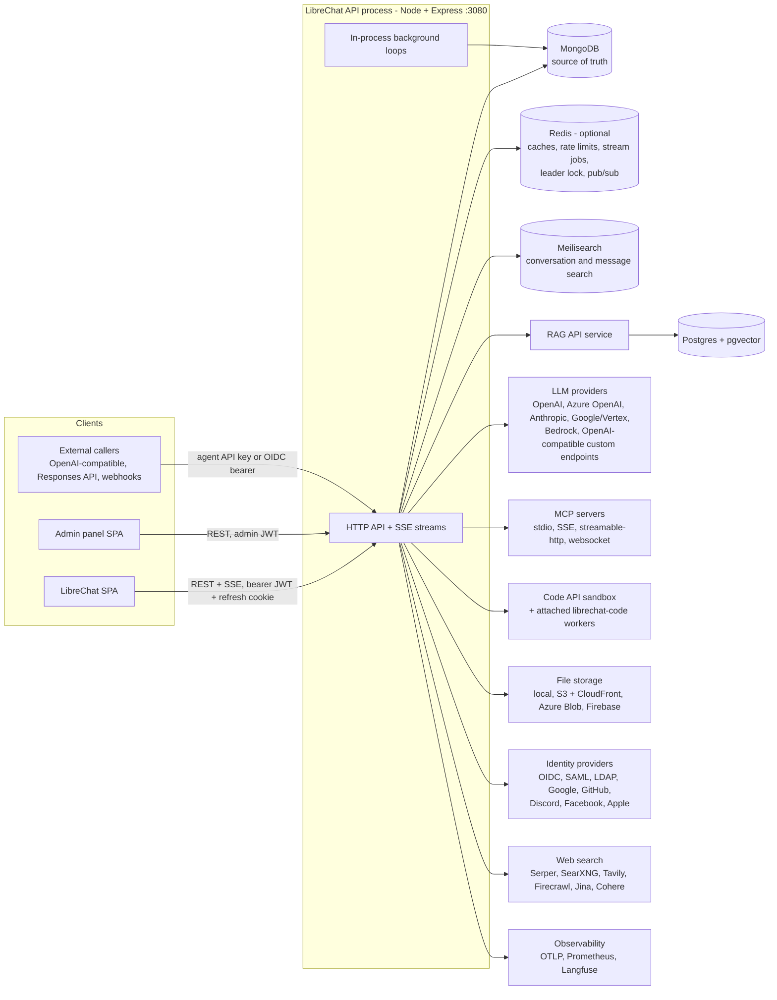

Design choices that shape everything else:

- **All chat runs as an agent.** A plain "chat with GPT/Claude/Gemini" request becomes an *ephemeral
  agent* and goes through the same LangGraph pipeline as a saved agent. Only the legacy OpenAI
  Assistants API has a separate path.
- **Generation is decoupled from HTTP.** `POST /api/agents/chat` starts a background generation job
  and returns JSON immediately. The client streams output with `GET /api/agents/chat/stream/:streamId`
  (SSE). A stream can be resumed after a reload and aborted from any replica.
- **MongoDB holds all async state.** Schedules, trigger deliveries and queued turns are Mongo
  documents with compare-and-swap leases. Redis carries ephemeral coordination only.
- **Tenant isolation lives in the data layer.** A Mongoose plugin adds `tenantId` to every query,
  using an AsyncLocalStorage context that the HTTP middleware sets.

## 2. Deployment topology

| Container | Image | Port | Role |
|---|---|---|---|
| `api` | LibreChat (node:24 alpine) | 3080 | API, SSE, SPA static files, all background loops |
| `admin-panel` | librechat-admin-panel | 3000 | Separate admin SPA; calls `api` |
| `client` (deploy compose) | nginx | 80/443 | Reverse proxy |
| `mongodb` | mongo 8 | 27017 | Primary database. A replica set is needed for transactions. |
| `meilisearch` | getmeili/meilisearch 1.35 | 7700 | Full-text search over conversations and messages |
| `rag_api` | librechat-rag-api (Python/FastAPI) | 8000 | Embedding and retrieval service |
| `vectordb` | pgvector 0.8 / pg15 | 5432 | Vector store for `rag_api` |
| `redis` | redis / bitnami chart | 6379 | Required for more than one replica |
| `langfuse-fanout-*` | Go gateway + otel-collector | 4318/4319 | Optional per-tenant Langfuse trace routing |

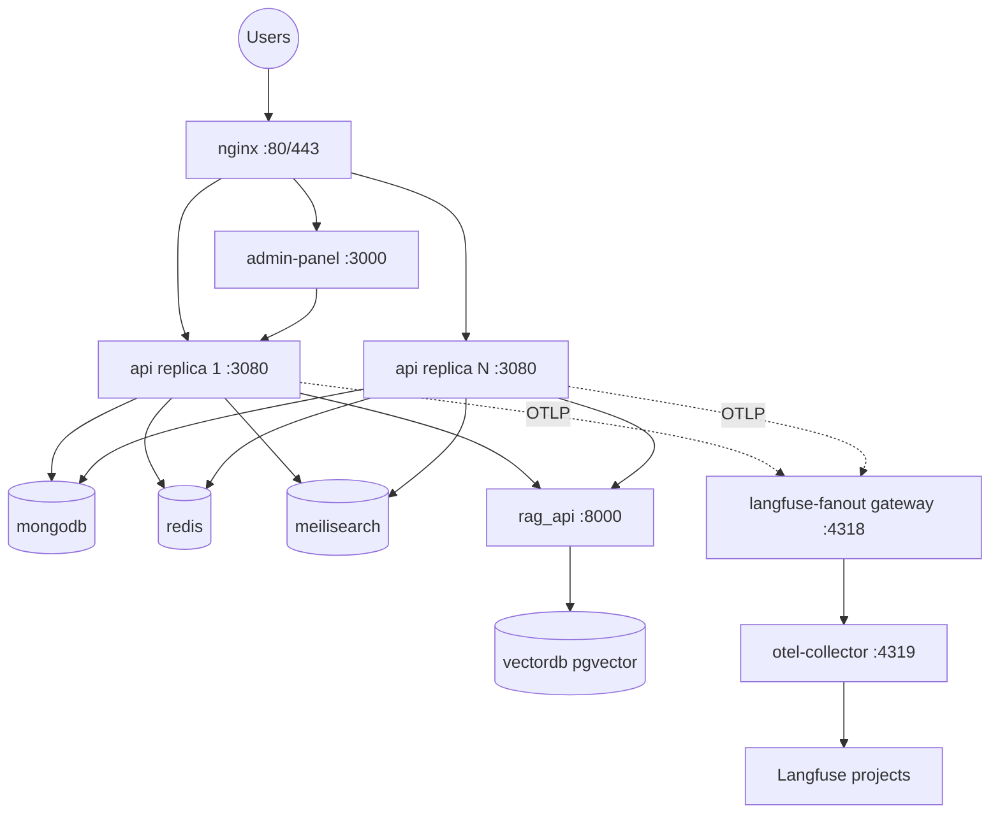

The Helm chart (`helm/librechat`) runs N replicas with an HPA and bundles MongoDB, Meilisearch, Redis
and the RAG API. Details: [reference 08 §7](reference/08-background-observability-deployment.md).

## 3. Code organization and layering

| Workspace | Language | Role in the backend |
|---|---|---|
| `api/` | CommonJS JS | Express wiring: `server/index.js` (bootstrap), `server/routes`, `server/middleware`, `server/controllers`, `server/services` (older services), `strategies/` (passport), `app/clients` (legacy `BaseClient`, tool manifest) |
| `packages/api` | TypeScript | New backend behavior: agents, streaming, endpoints, MCP, tools, files, auth, schedules, triggers, cache, cluster, config service |
| `packages/data-schemas` | TypeScript | Mongoose schemas (47 models), the data-access layer (`createMethods`), tenancy plugin, Meilisearch plugin, crypto, logger |
| `packages/data-provider` | TypeScript | Contracts shared with the frontend: zod `configSchema`, conversation and preset schemas, enums (endpoints, permissions, cache keys, events), API types |
| `@librechat/agents` (npm) | TypeScript | Agent SDK over LangChain JS and LangGraph JS: `Run`, graphs, provider clients, event stream, content aggregation, token counting, pruning and summaries, hooks, HITL, subagents |

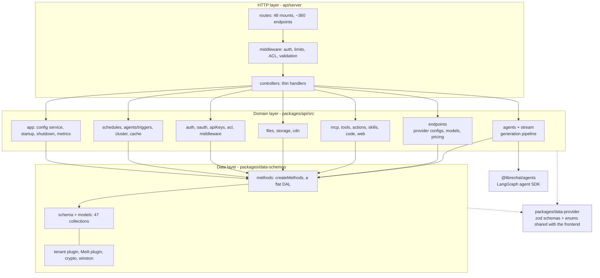

The repo's rule (`CLAUDE.md`) is that `/api` holds wiring and new behavior goes in `packages/api`,
built with dependency injection: modules receive DB methods, config and clients from the caller.
That rule maps directly onto a Python layout of FastAPI routers, service modules and repositories.

## 4. Bootstrap and the request pipeline

### 4.1 Startup sequence (`api/server/index.js`)

1. Load `.env` and bootstrap secrets (`CREDS_KEY`, `CREDS_IV`, `JWT_SECRET`, `JWT_REFRESH_SECRET`).
   Missing ones are generated and legacy defaults are rejected. OpenTelemetry starts before
   Express, HTTP and Mongoose are loaded.
2. Register the 47 Mongoose models (`createModels`) and build the data-access function bag
   (`createMethods`). Build the named caches (Keyv namespaces).
3. `startServer()`:
   - Wait for Redis. Build Prometheus metrics. Connect to Mongo.
   - Start the leader-gated code-environment reconciler. Start the Meilisearch sync (fire and forget).
   - Seed the DB as system: default roles, access roles, agent categories, system grants.
   - Load `librechat.yaml` into the base `AppConfig`. Initialize file storage, deployment plugins
     and skills, GitHub skill sync, and the expired-file sweep.
   - Run startup checks, sync `interface.*` flags into role permissions, and prepare `index.html` (CSP nonce).
   - Mount `/health`, `/livez`, `/readyz`, the global middleware and all routers.
   - Configure `GenerationJobManager` (Redis or in-memory job store and event transport).
4. `app.listen()`. The post-listen steps initialize MCP servers, the OAuth reconnect manager and the
   migration check, then start the **agent trigger engine** and the **schedule engine**. Only then
   does it set `serverReady = true`. Until that point, chat POSTs and schedule writes get a
   `503` with `Retry-After: 1`.
5. Graceful shutdown: a registry of shutdown tasks, each with a `phase` (pre-drain or post-drain) and a
   `priority`, and a 60-second hard deadline. Generation jobs are stopped before the HTTP drain; caches and
   exporters are closed last.

### 4.2 Global middleware (in order)

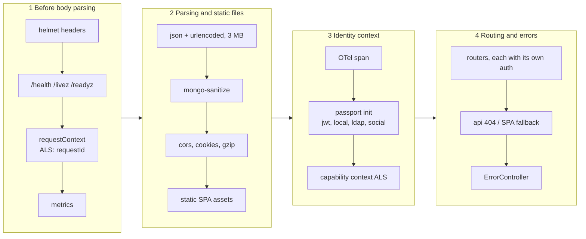

Authentication is **not** global. Each router applies `requireJwtAuth`, `optionalJwtAuth` or a
machine-auth middleware itself. Those middlewares also set the tenant ALS context.

### 4.3 The chat request middleware chain

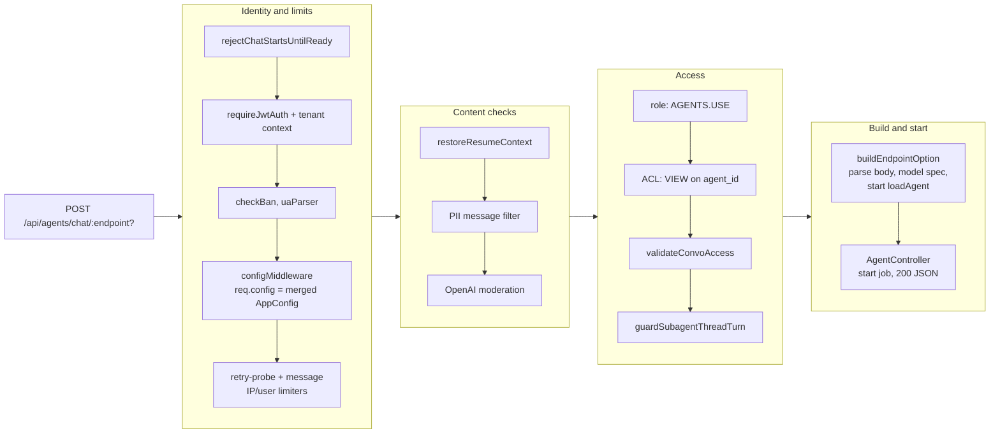

Rate limiters (login, register, messages, uploads, TTS/STT, tool calls, and others) use
`express-rate-limit` with a Redis store. Going over a limit calls `logViolation`, which adds to a
violation score. When the score crosses `BAN_INTERVAL`, the user and IP are banned and their sessions
deleted. Full catalog: [reference 01 §3](reference/01-bootstrap-config-infra.md).

## 5. Configuration system

Configuration has three sources: environment variables (secrets and infrastructure), `librechat.yaml`
(product configuration, validated by the zod `configSchema` in `packages/data-provider/src/config.ts`),
and **admin overrides** stored in Mongo per principal.

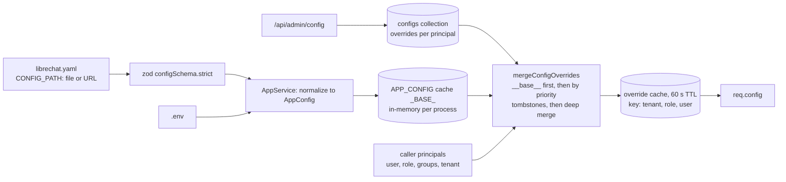

- Top-level YAML sections: `version`, `cache`, `interface` (UI feature flags that also drive role
  permissions), `registration`, `endpoints` (openAI, azureOpenAI, anthropic, google, bedrock, assistants,
  agents, custom[], all), `mcpServers`, `mcpSettings`, `modelSpecs`, `fileStrategy` and
  `fileStrategies`, `fileConfig`, `actions`, `balance`, `transactions`, `rateLimits`, `speech`, `ocr`,
  `webSearch`, `memory`, `summarization`, `skillSync`, `langfuse`, `filters` and `messageFilter`
  (PII), `turnstile`, `openapi`.
- Overrides are keyed by `(principalType, principalId, tenantId)` and carry `priority`, `overrides`,
  `tombstones` and `isActive`. `filters` is base-only, and `langfuse` can only be set on `__base__`.
- New operator-facing settings are added to `configSchema` with a default that keeps current behavior.
  Keep that rule in a Python port by making the pydantic config model the single definition.

Details: [reference 01 §4](reference/01-bootstrap-config-infra.md).

## 6. Authentication and sessions

### 6.1 Credential model

| Artifact | Format | Lifetime | Where it lives |
|---|---|---|---|
| Access token | HS256 JWT `{id, username, provider, email}` signed with `JWT_SECRET` | `SESSION_EXPIRY`, default 15 min | Client memory, sent as `Authorization: Bearer` |
| Refresh token | HS256 JWT `{id, sessionId}` signed with `JWT_REFRESH_SECRET` | `REFRESH_TOKEN_EXPIRY`, default 7 days | `refreshToken` cookie (httpOnly, SameSite=strict). `sessions` stores `sha256(token)`. |
| `token_provider` cookie | `librechat` or `openid` | same | Picks the refresh strategy |
| OpenID token reuse | IdP id/access/refresh tokens | IdP-defined | express-session (Redis) plus `openid_user_id` marker cookie |
| 2FA temp token | JWT `{userId, twoFAPending}` | 5 min | Returned after the password step |
| Agent trigger token | JWT `{id, scope:'agent_trigger'}` | 60 s | Internal loopback calls from the trigger engine |
| Agent API key | `sk-<64 hex>`, `sha256` stored | optional TTL | Remote agents API (`/api/agents/v1/*`) |

### 6.2 Login and refresh

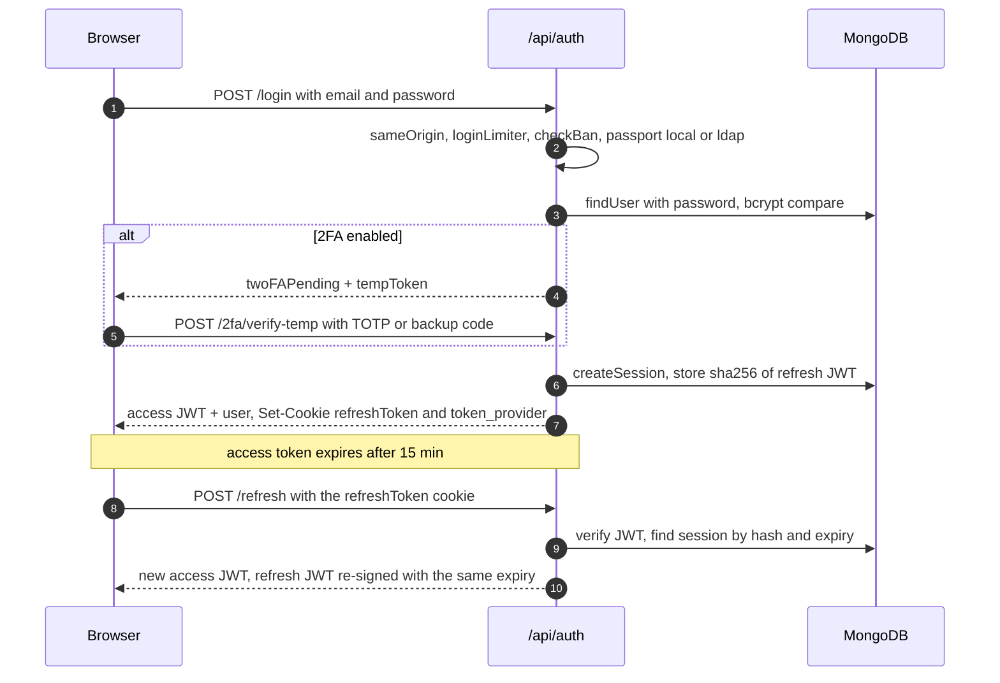

- **Login methods:** local (bcrypt), LDAP (`ldapauth`), social OAuth2 (Google, GitHub, Discord,
  Facebook, Apple), generic OpenID Connect (PKCE, nonce, role mapping, role sync, token reuse,
  Entra group sync, Microsoft OBO), and SAML. Social and SAML callbacks redirect to the SPA after
  setting cookies. The admin panel uses a one-time **exchange code + PKCE** flow.
- **Registration:** optional invites, domain allowlists, and email verification (bcrypt-hashed token,
  15 min). Unverified users carry a 7-day TTL and delete themselves. The first user becomes `ADMIN`.
- **2FA:** TOTP (RFC 6238, SHA-1, 30 s, ±1 step) with 10 SHA-256-hashed backup codes. The secret is
  encrypted as `v3:` AES-256-CTR.

Every flow, env var and edge case: [reference 02](reference/02-auth-authorization.md).

## 7. Authorization and tenancy

There are three separate authorization mechanisms, plus tenant scoping underneath all of them.

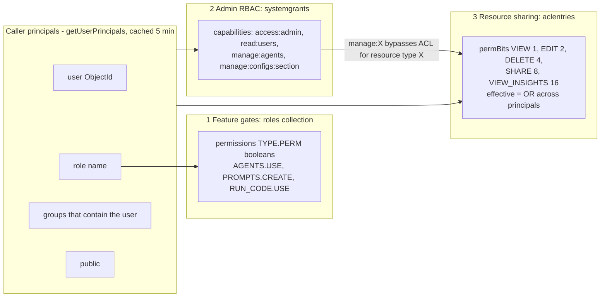

1. **Role permissions** (`generateCheckAccess`): `role.permissions[PermissionType][Permission]`. The
   default roles are `ADMIN` and `USER`; custom roles are allowed. The 17 permission types include
   PROMPTS, AGENTS, MEMORIES, BOOKMARKS, MULTI_CONVO, TEMPORARY_CHAT, RUN_CODE, WEB_SEARCH,
   FILE_SEARCH, FILE_CITATIONS, PEOPLE_PICKER, MARKETPLACE, MCP_SERVERS, REMOTE_AGENTS, SKILLS,
   SHARED_LINKS and SCHEDULES.
2. **System capabilities** (`requireCapability`): `systemgrants` rows keyed by (principal,
   capability, tenant). A grant with no `tenantId` applies to every tenant. `manage:X` implies `read:X`.
3. **Resource ACL** (`canAccessResource`): `aclentries` rows keyed by (principal, resourceType,
   resourceId), with `permBits`. The resource types are agent, remoteAgent, promptGroup, mcpServer,
   skill, codeEnvironment and sharedLink. The creator gets the `*_owner` access role (15). Sharing
   uses `/api/permissions/:type/:id` and needs SHARE, the role's `SHARE` permission, and
   `SHARE_PUBLIC` to make a resource public.

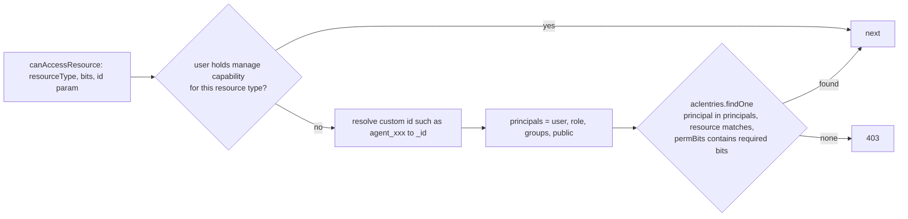

**Tenancy.** `tenantStorage` (AsyncLocalStorage) holds `{tenantId, userId, requestId}`. The
`applyTenantIsolation` Mongoose plugin:
- injects `tenantId` into every find, update, delete and aggregate filter;
- stamps it on inserts;
- rejects any attempt to change it;
- in strict mode (`TENANT_ISOLATION_STRICT`), refuses queries that have no tenant context.

`runAsSystem()` bypasses the scoping for platform jobs. The policy is written engine-neutrally in
`packages/data-schemas/src/tenant/policy.ts` and ports one-to-one to Python `contextvars`.

## 8. Chat generation pipeline

This is the core of the system and the hardest part to reproduce. The detailed walkthrough is
[reference 03](reference/03-chat-agent-pipeline.md).

### 8.1 End-to-end sequence

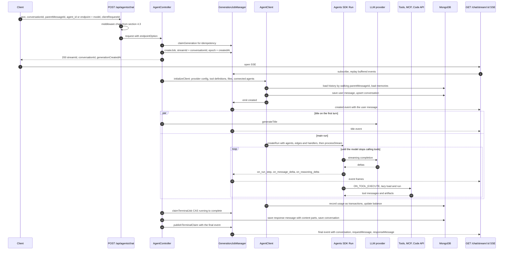

### 8.2 SSE contract

Every frame is `event: message` + `data: <json>`, except errors, which use `event: error`. The
payloads are:

| Frame | Meaning |
|---|---|
| `{created:true, message}` | The user message was accepted. The client renders it. |
| `{sync:true, resumeState}` | Snapshot for a reconnect (`?resume=true`): run steps, aggregated content, pending action |
| `{event:'on_run_step', data: RunStep}` | A new step. `message_creation` or `tool_calls`, with `index`, `stepId` and `agentId` |
| `on_run_step_delta` | Tool-argument chunks, plus MCP or action OAuth prompts (`auth`, `expires_at`) |
| `on_run_step_completed` | Tool result `{tool_call:{id, name, args, output}}` |
| `on_message_delta` / `on_reasoning_delta` | Text and thinking deltas keyed by step id |
| `on_pending_action` | HITL: a tool approval or an `ask_user_question` payload |
| `on_steer_applied`, `on_subagent_update`, `on_summarize_*`, `on_token_usage`, `on_context_usage`, activity and reasoning labels | Advanced features |
| `attachment` | Files, web-search results, memory updates and citations produced by tools |
| `title` | Generated conversation title |
| `{final:true, conversation, requestMessage, responseMessage}` | Terminal frame. The abort variant carries `aborted:true`; the reconcile variant tells the client to refetch. |

The SDK's content aggregator folds these events into `contentParts[]`, which is stored as
`message.content`. The part types are text, think, tool_call, image_file, summary, steer and
agent_update. **The frontend depends on this event and content-part contract exactly.** If the
Python port serves the existing SPA, it must produce the same frames.

### 8.3 Generation job lifecycle

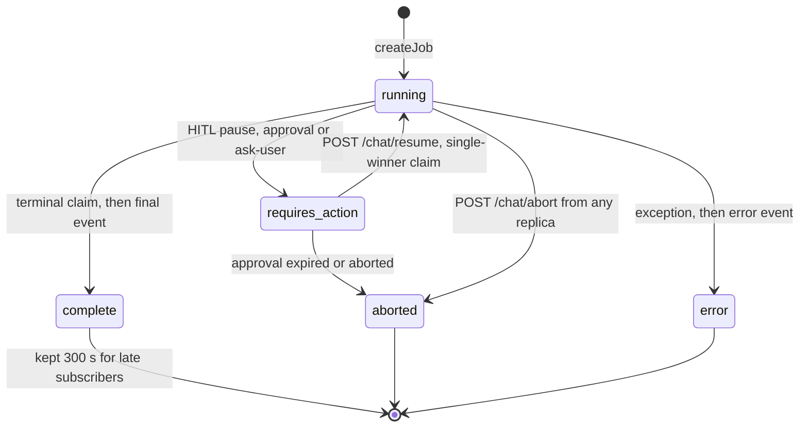

- **Job store.** In Redis mode a job is a hash `stream:{id}:job` plus a Redis Stream
  `stream:{id}:chunks`, an append-only log of every emitted event. Live frames go over pub/sub
  `stream:{id}:events`, ordered by a sequence number. Status changes are Lua CAS scripts. In memory
  mode an early-event buffer holds frames until the first subscriber attaches.
- **Resume.** The client calls `GET /chat/status/:conversationId`, then reattaches with `resume=true`.
  The server rebuilds the aggregated content by replaying the chunk log and sends one `sync` frame
  before going live.
- **Abort.** `POST /chat/abort` sets the job status to aborted by CAS and publishes `abort`. The replica that owns the
  run calls `AbortController.abort()`, which cancels the LangGraph run. The requester saves the
  partial response (`unfinished:true`) and publishes the abort final frame.
- **Fencing.** The job's `createdAt` is a generation epoch. Every emit, abort and persist carries it, so
  a replaced generation cannot write over its successor. Exactly one party (complete, abort, error or
  pause) wins the terminal CAS, and only that party publishes the terminal frame.

### 8.4 Persistence points

1. The user message and a conversation upsert happen in parallel with generation.
2. The title is cached (`GEN_TITLE`, 2 min), emitted, then saved with a metadata-only update.
3. The response message (`content[]`, `tokenCount`, `attachments`, `contextMeta`, `unfinished`,
   `error`, `finish_reason`) is written after the terminal claim.
4. Usage becomes `transactions` rows plus a balance update.
5. Memory updates come from a separate memory-agent run.
6. LangGraph checkpoints are written only when HITL, ask-user or an event actor needs them.
7. On a disconnect, abort or pause, a partial response is saved with `unfinished:true`.

### 8.5 Other ingress protocols

- `POST /api/agents/v1/chat/completions` is **OpenAI-compatible**: `model` is the agent id and the
  stream uses `data: {chat.completion.chunk}` + `[DONE]`. `POST /api/agents/v1/responses` is the
  **Open Responses API**, with `store` and `previous_response_id`.
- Both authenticate with an agent API key or an OIDC bearer, wrap the request in an `AgentRunEnvelope`,
  and call `createRun` directly. They skip the resumable job manager and HITL.
- `POST /api/agents/v1/events` is the **webhook ingress** for event-driven agents
  (see [section 15](#15-background-processing)).

## 9. Agent runtime

`createRun` (`packages/api/src/agents/run.ts`) builds a LangGraph graph through `@librechat/agents`. The SDK
itself is mapped in its own document, [@librechat/agents SDK architecture](agents-sdk/README.md). This section
covers how LibreChat uses it.

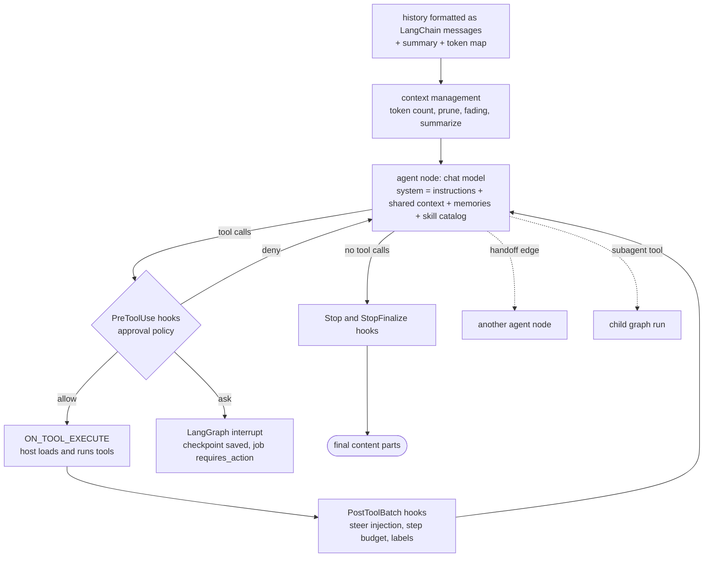

| Feature | What it does | Where |
|---|---|---|
| Ephemeral agents | Turn a plain endpoint + model chat into a synthetic agent, with tools from UI toggles and model specs | `agents/load.ts` |
| Multi-agent graphs | `edges[]` with `handoff` (transfer tools) or `direct` (static or parallel fan-out). The legacy `agent_ids` become a sequential chain. An "added convo" runs a second agent in parallel. | `agents/edges.ts`, `discovery.ts`, `added.ts` |
| Event-driven tools | The graph holds schema-only tool definitions. The SDK emits `ON_TOOL_EXECUTE` and the host instantiates and runs the tools. Speculative ("eager") execution runs while arguments stream. | `agents/handlers.ts` |
| Context management | Token counting with a calibration ratio, pruning to `maxContextTokens`, "fading" of old tool results (a latched tier keeps the prompt cache stable), and summarization/compaction into `summary` parts | `agents/compaction.ts`, `fading.ts` |
| HITL | The tool-approval policy (allow, ask or deny globs) and `ask_user_question` raise a LangGraph `interrupt()`. The checkpoint goes to Mongo (`agent_checkpoints`), and the run resumes with `Command(resume)`. | `agents/hitl/*`, `checkpointer.ts` |
| Steering | Mid-run user messages go into a per-stream FIFO and are injected at tool-batch boundaries. `preempt` seals the model stream. | `agents/steering/*`, `stream/SteeringLifecycle.ts` |
| Queued turns | A follow-up sent while a run is active is stored durably in Mongo and admitted as a new turn once the current one settles | `agents/queuedTurns.ts` |
| Subagents | A spawn tool runs child graphs, optionally detached and backgrounded, with durable child threads and completion wakeups | `agents/subagent*.ts` |
| Background tools | `run_in_background`: the call returns a handle and the model polls `check_background_task` | `agents/background.ts` |
| Memory | Stored memories are injected into the system prompt. A background memory-agent run applies `set_memory` / `delete_memory`. | `agents/memory.ts` |

The **Python substitute** is LangGraph Python (`StateGraph`, `ToolNode` or a custom executor node,
`interrupt` + `Command(resume)`, `MongoDBSaver`) plus LangChain chat models or litellm. The part that
needs new code is an **event translator**: it maps `astream_events(v2)` / `astream(stream_mode=[messages,
updates, custom])` output into LibreChat's `RunStep` and delta event schema, plus a content aggregator.

## 10. LLM providers and models

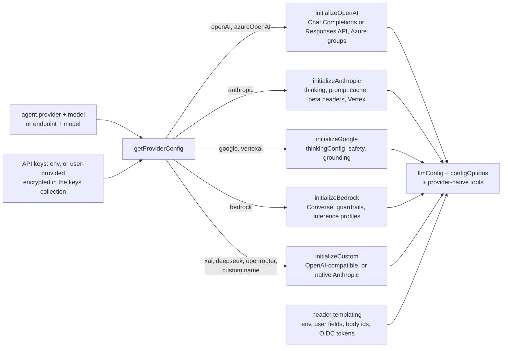

- **Endpoint types:** openAI, azureOpenAI, anthropic, google, bedrock, custom (a list in YAML),
  agents, and the legacy assistants and azureAssistants.
- **Model lists:** `GET /api/models` merges env lists, provider `/models` fetches (cached 2 min),
  YAML defaults, and per-user fetches when the key is user-provided. OpenRouter and Helicone
  responses also carry pricing and context sizes.
- **Tokens and pricing:** static tables of context windows (longest-substring model matching) and USD
  per 1M tokens for prompt, completion, cache read, cache write and premium long-context tiers.
  `endpointTokenConfig` overrides the tables.
- **Model specs:** curated presets in YAML (`modelSpecs.list`). With `enforce` set, the request body
  is replaced by the spec preset. Private fields such as `promptPrefix` are never sent to the client.
- **Titles:** a separate small completion, run in parallel on the first turn, with a 45 s timeout. The
  model is configurable (`titleModel`, `titleEndpoint`, `titleMethod`).
- **Speech:** STT through OpenAI or Azure Whisper; TTS through OpenAI, Azure, ElevenLabs or LocalAI.

Full parameter mapping per provider: [reference 04](reference/04-providers-models.md).

## 11. Tools, MCP, actions, skills and code execution

### 11.1 Tool resolution

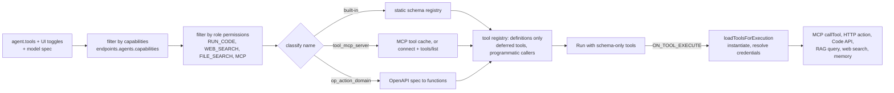

| Category | Tool names | Executes via |
|---|---|---|
| Built-in plugins | `google`, `dalle`, `flux`, `wolfram`, `tavily_search_results_json`, `image_gen_oai`, `gemini_image_gen`, `calculator` | LangChain tool classes; credentials from env or the per-user encrypted `pluginauths` |
| MCP | `<tool>_mcp_<server>` | MCP client session (per app, per user, or per request) |
| Actions | `<operationId>_action_<domain>` | HTTP call built from the stored OpenAPI spec (API key or OAuth2) |
| Code | `execute_code`, `bash_tool`, `read_file`, `search_workspace`, `list_workspace_files`, `bash_programmatic_tool_calling` | External Code API (`/exec`, `/upload`, `/download`, `/workspace-tools/execute`) |
| Files | `file_search`, `create_file`, `edit_file` | RAG API `/query`; code workspace |
| Web | `web_search` | Search provider, then scraper, then reranker |
| Skills | `skill` | Returns the SKILL.md body and puts bundled files in the sandbox |
| Memory | `set_memory`, `delete_memory` | `memoryentries` |
| Discovery | `tool_search` | Local registry search for deferred tools |
| HITL | `ask_user_question` | LangGraph interrupt |

### 11.2 MCP

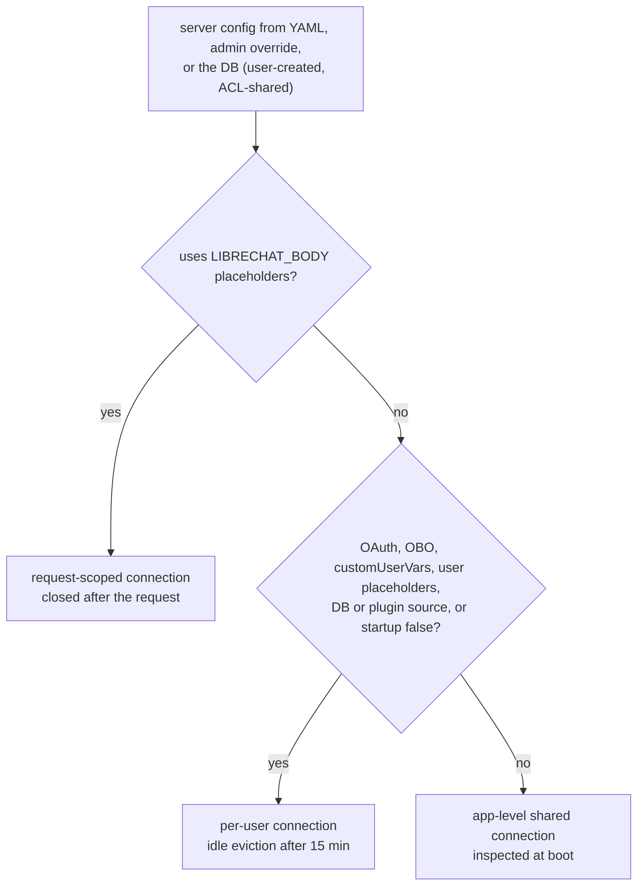

MCP OAuth is a blocking flow that the chat stream exposes to the user:

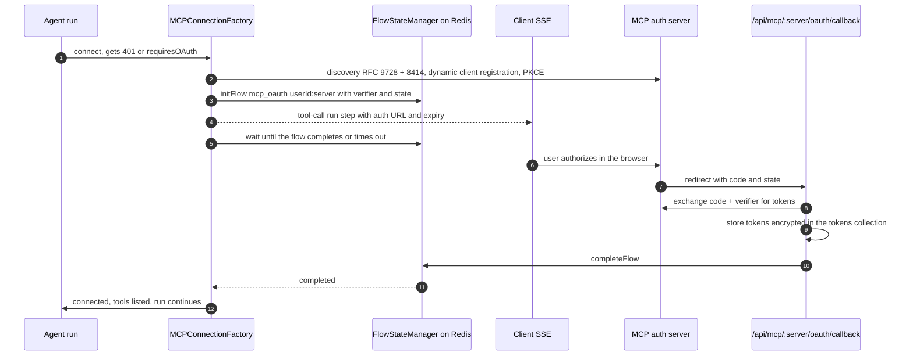

### 11.3 Actions, skills, code and web search

- **Actions:** an OpenAPI spec is stored in `actions.metadata.raw_spec`. The client domain must match
  the spec's server URL, and it must pass the domain and IP allowlist (SSRF guard). Each operation
  becomes one function tool. Secrets are AES-encrypted. OAuth actions use the same flow mechanism,
  with a state JWT.
- **Skills:** SKILL.md body + frontmatter + bundled files, ACL-shared. Sources are inline, `.zip`
  import, a deployment directory, plugins, or GitHub sync. The model calls the `skill` tool, and files
  are primed into the sandbox at `/mnt/data/skills/<name>/`.
- **Code API contract:** `POST /exec {lang, code, args, session_id, files}` returns
  `{stdout, stderr, session_id, files}`. There are also `POST /upload`, `/upload/batch`,
  `GET /download/:session/:file` and `POST /workspace-tools/execute`. Stateful sessions are scoped
  per user, per agent-user, or per conversation. Attached environments are user machines running a
  `librechat-code` worker behind the Code API bridge.
- **Web search:** the first configured provider in each category is used, with keys from env or the
  user. SSRF-safe HTTP agents are used, and results stream to the client as `web_search` attachments
  with citation anchors.

Details: [reference 05](reference/05-tools-mcp-actions-skills.md).

## 12. Files, storage and RAG

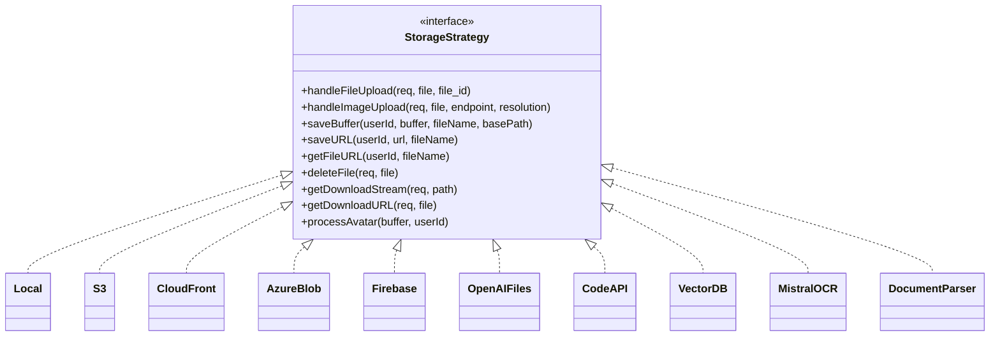

`getStrategyFunctions(source)` returns the implementation for a `FileSources` value. Which store is
used for an avatar, image, document or skill comes from `fileStrategy` / `fileStrategies`.

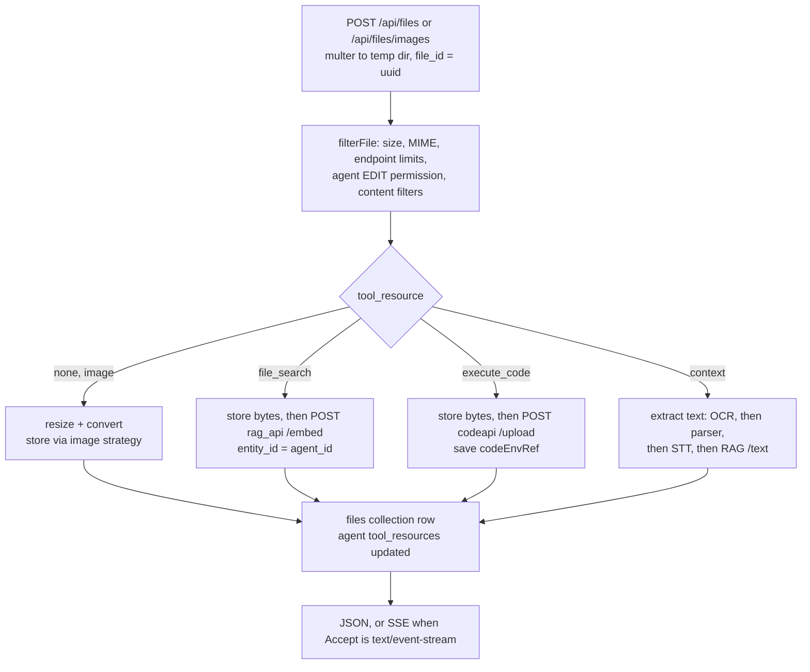

- **RAG API contract.** Every call carries a 5-minute HS256 JWT `{id}` signed with the shared
  `JWT_SECRET`.
  - `POST /embed` (multipart `file_id`, `file`, `entity_id`) returns `{status, known_type}`.
  - `POST /query {file_id, query, k, entity_id}` returns `[[{page_content, metadata}, distance]]`.
  - `POST /text`, `DELETE /documents [ids]`, `GET /health`.
- **Lifecycle.**
  - `expiresAt` is a 1 h TTL for uploads that are never used. It is cleared once a message uses the file.
  - `expiredAt` is the retention deadline inherited from the conversation. The leader-only hourly
    sweep deletes those files from storage, the vector DB and the Code API, with backoff.

Details: [reference 06 §1-4](reference/06-files-storage-conversations.md).

## 13. Conversations, messages, search and sharing

- **Tree model.** A conversation is a header row with the preset fields spread in. Messages form a tree
  through `parentMessageId`; the root parent is `00000000-0000-0000-0000-000000000000`. Siblings are
  regenerations or edits, and the history sent to the model is the path from the chosen leaf to the root.
- **Pagination.** Keyset cursors: `base64(JSON{primary, secondary, id})` with `limit+1` fetches, for
  conversations (sorted by title, createdAt, updatedAt or archivedAt) and messages (by createdAt).
- **Operations:** archive, pin, tag (bookmarks with counts), move to a project, duplicate, fork
  (direct path, include branches, or target level, with ids remapped), import (ChatGPT, Claude,
  ChatbotUI and LibreChat JSON), feedback (also sent to Langfuse as a score), and delete. Delete
  cascades: it drains generations, cancels subagents, then deletes messages, tool calls, shares
  and checkpoints.
- **Search.** A Meilisearch plugin on the Conversation and Message models writes to Meili after saves,
  with a version CAS. A startup `syncWithMeili` backfills. Every query is filtered by `user`.
- **Share links.** A `sharedlinks` snapshot of message ids and file snapshots, with a nanoid `shareId`.
  Access goes through the ACL (a PUBLIC principal means anonymous access is allowed). Shared output
  replaces ids with anonymous ones.
- **Also here:** prompts (groups with a production version and slash commands, ACL-shared), presets,
  projects (folders with denormalized stats), favorites, banners and insights (live Mongo aggregations).

Details: [reference 06 §5-6](reference/06-files-storage-conversations.md).

## 14. Balance and token accounting

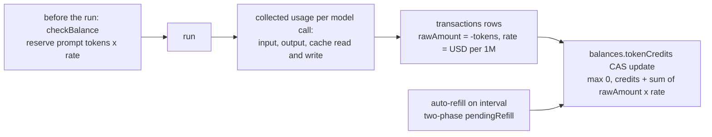

- 1 credit is $0.000001, so the rate in USD per 1M tokens equals credits per token. The rate is looked
  up in this order: `endpointTokenConfig`, then the premium long-context tier, then the `tokenValues`
  table, then a default of 6.
- An aborted completion is charged 1.15×. Prompt caching splits the prompt charge into input, cache
  write and cache read.
- Balance is off by default (`balance.enabled`). Transactions are recorded whenever balance is on.

Details: [reference 02 §7](reference/02-auth-authorization.md).

## 15. Background processing

Every replica runs every loop. Duplicate work is prevented by **Mongo CAS leases** (schedules,
trigger deliveries, queued turns) or by the **Redis leader lock** (file sweep, code-environment
reconciler, MCP registry writes).

| Loop | Period | Guard | Job |
|---|---|---|---|
| Schedule engine | 30 s + jitter, reconciles every 4th tick | Mongo lease on `schedules` | Claim due schedules and fire them through the trigger queue |
| Agent trigger engine | 1 s, backing off to 15 s idle; woken on enqueue | Mongo CAS lease on `agenttriggerdeliveries` | Dispatch deliveries as loopback `POST /api/agents/chat/agents` or `/steer/deliver` |
| Trigger maintenance | 30 s | idempotent | Recover lane publications, user purges, batches |
| Queued-turn recovery | 30 s | Mongo lease | Re-publish wakeups, reconcile admission |
| Generation job cleanup | 60 s | per store | Reap stale jobs and expired approvals |
| File retention sweep | 1 h | leader | Delete expired files everywhere |
| Code-environment reconciler | 60 s | leader | Worker revocation leases |
| GitHub skill sync | 60 min | Mongo lock | Mirror skills from GitHub |
| Leader election | renew every 10 s, lease 25 s | Redis `SET NX EX` | Single leader |
| Meilisearch sync | startup | flow lock | Backfill the search index |

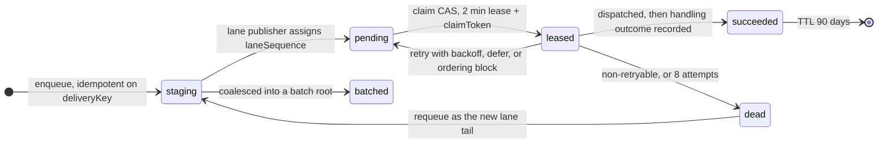

- **Trigger delivery** (above) is a durable, source-neutral outbox of agent turns. It carries
  schedules, webhooks, subagent completions, background-tool completions and queued turns. Each
  ordering lane is a strict FIFO: a later event cannot overtake an unsettled earlier one.
- **ScheduleRun** states: `started`, then `requires_action`, `success`, `error` or `interrupted`, or a
  skip (`skipped_overlap`, `skipped_balance`). A unique partial index on `{scheduleId}` where
  `status: started` allows one active run per schedule. A unique partial `capacitySlot` enforces
  global concurrency inside the database.
- **Account deletion** is fenced: set `agentTriggerDeletionStartedAt`, drain deliveries, subagents,
  schedules and generations, delete about 25 collections in order, then purge the trigger data.

Details: [reference 08](reference/08-background-observability-deployment.md).

## 16. Caching, Redis and clustering

| Concern | With Redis | Without Redis |
|---|---|---|
| Named caches (`CacheKeys`: ROLES, APP_CONFIG, TOOL_CACHE, MODEL_QUERIES, TOKEN_CONFIG, GEN_TITLE, FLOWS, ABORT_KEYS, USER_PRINCIPALS...) | Keyv on Redis, namespaced `PREFIX::NS:key`. `APP_CONFIG` and `CONFIG_STORE` stay in memory by default. | In-memory Keyv with a 30 s sweeper |
| Violations and bans | Redis-backed violation scores; bans in a Mongo-backed Keyv | JSON files + Mongo |
| Rate limits | `rate-limit-redis` | in-process |
| Sessions (OIDC, SAML) | `connect-redis` | `memorystore` |
| Generation streams | `RedisJobStore` + pub/sub transport | in-memory |
| Leader | `SET LeadingServerUUID NX EX 25` + Lua renew | always leader |
| OAuth and flow waits | FlowStateManager on Redis Keyv | in-memory |

The rest (TLS, cluster mode, heartbeat, READONLY recovery):
[reference 01 §5-6](reference/01-bootstrap-config-infra.md).

## 17. Observability

- **Logs:** Winston with daily-rotated error and debug files, JSON console output, redaction, and
  request context from ALS (request id, tenant, user).
- **Metrics:** Prometheus at `/metrics`, bearer `METRICS_SECRET`. Covers HTTP, SSE streams,
  generation jobs, Mongo and Redis operations, uploads and agent startup latency.
- **Traces:** OpenTelemetry NodeSDK (HTTP, Express, Mongo, Undici, IORedis) with OTLP export. Browser
  RUM is proxied through `/api/rum`.
- **LLM tracing:** Langfuse, configured per tenant, with deterministic trace ids `sha256(runId)`. User
  feedback becomes Langfuse scores. `/api/traces/:conversationId` shows traces to the conversation owner.

## 18. Data model

47 Mongoose models. Almost all carry `tenantId`, and their unique indexes are compound with it. The
`user` foreign key is a **string** in Conversation, Message, ConversationTag, SharedLink, Preset,
ChatProject and PluginAuth, and an **ObjectId** in most other collections. Keep that difference if the
Python port has to read existing data.

### 18.1 Identity and access

```mermaid
erDiagram
  User ||--o{ Session : "user"
  User ||--o{ Token : "userId"
  User ||--o| Balance : "user"
  User ||--o{ Transaction : "user"
  User ||--o{ Key : "userId"
  User ||--o{ PluginAuth : "userId"
  User ||--o{ AgentApiKey : "userId"
  Role ||--o{ User : "User.role = Role.name"
  Group }o--o{ User : "memberIds"
  AccessRole ||--o{ AclEntry : "roleId"
  User ||--o{ AclEntry : "principal user"
  Group ||--o{ AclEntry : "principal group"
  Role ||--o{ AclEntry : "principal role"
  User ||--o{ SystemGrant : "principal"
  Role ||--o{ SystemGrant : "principal"
  Role ||--o{ Config : "principal incl __base__"
  User ||--o{ RefreshTokenBridge : "userId"
  User {
    ObjectId _id
    string email
    string role
    string provider
    boolean twoFactorEnabled
    date expiresAt
    string tenantId
  }
  Session {
    ObjectId user
    string refreshTokenHash
    date expiration
  }
  AclEntry {
    string principalType
    mixed principalId
    string resourceType
    ObjectId resourceId
    int permBits
  }
  SystemGrant {
    string principalType
    mixed principalId
    string capability
    string tenantId
  }
  Balance {
    ObjectId user
    number tokenCredits
    array reservations
  }
  Transaction {
    ObjectId user
    string conversationId
    string tokenType
    number rawAmount
    number rate
    number tokenValue
  }
```

### 18.2 Chat

```mermaid
erDiagram
  User ||--o{ Conversation : "user as string"
  Conversation ||--o{ Message : "conversationId"
  Message ||--o{ Message : "parentMessageId"
  Conversation ||--o{ Conversation : "subagentThread parent"
  ChatProject ||--o{ Conversation : "chatProjectId"
  ConversationTag }o--o{ Conversation : "tags"
  Conversation ||--o{ SharedLink : "conversationId"
  SharedLink }o--o{ Message : "messages snapshot"
  Message ||--o{ ToolCall : "messageId"
  Conversation ||--o{ File : "conversationId"
  Conversation ||--o{ AgentQueuedTurn : "conversationId"
  User ||--o{ Preset : "user"
  Conversation {
    string conversationId
    string user
    string title
    string endpoint
    string model
    string agent_id
    array messages
    array tags
    boolean isArchived
    date expiredAt
  }
  Message {
    string messageId
    string conversationId
    string parentMessageId
    string sender
    boolean isCreatedByUser
    string text
    array content
    int tokenCount
    boolean unfinished
    boolean error
  }
  SharedLink {
    string shareId
    string conversationId
    string targetMessageId
    array fileSnapshots
  }
```

### 18.3 Agents, tools and content

```mermaid
erDiagram
  User ||--o{ Agent : "author"
  Agent ||--o{ Agent : "edges.to"
  AgentCategory ||--o{ Agent : "category"
  Agent }o--o{ Action : "actions"
  Agent }o--o{ MCPServer : "mcpServerNames"
  Agent }o--o{ Skill : "skills"
  Agent }o--o| CodeEnvironment : "code_environment_id"
  Agent }o--o{ File : "tool_resources file_ids"
  Skill ||--o{ SkillFile : "skillId"
  User ||--o{ MemoryEntry : "userId"
  Agent ||--o{ MemoryEntry : "agentId partition"
  PromptGroup ||--o{ Prompt : "groupId"
  PromptGroup ||--|| Prompt : "productionId"
  User ||--o{ File : "user"
  User ||--o{ Assistant : "user"
  Agent {
    string id
    string provider
    string model
    string instructions
    array tools
    mixed tool_resources
    array edges
    array versions
    ObjectId author
  }
  File {
    string file_id
    ObjectId user
    string source
    string context
    string filepath
    boolean embedded
    date expiresAt
    date expiredAt
  }
  MCPServer {
    string serverName
    mixed config
    ObjectId author
  }
```

### 18.4 Scheduling and triggers

```mermaid
erDiagram
  User ||--o{ Schedule : "user"
  Agent ||--o{ Schedule : "agent_id"
  Schedule ||--o{ ScheduleRun : "scheduleId"
  ScheduleRun }o--o| AgentTriggerDelivery : "deliveryKey"
  ScheduleRun }o--o| Conversation : "conversationId"
  AgentTriggerLaneSequence ||--o{ AgentTriggerDelivery : "orderingKey"
  AgentTriggerDelivery ||--o{ AgentTriggerDelivery : "batch members"
  AgentQueuedTurnSequence ||--o{ AgentQueuedTurn : "lane"
  AgentQueuedTurn }o--|| AgentTriggerDelivery : "deliveryKey wakeup"
  User ||--o| AgentTriggerUserPurge : "_id"
  Schedule {
    string id
    object cadence
    string timezone
    date nextRunAt
    date leaseUntil
    string claimToken
    boolean enabled
  }
  ScheduleRun {
    string scheduleId
    date scheduledFor
    string status
    int capacitySlot
    date settledAt
  }
  AgentTriggerDelivery {
    string deliveryKey
    string orderingKey
    int laneSequence
    string status
    mixed envelope
    int attempts
    date leaseUntil
  }
```

### 18.5 Collection inventory

| Domain | Collections |
|---|---|
| Identity and access | users, sessions, tokens, roles, groups, accessroles, aclentries, systemgrants, auditlogs (hash-chained, append-only), keys, pluginauths, agentapikeys, balances, transactions, refreshtokenbridges, openidrefreshflights |
| Chat | conversations, messages, conversationtags, sharedlinks, presets, toolcalls, chatprojects, agentqueuedturns, agentqueuedturnsequences |
| Agents and tools | agents, agentcategories, actions, assistants, mcpservers, memoryentries, toolfavorites, skills, skillfiles, skillsynccredentials, skillsyncstatuses, codeenvironments |
| Files and prompts | files, promptgroups, prompts |
| Scheduling and triggers | schedules, scheduleruns, agenttriggerdeliveries, agenttriggerlanesequences, agenttriggeruserpurges |
| Configuration and UI | configs, banners |
| Outside the model registry | `agent_checkpoints` and `agent_checkpoint_writes` (LangGraph), `keyv` (Mongo-backed caches), `librechatCredentialMetadata`, `mcp_authorization_fence_retries`, `code_environment_tombstones` |

Every field, index, TTL, method and migration: [reference 07](reference/07-data-model.md).

## 19. HTTP API surface

About 360 endpoints across 48 mounts. The biggest groups:

| Prefix | Auth | Purpose |
|---|---|---|
| `/api/auth`, `/oauth` | public or JWT | Login, register, refresh, logout, 2FA, password reset, social/OIDC/SAML callbacks |
| `/api/agents` | JWT | Agent CRUD and versions, tools, actions, chat (start, stream, status, abort, resume, steer, queued turns) |
| `/api/agents/v1/*` | API key, OIDC, M2M OIDC | OpenAI-compatible chat completions and models, Responses API, event ingress, agent and skill management |
| `/api/convos`, `/api/messages` | JWT | Conversation and message CRUD, fork, import, archive, feedback, subagent threads |
| `/api/files` | JWT | Upload, images, avatars, download, speech (STT/TTS), code downloads |
| `/api/mcp` | JWT | MCP server CRUD, connection status, reinitialize, OAuth initiate and callback |
| `/api/prompts`, `/api/skills`, `/api/memories`, `/api/tags`, `/api/presets`, `/api/projects`, `/api/share`, `/api/schedules` | JWT | Feature CRUD |
| `/api/permissions`, `/api/roles` | JWT | Sharing ACLs, role permissions |
| `/api/admin/*` | JWT + `access:admin` | Admin login exchange, config overrides, users, roles, groups, grants, audit log, skills sync, Langfuse, code environments |
| `/api/config`, `/api/endpoints`, `/api/models`, `/api/banner`, `/api/balance`, `/api/user`, `/api/keys`, `/api/api-keys` | JWT or optional | Startup config, endpoint and model catalogs, user settings, user-provided keys |
| `/health`, `/livez`, `/readyz`, `/metrics`, `/api/openapi.json` | public or bearer | Operations |

Every route with its middleware chain and handler: [reference 09](reference/09-http-routes.md).

---

## 20. Python replication blueprint

### 20.1 Technology mapping

| Node / LibreChat piece | Python choice |
|---|---|
| Express routers + middleware chains | **FastAPI** `APIRouter` per prefix. Middleware chains become `Depends(...)` chains; global concerns become Starlette middleware. |
| `librechat.yaml` zod schema | **pydantic v2** models (`extra='forbid'`) + **pydantic-settings** for env. YAML via `ruamel.yaml` or PyYAML. |
| Mongoose + data-schemas methods | **PyMongo async / Motor** with **Beanie** or plain pydantic documents behind repository classes. Raw `find_one_and_update` for every CAS or lease. |
| Tenant plugin + AsyncLocalStorage | `contextvars.ContextVar` + a `TenantScopedCollection` wrapper (filters, stamping, `$set` guard, `aggregate` `$match`), plus `run_as_system()` |
| passport strategies | **PyJWT**, **authlib** (OAuth2/OIDC, PKCE), **ldap3**, **python3-saml**, **passlib/bcrypt** (cost 10), **pyotp** |
| `@librechat/agents` (LangGraph JS) | **langgraph** + **langchain-core** + provider packages (`langchain-openai`, `-anthropic`, `-google-genai`/`-vertexai`, `-aws`), or **litellm**. You write the event translator and content aggregator yourself. The porting plan is in [the SDK document, section 12](agents-sdk/README.md#12-python-porting-plan). |
| LangGraph Mongo checkpointer | `langgraph-checkpoint-mongodb` (`MongoDBSaver`) with a namespace per generation + TTL |
| GenerationJobManager + SSE | **sse-starlette** `EventSourceResponse`. The job store is `redis.asyncio` (hash + Redis Streams `XADD`/`XRANGE` + Lua CAS) or an in-memory dict. Pub/sub carries sequence-numbered frames. |
| MCP SDK | Official **`mcp`** Python SDK (stdio, SSE, streamable-http, websocket clients; `OAuthClientProvider`) + optionally `langchain-mcp-adapters` |
| OpenAPI actions | `openapi-core` or `prance` + `jsonref`, pydantic `create_model` per operation, `httpx` with an SSRF-checking transport |
| Keyv caches, rate limits | `redis.asyncio` / `cachetools.TTLCache` behind a `Cache` protocol; the **limits** library (or slowapi) with Redis storage |
| File storage | `aiofiles`, `aioboto3` (+ `botocore` `CloudFrontSigner`), `azure-storage-blob`, `firebase-admin`, **Pillow**/pyvips |
| Document parsing / OCR | `pypdf`/`pdfplumber`, `python-docx`, `openpyxl`, Mistral OCR over `httpx` |
| Meilisearch | `meilisearch-python-sdk` (async), fed by an outbox task rather than ORM hooks |
| Background loops | asyncio tasks started from FastAPI `lifespan`, with the same Mongo leases. **Don't** move the trigger queue to Celery or arq: per-lane FIFO + dead-letter requeue needs the Mongo model. |
| Leader election | `redis.asyncio` `SET NX EX` + Lua renew, or `redis.lock.Lock` |
| Crypto (`encrypt`, `encryptV2`, `encryptV3`) | `cryptography` AES-CBC (static IV), AES-CBC `iv:ct`, AES-256-CTR `v3:iv:ct`, byte-compatible |
| Winston, prom-client, OTel, Langfuse | `structlog`/`logging`, `prometheus-client`, `opentelemetry-instrumentation-{fastapi,httpx,pymongo,redis}`, `langfuse` v3 |
| Node cluster / replicas | `uvicorn --workers N` or `gunicorn -k uvicorn.workers.UvicornWorker`; Redis becomes mandatory above one process |

### 20.2 Suggested package layout

```text
librechat_py/
  app/
    main.py            # app factory, lifespan: startup order, readiness gates, shutdown registry
    settings.py        # pydantic-settings, env grouped by concern
    config/            # librechat.yaml models, AppConfig service, principal overrides merge
    api/
      deps/            # auth, tenant, bans, rate limits, role/capability/ACL checks, req.config
      routes/          # one module per mount prefix (auth, agents, convos, messages, files, mcp, ...)
    auth/              # jwt, sessions, local, oauth/oidc (authlib), saml, ldap, 2fa, agent api keys
    authz/             # role permissions, system grants, ACL service, principals cache
    agents/            # controller, client (history, build_messages, finalize), initialize, load,
                       # edges/discovery, hitl, steering, queued turns, subagents, memory, title, usage
    runtime/           # replaces @librechat/agents: graph builder, event schema + translator,
                       # content aggregator, message formatting, token counting, pruning, summaries, hooks
    providers/         # llm config builders per provider (or litellm), model lists, token + price tables
    stream/            # job manager, job store (memory / redis), event bus, resume snapshot, SSE writer
    tools/             # registry, built-ins, web search, file search, code exec, actions, skills
    mcp/               # server registry, connection manager (app/user/request scope), oauth, tool adapter
    files/             # upload pipeline, storage strategies, images, rag client, ocr, retention sweep
    conversations/     # convo/message services, cursors, fork/import, share links, tags, projects, prompts, presets
    billing/           # balance reservations, transactions, rate tables
    background/        # loop runner, leader election, schedules engine, trigger engine, sweeps
    db/                # client, tenant-scoped collections, documents, indexes, migrations CLI
    cache/             # cache protocol, backends, named caches, violations and bans
    search/            # meilisearch sync + outbox
    observability/     # logging, metrics, otel, langfuse
  tests/               # pytest + mongodb (testcontainers) + real MCP servers from the Python SDK
```

### 20.3 Contracts to keep byte-compatible

Keep these identical if the Python backend will serve the existing frontend or read the existing
database. If it is a clean-room product, treat them as recommended defaults.

1. **SSE frames and content parts** ([section 8.2](#82-sse-contract)): the event names, `RunStep`
   shape, delta shapes, `created`, `sync` and `final` frames, the abort and reconcile variants, and
   `attachment` payloads.
2. **The chat start protocol:** POST returns `{streamId, conversationId, generationCreatedAt}`;
   `streamId == conversationId`; the GET stream supports `resume=true`; the status and abort endpoints.
3. **REST request and response shapes** for all routes in reference 09. `packages/data-provider/src`
   holds the TypeScript types (`types/queries.ts`, `api-endpoints.ts`, `data-service.ts`).
4. **Auth:** access JWT claims, the `refreshToken` / `token_provider` cookies, and `sha256` session
   hashes, so existing sessions keep working.
5. **Stored data formats:** collection names, `user` string vs ObjectId, the message tree root id,
   cursor encoding, the `encrypt`, `encryptV2` and `encryptV3` formats, bcrypt hashes, audit-log hash
   canonicalization (`stableStringify`), and tool naming (`_mcp_`, `_action_`, `sys__all__sys`).
6. **The RAG API and Code API HTTP contracts** (sections 12 and 11.3). Both services can be reused
   unchanged; the RAG API is already Python.

### 20.4 Phased roadmap

| Phase | Scope | Done when |
|---|---|---|
| 0. Foundation | Settings, YAML config models, Mongo repositories + tenant wrapper, caches, logging, `/health`, shutdown registry, crypto | Config validates against a real `librechat.yaml`; tenant conformance tests pass |
| 1. Identity | Local auth, refresh sessions, 2FA, roles + permission gates, bans + rate limits, `/api/user`, `/api/config`, `/api/endpoints`, `/api/models` | The existing SPA can log in and load its startup config |
| 2. Core chat | Ephemeral agents on 2 or 3 providers, history loading, the SSE contract, job manager (in-memory, then Redis), abort, resume, titles, convo/message CRUD, cursors | Streaming chat, regenerate, edit, abort and reload-resume all work in the SPA |
| 3. Agents and tools | Agent CRUD and versions, ACL sharing, the tool registry, built-in tools, MCP (app and user scope, OAuth flow), actions, web search, memory, handoff edges | Agents with MCP and actions run; OAuth prompts show in the stream |
| 4. Files | Storage strategies, uploads, images, RAG embed/query + `file_search`, text extraction, code API upload and priming, retention sweep | Attachments, file search with citations and code execution files work |
| 5. Product surface | Presets, prompts, tags, projects, share links, search (Meili), import and fork, balance + transactions, model specs, speech | Parity with upstream LibreChat features |
| 6. Advanced agent runtime | HITL approvals + checkpoints, steering, queued turns, subagents, background tools, summarization/compaction, skills, stateful code environments | The fork-specific agent features |
| 7. Async and enterprise | Trigger engine, schedules, event ingress and bindings, system grants + admin API + audit log, config overrides, OIDC/SAML/LDAP, multi-tenancy strict mode, remote agents APIs, Langfuse/OTel/metrics | Multi-replica deployment with Redis, admin panel compatible |

### 20.5 What to simplify

Much of the Node code handles **mixed-version rolling deploys** and **DocumentDB/Cosmos quirks**. A
fresh Python implementation can leave these out:

- the trigger-delivery **capability shield** (the dual `capability_*` lifecycle for old workers);
- generation **protocol v1** compatibility and the legacy-turn adapters for event actors;
- `permissionBitSupersets` (use `$bitsAllSet` on real MongoDB);
- DocumentDB transaction probes and `$$NOW` avoidance;
- `experimental.js` (Node cluster harness);
- the legacy **Assistants API** endpoints, which OpenAI is deprecating;
- the file-backed violation stores (`./data/*.json`).

Keep the correctness mechanisms: generation epochs, single-winner terminal CAS, Mongo leases with
claim tokens, unique partial indexes used as concurrency guards, and the owner-deletion fence.

### 20.6 Main risks

1. **Rebuilding `@librechat/agents`.** Event normalization, content aggregation, provider quirks
   (Anthropic thinking and cache control, Google thought signatures, OpenAI Responses API), pruning and
   summarization make this the largest piece of work: about 123k lines of TypeScript. Start from LangGraph
   Python and write golden tests against recorded SSE streams from the Node server. A Node sidecar running
   the TypeScript SDK can bridge the gap until the Python port is ready
   ([SDK document, section 12.4](agents-sdk/README.md#124-how-to-de-risk-it)).
2. **Frontend coupling.** If the Python backend serves the existing SPA, every response shape and SSE
   frame counts as a contract. Record real traffic from the Node backend and replay it as fixtures.
3. **Concurrency semantics.** Leases, fences and CAS rules are spread across the schedule, trigger,
   queued-turn and job-store code. Port them with their unique indexes and add failure-injection tests.
4. **Scope.** The fork is several times larger than upstream LibreChat. Settle which fork-only features
   (schedules, event actors, subagent threads, attached code environments, Langfuse fanout) are
   actually needed before phase 6.
