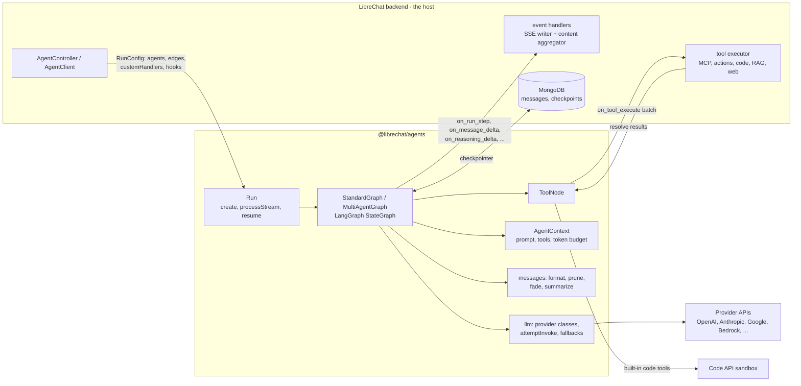
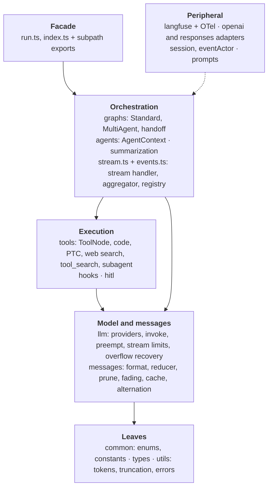
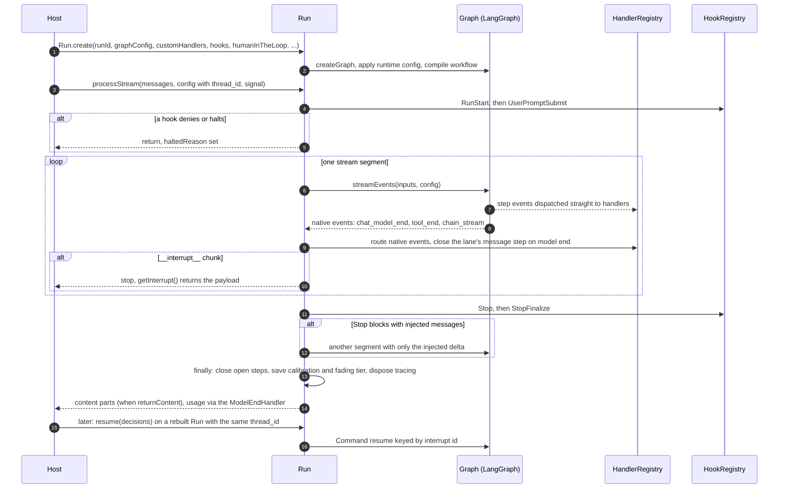
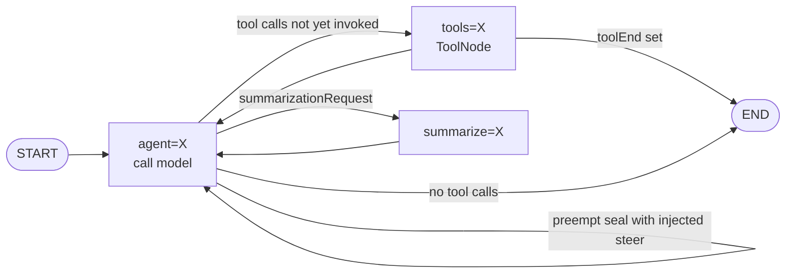
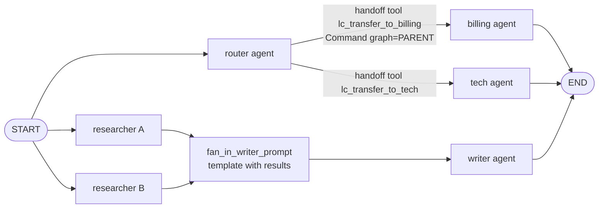
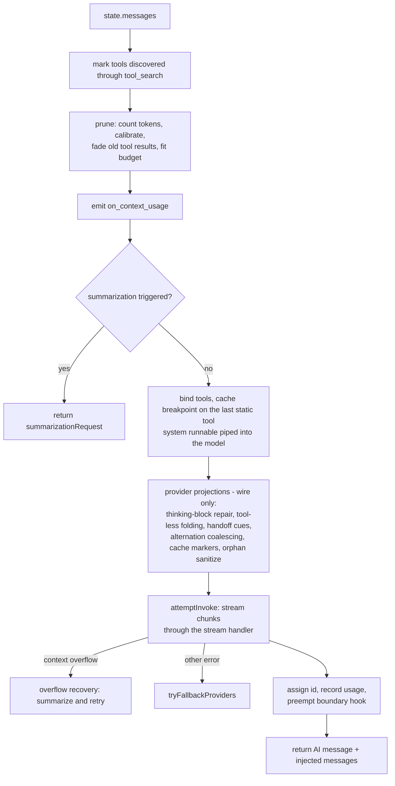
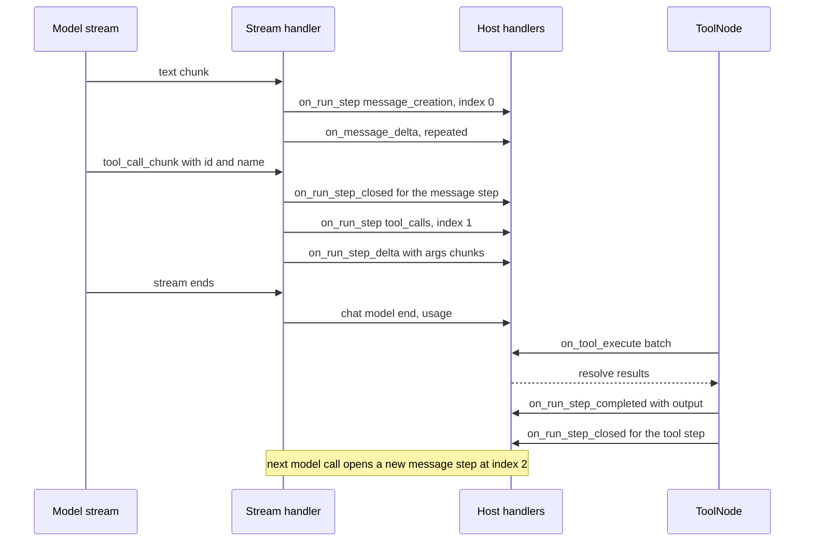
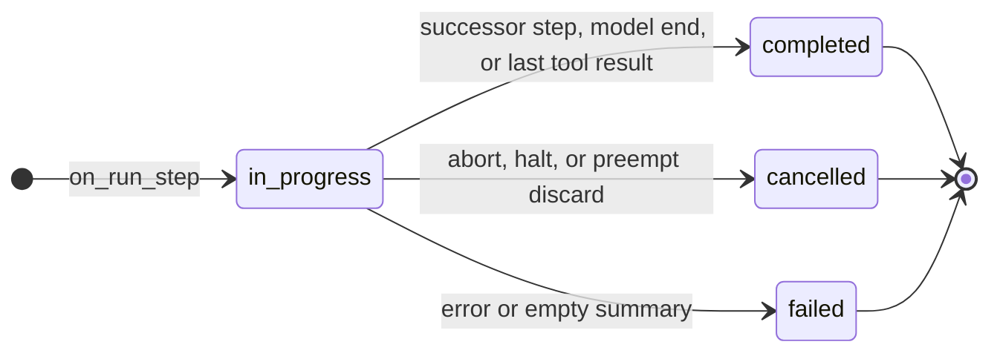
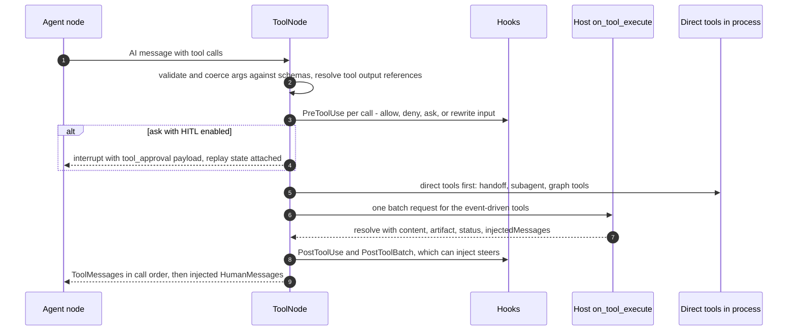
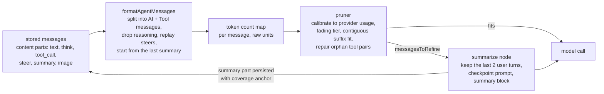

# @librechat/agents SDK Architecture

**English** · [中文](../zh/agents-sdk/README.md)

`@librechat/agents` ([LibreChat-AI/agents](https://github.com/LibreChat-AI/agents)) is the agent runtime
underneath every LibreChat chat. The LibreChat backend
([backend architecture](../README.md), section 9) authenticates a request, builds the agent configuration and
persists the result. The SDK takes it from there: it runs the LangGraph loop, streams the model output as
normalized events, executes tools, manages the context window, and pauses for human approval.

This document maps the SDK for a team rebuilding it in Python.

- **Snapshot:** `v3.9.3` (`2d5653d`). LibreChat `v0.8.8-rc4` pins `3.9.1`; the two are close enough for the
  architecture described here.
- **Size:** about 123k lines of non-test TypeScript in 346 files. On top of that there are about 62k lines of
  specs and scripts. It is built on `@langchain/core 1.2`, `@langchain/langgraph 1.4` and the LangChain
  provider packages.
- **How it was produced:** static reading of the source, docs, ADRs and specs. Nothing was run.
- **How to read it:** this page has the diagrams and the Python plan. The six reference chapters have
  field-level detail, with file paths.

| Reference chapter | Covers |
|---|---|
| [01 Run API and event contract](reference/01-run-api-events.md) | Exports, `RunConfig`, `processStream`/`resume`, every `GraphEvents` payload, ordering rules, content aggregation, OpenAI/Responses adapters, `AgentSession` |
| [02 Graphs, HITL, hooks](reference/02-graphs-hitl-hooks.md) | State channels, node topology, routing, multi-agent handoffs and fan-out, `AgentContext`, system-prompt assembly, approvals and replay, the hook catalog, preemption, event actors |
| [03 Tools](reference/03-tools.md) | `ToolNode`, the `on_tool_execute` host contract, validation, truncation, eager execution, built-in tools, the Code API, tool search, programmatic tool calling, web search, subagents |
| [04 LLM providers](reference/04-llm-providers.md) | Provider classes and quirks, the invocation path, retries and fallbacks, prompt caching per provider, stream limits, context-overflow recovery |
| [05 Messages and context](reference/05-messages-context.md) | `formatAgentMessages`, the state reducer, token counting, pruning, fading tiers, summarization and compaction |
| [06 Observability and layout](reference/06-observability-layout.md) | Langfuse and OTel tracing, built-in prompts, titles, ADRs, repo layout, module dependency map, porting order |

---

## Contents

1. [Where the SDK sits](#1-where-the-sdk-sits)
2. [Module map](#2-module-map)
3. [Run lifecycle](#3-run-lifecycle)
4. [Graph topology](#4-graph-topology)
5. [The agent node](#5-the-agent-node)
6. [Streaming event contract](#6-streaming-event-contract)
7. [Tool execution](#7-tool-execution)
8. [Human-in-the-loop, hooks and steering](#8-human-in-the-loop-hooks-and-steering)
9. [LLM provider layer](#9-llm-provider-layer)
10. [Messages and context management](#10-messages-and-context-management)
11. [Observability](#11-observability)
12. [Python porting plan](#12-python-porting-plan)

---

## 1. Where the SDK sits



The SDK does not persist messages, authenticate users or know about HTTP. It depends on the host for four things:

1. **Configuration:** `AgentInputs` per agent (provider, client options, instructions, tool definitions,
   token limits) plus the graph edges.
2. **Event handlers:** a `HandlerRegistry` that receives the normalized stream events. LibreChat forwards
   them to SSE and folds them into `message.content`.
3. **Tool execution:** in event-driven mode the model is bound to schema-only tools. The SDK sends each tool
   batch to the host as an `on_tool_execute` request and waits for the results.
4. **Checkpointer:** needed only for human-in-the-loop pauses, event actors and durable subagents.

## 2. Module map



| Directory | Non-test LOC | Role |
|---|---|---|
| `src/tools` | 38.2k | ToolNode (6.3k), subagents (7.5k), web search (7.0k), local engine (5.7k), Cloudflare (2.9k), code, PTC, tool search |
| `src/llm` | 20.4k | Patched provider classes (OpenAI 4.9k, Anthropic 3.4k, Bedrock 2.6k, Google 1.8k), invoke, fallbacks, preemption, limits |
| `src/messages` | 17.6k | `formatAgentMessages`, pruning, fading, cache markers, reducer, provenance, alternation |
| `src/graphs` | 8.4k | `Graph.ts` (6.2k), `MultiAgentGraph.ts`, handoff routing |
| `src/utils` | 6.3k | Token counting, tool-content compaction, truncation, overflow detection, title chains |
| `run.ts`, `stream.ts`, `events.ts` | 6.6k | Public facade, stream handler, content aggregator, handler registry |
| `src/types` | 5.0k | Shared types; the schema for a Python port |
| `src/langfuse*`, `instrumentation.ts` | 3.9k | Tracing |
| `src/session`, `src/eventActor` | 6.2k | Programmatic sessions, durable event actors |
| `src/summarization`, `src/hooks`, `src/agents`, `src/hitl` | 8.5k | Compaction, lifecycle hooks, per-agent context, approval helpers |

TypeScript tolerates directory-level cycles (llm ↔ messages, graphs ↔ tools, agents ↔ summarization); Python
does not. A port needs a strict dependency order:
common → types → utils → messages → llm → tools → agents → graphs → stream/summarization → run.
See [chapter 06 §2](reference/06-observability-layout.md).

## 3. Run lifecycle



- `processStream` supports a caller `AbortSignal`, cooperative **preemption** (seal the partial turn and
  continue), **stop continuations** (a Stop hook injects a follow-up), and a recursion limit (default 50,
  plus headroom for preemption seals).
- Title and label generation (`generateTitle`, `generateActivityLabel`, `generateReasoningLabel`) are separate
  small model calls on `Run` that emit no graph events.
- Token usage is not accumulated on `Run`. The host's `ModelEndHandler` collects `usage_metadata` from every
  `on_chat_model_end`; subagent usage arrives through `subagentUsageSink`.

## 4. Graph topology

### 4.1 Single agent



The state channels are:
- `messages`: an id-upsert reducer with a `__remove_all__` sentinel used by compaction;
- `summarizationRequest`;
- `runStepState`: a checkpointed sidecar of run-step ids and content indexes, so a resumed run keeps its step ids;
- `handoffState` (multi-agent only).

The outer workflow wraps each agent's subgraph as one node.

### 4.2 Multi-agent



- **Handoff edges** give the source agent `lc_transfer_to_<dest>` tools. A tool call returns
  `Command(goto=dest, graph=PARENT)`. Several handoffs in one batch become a parallel `Send` fan-out with a
  shared group id. The receiver sees the transfer stripped out, plus an optional routing instruction. Handoffs
  are capped by `maxHandoffs`.
- **Direct edges** are static. They support single-source edges, all-of joins (`[A, B] → C`), and prompt
  nodes that render `{results}` from this run's messages and can hide those results from the destination
  (`excludeResults`).
- **Agent identity** is carried on `RunStep.agentId`, and parallel lanes carry `groupId`. LibreChat uses these
  to render columns and to hide sequential outputs; the SDK itself has no `hide_sequential_outputs`.

## 5. The agent node



`AgentContext` builds the system prompt in two parts:
- a **stable** part: the multi-agent identity preamble, the instructions, and the programmatic tool-calling guide;
- a **dynamic** part: additional instructions and the cross-run conversation summary.

When the provider supports prompt caching, the stable part carries a cache breakpoint and the dynamic part
moves to a "dynamic tail" just before the last user message. Together with the tool, stable-prefix and
conversation-tail breakpoints, this keeps up to four cache breakpoints and holds cache hit rates up as the
conversation grows.

## 6. Streaming event contract

This is the contract the LibreChat frontend is built on, and it must be reproduced exactly.
[Chapter 01 §3](reference/01-run-api-events.md) has every payload field.

| Event | Emitted when | Payload core |
|---|---|---|
| `on_run_step` | A new message step starts (first content for a step key, a phase split, or a switch from reasoning to text), or a new tool-call step starts | `RunStep {id, type: message_creation or tool_calls, index, stepIndex, stepDetails, runId, agentId?, groupId?, status, created_at}` |
| `on_message_delta` | A text chunk arrives | `{id: stepId, delta: {content: [{type: text, text}]}}` |
| `on_reasoning_delta` | A reasoning chunk arrives. Every provider's shape is normalized to `think`. | `{id, delta: {content: [{type: think, think}]}}` |
| `on_run_step_delta` | A tool-argument chunk arrives. The host also sends MCP OAuth prompts on this event. | `{id, delta: {type: tool_calls, tool_calls: [{id, name, args, index}], auth?, expires_at?}}` |
| `on_run_step_completed` | A tool result is ready, or a summary is committed | `{result: {id, index, type: tool_call, tool_call: {id, name, args, output, progress: 1}}}` |
| `on_run_step_closed` | Exactly once per step: completed, cancelled or failed | `{id, index, type, status, closed_at}` |
| `on_tool_execute` | Event-driven tool batch. This one is an RPC to the host. | `{toolCalls, agentId, userId, configurable, resolve, reject, onResult?}` |
| `on_context_usage` | Before each model call | Token budget breakdown |
| `on_summarize_start` / `_delta` / `_complete` | Compaction | Summary progress and the final `summary` block |
| `on_subagent_update` | Child agent activity, wrapped with lineage | `{subagentRunId, subagentType, phase, data, ...}` |
| `on_agent_log` | Debug and diagnostic logging | `{level, scope, message}` |





- **Ordering rules.**
  - A step's deltas always follow its `on_run_step`.
  - Within one agent lane, the previous message step closes before the next one opens.
  - Content indexes are reserved synchronously, so parallel lanes never collide.
  - At the end of a run, every step still in progress is closed, except when the run paused for approval.
- **Content aggregation.** `createContentAggregator` folds these events into `contentParts[]`, which is exactly
  what LibreChat stores as `message.content`:
  - text and think parts concatenate;
  - tool-call args concatenate until a final update sets `output` and `progress: 1`;
  - summaries replace their slot.

  Port this function line for line.

## 7. Tool execution



- **Two execution modes.** In *direct* mode, LangChain tool instances run in process. In *event-driven*
  mode (LibreChat's default), the model sees schema-only definitions and the host runs each batch.
  Handoff, subagent and graph-managed tools always run directly.
- **Results.**
  - Outputs are truncated to `maxToolResultChars`, keeping 70% of the budget for the head and 30% for the tail.
  - Errors become `Error: ... Please fix your mistakes.` ToolMessages.
  - Artifacts pass through (`content_and_artifact`).
  - Code-session files are merged into a shared session map.
- **Eager execution.** The SDK can start a host tool call while the model is still streaming, once the
  call's arguments are sealed. If the final arguments differ from what was started, the SDK refuses to run the
  tool twice.
- **Built-in tools:**
  - `execute_code`, `bash_tool`, and programmatic tool calling (`run_tools_with_code` /
    `run_tools_with_bash`): sandbox code that calls other tools through a continuation loop on the Code API;
  - `tool_search`: BM25 discovery of deferred tools;
  - `web_search`: search, scrape and rerank with citation anchors;
  - `subagent`: spawns a child graph, in the foreground or detached;
  - `calculator`;
  - the `skill` and `read_file` definitions, which the host executes;
  - a local coding suite and a Cloudflare sandbox suite.
- **Code API contract** ([chapter 03 §4](reference/03-tools.md)):
  - `POST {base}/exec` with `{lang, code, args, files, session_id}` returns
    `{session_id, stdout, stderr, files, deleted_files}`.
  - `POST {base}/exec/programmatic` works with continuation tokens.
  - The base URL comes from `LIBRECHAT_CODE_BASEURL`, defaulting to `https://api.librechat.ai/v1`.
  - Auth headers are supplied by the host.

## 8. Human-in-the-loop, hooks and steering

- **Approvals.**
  - A `PreToolUse` hook decision of `ask` raises one LangGraph `interrupt()` per tool batch. The payload is
    `{type: tool_approval, action_requests, review_configs}`.
  - The resume value is a decision per call: `approve`, `reject`, `edit` (new input) or `respond` (a
    synthetic result). Missing or invalid decisions fail closed.
  - On resume LangGraph re-runs the ToolNode from the start. The SDK attaches replay records to the
    interrupt value, so sibling tools that already finished are not run again.
- **Ask the user.** `ask_user_question` / `ask_user_questions` interrupt with up to 4 questions, and resume
  with `{answer}` or `{answers}`.
- **Hooks.** A registry keyed by event, matched by glob or regex, with timeouts and one-shot matchers. The
  results fold as follows: `deny` beats `ask`, which beats `allow`; the last `updatedInput` wins; injected
  messages accumulate. The events are:
  - `RunStart`, `UserPromptSubmit`;
  - `PreToolUse`, `PostToolUse`, `PostToolUseFailure`, `PostToolBatch`, `PermissionDenied`;
  - `PreemptBoundary`;
  - `SubagentStart`, `SubagentStop`;
  - `Stop`, `StopFinalize`, `StopFailure`;
  - `PreCompact`, `PostCompact`.
- **Steering channels.** A user message sent mid-run can reach the model in three places:
  1. at a tool boundary, through `PostToolBatch` injected messages;
  2. mid-generation, when `preemption.shouldPreempt()` seals the partial turn and `PreemptBoundary` injects;
  3. at the end, when a `Stop` hook blocks and injects.

  Stored steers are `steer` content parts that `formatAgentMessages` replays as user turns.

## 9. LLM provider layer

| Provider | SDK class | Quirks the SDK handles |
|---|---|---|
| OpenAI, Azure | patched `ChatOpenAI` / `AzureChatOpenAI` with Completions and Responses delegates | Responses API routing, reasoning passthrough, explicit cache breakpoints, abortable fetch with SDK retries off, stream smoothing |
| Anthropic | `CustomAnthropic` | Vendored message conversion, thinking blocks and signatures, beta headers, assistant-prefill stripping, incremental usage, manual tool streaming |
| Bedrock | `CustomChatBedrockConverse` | Owns `ConverseStream`, cache points, inference profiles, guardrails, strict user/assistant alternation |
| Google, Vertex | patched `ChatGoogleGenerativeAI` / `ChatVertexAI` | Thought signatures, `thinkingConfig`, server-side tool parts, schema sanitizing |
| DeepSeek, xAI, Moonshot, OpenRouter, Mistral | subclasses | `reasoning_content` replay, `<think>` parsing, OpenRouter `reasoning_details`, strict alternation |

- `attemptInvoke` streams the model, feeds every chunk to the stream handler, and enforces stream limits
  (64 KiB of tool-call args by default).
  - On a context-length error it runs **overflow recovery**: it summarizes and retries under a corrected
    budget.
  - On other errors it tries the configured **fallback providers** in order.
- Custom providers can be added at runtime with `registerProvider({provider, model, family})`.

Details and every conversion quirk a port will hit: [chapter 04](reference/04-llm-providers.md).

## 10. Messages and context management



- **Formatting.** A stored assistant message with parts `[think, text + tool_call_ids, tool_call, steer, text]`
  becomes:
  - `AI(text, tool_calls)`
  - `Tool(output)`
  - `Human(steer)`
  - `AI(text)`

  Reasoning is dropped unless `preserveReasoningContent` is set (it is for DeepSeek). The token map is split
  across the derived messages by character length.
- **Token counting.** `o200k_base` for most models, a Claude vocabulary × 1.1 for Claude, 3 tokens per
  message, and image, PDF and audio estimators.
- **Calibration.** A ratio between provider-reported usage and local counts, clamped to [0.5, 5] and carried
  between runs.
- **Pruning** keeps a contiguous suffix within `maxContextTokens × 0.95` minus the instructions. It never starts
  on a tool message, reattaches Anthropic thinking blocks, and returns dropped messages as `messagesToRefine`.
- **Fading** truncates old tool results by a "latched" tier that only ever gets stricter, so the bytes stay
  identical from call to call and provider prompt caches keep hitting.
- **Summarization** triggers on a configurable token ratio, remaining tokens, or message count. It summarizes
  everything except a recency tail with a checkpoint-style prompt (Goal, Constraints, Progress, Decisions,
  Next Steps). It writes a `summary` content part with a `coverage.retainedFromMessageId` anchor, and gives
  up after 3 failures in a row.

The default checkpoint prompt text, the carrier format and 16 invariants to test are in
[chapter 05](reference/05-messages-context.md).

## 11. Observability

Tracing is optional. Langfuse is layered on OpenTelemetry:
- a dedicated tracer provider;
- deterministic trace ids (`sha256(runId)[:32]`), so feedback can be scored without a lookup;
- span shaping and redaction at export time;
- per-tenant routing to separate Langfuse destinations.

LangGraph control flow (interrupts, parent commands) is recorded as success, not as an error. The run names
(`AgentGraph`, `AgentModelCall`, ...) are part of the contract, because LibreChat imports them.
[Chapter 06](reference/06-observability-layout.md) covers this and the built-in label and title prompts.

## 12. Python porting plan

### 12.1 What LangGraph Python already gives you, and what you must write

| Area | Available in Python | Must be written |
|---|---|---|
| Graph runtime | `StateGraph`, `add_messages` + `RemoveMessage(REMOVE_ALL_MESSAGES)`, `Command(goto, graph=PARENT)`, `Send`, `interrupt`, `Command(resume=...)`, checkpointers, `durability="exit"` | Node wiring for `agent=`, `tools=`, `summarize=`; routing; the `runStepState` and `handoffState` channels |
| Streaming | `astream_events(v2)`, `get_stream_writer`, `adispatch_custom_event` | The chunk-to-`RunStep` state machine (step keys, reasoning transitions, lane closing), the content aggregator, and the ordering guarantees |
| Tools | `ToolNode`, `StructuredTool`, `langchain-mcp-adapters` | A custom ToolNode: event-driven host RPC with futures, hooks, HITL replay records, Send fan-out for handoffs, truncation, eager execution |
| Providers | `langchain-openai`, `-anthropic`, `-google-genai`, `-google-vertexai`, `-aws`, `-mistralai`, `-deepseek`, `-xai`, or litellm | Thinking and signature handling, cache markers, alternation coalescing, Responses API replay, usage normalization, fallback chain, overflow detection |
| Context | `trim_messages` (not sufficient) | `formatAgentMessages`, the calibrated pruner, fading tiers, orphan repair, the summarize node and prompts |
| HITL and hooks | `interrupt` | The hook registry and fold rules, the approval payload and decision validation, replay of settled siblings |
| Tracing | `langfuse` v3 (OTel-native), `opentelemetry-sdk` | Span shaping and redaction exporter, deterministic ids, tenant routing |

### 12.2 Package layout (acyclic)

```text
librechat_agents/
  common/         enums.py (GraphEvents, Providers, ContentTypes, StepTypes, Constants), constants.py
  types/          pydantic models: RunStep, deltas, content parts, ToolExecuteRequest/Result, hitl, RunConfig  (leaf)
  utils/          tokens.py, truncation.py, tool_content.py, errors.py (context overflow), misc.py
  messages/       format.py, reducer.py, prune.py, fading.py, cache.py, alternation.py, provenance.py, injected.py
  llm/            registry.py, init.py, invoke.py (attempt_invoke, fallbacks), preempt.py, stream_limits.py,
                  overflow.py, providers/{openai,anthropic,bedrock,google,vertexai,mistral,openrouter,deepseek,xai}.py
  tools/          tool_node.py, handlers.py, code_executor.py, bash.py, ptc.py, tool_search.py, calculator.py,
                  subagent/, search/, local/
  hooks/          registry.py, execute.py, matchers.py, policies.py
  hitl/           payloads.py, approval.py, ask_user.py
  agents/         context.py (AgentContext, system prompt, budgets), projection.py
  graphs/         base.py (step bookkeeping), standard.py, multi_agent.py, handoff.py, factory.py
  summarization/  trigger.py, node.py, prompts.py, semantic_index.py
  stream/         stream_handler.py, aggregator.py, registry.py (HandlerRegistry, ModelEndHandler, ToolEndHandler)
  run.py          Run: create, process_stream, resume, get_interrupt, generate_title
  observability/  langfuse/, otel.py (no-op when not configured)
  adapters/       openai_chat.py, responses.py
  session/, event_actor/   (late phases)
```

### 12.3 Porting order

| Phase | Scope | Done when |
|---|---|---|
| 0. Leaves | Enums, pydantic event and content models, token counter, truncation, overflow detection | The models round-trip recorded TypeScript event JSON unchanged |
| 1. Minimal loop | OpenAI + Anthropic providers, `formatAgentMessages`, AgentContext (instructions + tool binding), standard graph, event-driven ToolNode, stream handler, aggregator, `Run.process_stream` with abort | A LibreChat-shaped chat with tool calls produces byte-identical `contentParts` to the TypeScript SDK on recorded fixtures |
| 2. Production chat | Titles, pruner + calibration + fading, overflow recovery, summarization, fallbacks, remaining providers, prompt caching, basic Langfuse | Long conversations stay within budget and cache hit rates match |
| 3. Agent features | Multi-agent handoffs and fan-out, hooks, HITL approvals + resume with replay, subagents, tool search, PTC, code and web search tools, stream limits, preemption and steering | Approval, steer and handoff scenarios from the TypeScript specs pass |
| 4. Fidelity | Full trace shaping and tenant routing, activity and reasoning labels, semantic index, provenance invariant | Golden trace-shaping tests pass |
| 5. Advanced | Event actors, sessions, local and Cloudflare execution engines, OpenAI and Responses adapters | As needed |

### 12.4 How to de-risk it

- **Golden fixtures first.** Run the TypeScript SDK on a fixed set of conversations, using `FakeChatModel` and
  recorded provider streams. Record every handler event and the final `contentParts`, then make the Python port
  reproduce them exactly. `src/specs` (68 behavioral spec files) is a ready-made scenario list.
- **Optional sidecar bridge.** While the Python backend is being built, it can keep using the TypeScript SDK
  through a small Node sidecar. The sidecar exposes `process_stream` and `resume` over a socket and relays
  `on_tool_execute` batches back to Python. This lets the backend port and the SDK port ship independently.
  The event and `on_tool_execute` payloads are the protocol.
- **What to drop.** Mixed-version compatibility code, the `lazyRequire` source-mode machinery, the legacy
  supervisor and task-manager prompts, and the Cloudflare and local engines unless you need them.
- **Pitfalls** (collected from the chapters):
  - LangGraph Python also re-runs an interrupted node from the start, so port the replay records.
  - Every message needs an id before it leaves a node, or the id-upsert reducer duplicates it.
  - Capture `start_index` outside the reducers.
  - Never await inside the preemption-claim or once-matcher critical sections.
  - Keep the camelCase and snake_case field names exactly (`stepDetails`, `runId`, but `created_at`,
    `tool_call_ids`).
  - Break the directory cycles with Protocols.
