# LibreChat 后端架构

[English](../README.md) · **中文**

本文是 LibreChat 后端的全景图，从数据库一直讲到 HTTP API。它面向用 Python 重新实现后端的团队。前端（`client/`、`packages/client`）不在范围内，只有后端必须保持、前端所依赖的契约除外。

- **快照：** `v0.8.8-rc4`（`361553f`）。这个分支在上游 LibreChat 的基础上增加了大量功能：定时聊天、智能体事件触发器、排队轮次、子智能体、技能、附加代码环境、管理面板 API、洞察（insights）、Langfuse 链路追踪和多租户。
- **成文方式：** 静态阅读了 `api/`、`packages/api`、`packages/data-schemas` 和 `packages/data-provider` 中约 1,430 个非测试源文件。`@librechat/agents` 是基于 LangGraph 的智能体 SDK，它是来自另一个仓库的外部 npm 包（v3.9.1），有[单独的文档](agents-sdk/README.md)。
- **阅读方式：** 本页给出图示、设计决策和 Python 蓝图。每一节都链接到一个参考章节，其中包含文件路径、字段列表、环境变量和边界情况。

| 参考章节 | 内容 |
|---|---|
| [01 启动、配置与基础设施](reference/01-bootstrap-config-infra.md) | 启动顺序、全局中间件、`librechat.yaml`、配置覆盖、缓存、Redis、多租户、集群 |
| [02 认证与授权](reference/02-auth-authorization.md) | 令牌与 Cookie、各种登录流程、角色、能力（capability）、ACL、管理 API、API 密钥、余额 |
| [03 聊天与智能体管线](reference/03-chat-agent-pipeline.md) | 端到端聊天请求、SSE 事件、生成任务、中止与恢复、HITL、插话（steer）、OpenAI 兼容 API |
| [04 模型提供商与模型](reference/04-providers-models.md) | 端点类型、提供商配置构建器、模型列表、token 与定价、模型规格（modelSpec）、标题、语音 |
| [05 工具、MCP、Actions、技能](reference/05-tools-mcp-actions-skills.md) | 工具解析、MCP 连接与 OAuth、OpenAPI Actions、技能、Code API、网页搜索、记忆 |
| [06 文件、存储、对话](reference/06-files-storage-conversations.md) | 存储策略、上传流程、RAG 契约、保留期、对话、搜索、分享链接、提示词 |
| [07 数据模型](reference/07-data-model.md) | 全部 47 个集合的字段与索引、关系、数据访问方法、迁移 |
| [08 后台任务、可观测性、部署](reference/08-background-observability-deployment.md) | 后台循环、定时任务、触发器、排队轮次、级联删除、OTel、Langfuse、容器 |
| [09 HTTP API 清单](reference/09-http-routes.md) | 约 360 个路由，每个都列出方法、路径、中间件链和处理器 |

智能体运行时有单独的文档：[@librechat/agents SDK 架构](agents-sdk/README.md)，另附六个参考章节（运行 API 与事件契约、图与 HITL、工具、LLM 提供商、上下文管理、可观测性与移植顺序）。

---

## 目录

1. [系统上下文](#1-系统上下文)
2. [部署拓扑](#2-部署拓扑)
3. [代码组织与分层](#3-代码组织与分层)
4. [启动流程与请求管线](#4-启动流程与请求管线)
5. [配置系统](#5-配置系统)
6. [认证与会话](#6-认证与会话)
7. [授权与多租户](#7-授权与多租户)
8. [聊天生成管线](#8-聊天生成管线)
9. [智能体运行时](#9-智能体运行时)
10. [LLM 提供商与模型](#10-llm-提供商与模型)
11. [工具、MCP、Actions、技能与代码执行](#11-工具mcpactions技能与代码执行)
12. [文件、存储与 RAG](#12-文件存储与-rag)
13. [对话、消息、搜索与分享](#13-对话消息搜索与分享)
14. [余额与 token 计费](#14-余额与-token-计费)
15. [后台处理](#15-后台处理)
16. [缓存、Redis 与集群](#16-缓存redis-与集群)
17. [可观测性](#17-可观测性)
18. [数据模型](#18-数据模型)
19. [HTTP API 面](#19-http-api-面)
20. [Python 复刻蓝图](#20-python-复刻蓝图)

---

## 1. 系统上下文

LibreChat 只有一种 Node.js 进程类型：一个监听 3080 端口的 Express 服务器。它提供 REST API、SSE 流和构建好的 SPA。所有后台工作进程都运行在同一个进程内。没有独立的工作进程层，任何副本都可以执行任何任务。MongoDB 是所有持久状态的唯一数据源。Redis 是可选的；一旦副本多于一个，Redis 就是必需的。

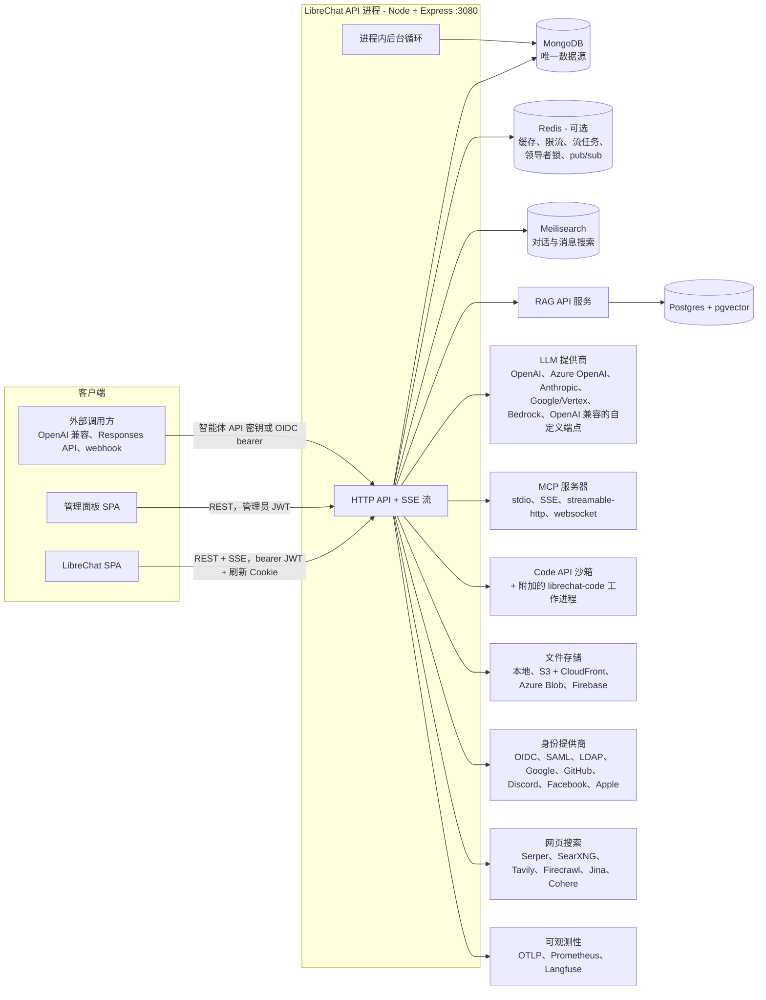

决定了其余一切的设计选择：

- **所有聊天都以智能体方式运行。** 一次普通的“和 GPT/Claude/Gemini 聊天”请求会变成一个*临时智能体*，与已保存的智能体走同一条 LangGraph 管线。只有旧版 OpenAI Assistants API 走单独的路径。
- **生成与 HTTP 解耦。** `POST /api/agents/chat` 启动一个后台生成任务，并立即返回 JSON。客户端通过 `GET /api/agents/chat/stream/:streamId`（SSE）以流式方式接收输出。流在页面重新加载后可以恢复，也可以从任意副本中止。
- **MongoDB 保存所有异步状态。** 定时任务、触发器投递和排队轮次都是带有比较并交换（CAS）租约的 Mongo 文档。Redis 只承担临时性的协调工作。
- **租户隔离放在数据层。** 一个 Mongoose 插件会给每个查询加上 `tenantId`，所用的 AsyncLocalStorage 上下文由 HTTP 中间件设置。

## 2. 部署拓扑

| 容器 | 镜像 | 端口 | 角色 |
|---|---|---|---|
| `api` | LibreChat（node:24 alpine） | 3080 | API、SSE、SPA 静态文件、所有后台循环 |
| `admin-panel` | librechat-admin-panel | 3000 | 独立的管理 SPA；调用 `api` |
| `client`（部署用 compose） | nginx | 80/443 | 反向代理 |
| `mongodb` | mongo 8 | 27017 | 主数据库。事务需要副本集。 |
| `meilisearch` | getmeili/meilisearch 1.35 | 7700 | 对话和消息的全文搜索 |
| `rag_api` | librechat-rag-api（Python/FastAPI） | 8000 | 向量化与检索服务 |
| `vectordb` | pgvector 0.8 / pg15 | 5432 | `rag_api` 的向量存储 |
| `redis` | redis / bitnami chart | 6379 | 副本多于一个时必需 |
| `langfuse-fanout-*` | Go 网关 + otel-collector | 4318/4319 | 可选的按租户 Langfuse 链路追踪路由 |

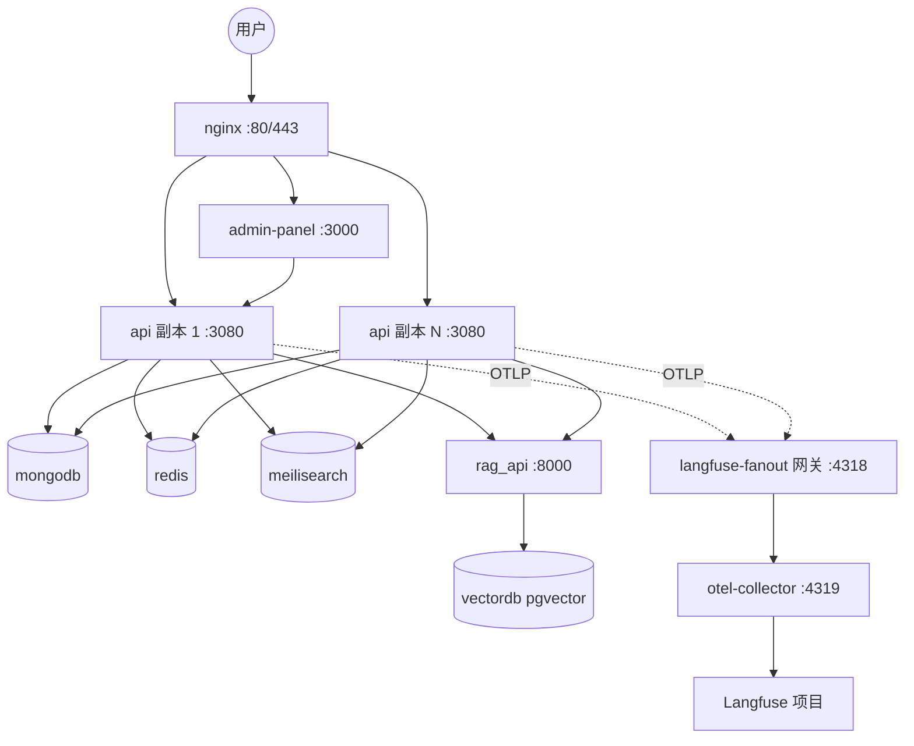

Helm chart（`helm/librechat`）以 N 个副本运行并配有 HPA，同时打包了 MongoDB、Meilisearch、Redis 和 RAG API。详见：[参考章节 08 §7](reference/08-background-observability-deployment.md)。

## 3. 代码组织与分层

| 工作区 | 语言 | 在后端中的角色 |
|---|---|---|
| `api/` | CommonJS JS | Express 装配（wiring）：`server/index.js`（启动）、`server/routes`、`server/middleware`、`server/controllers`、`server/services`（较老的服务）、`strategies/`（passport）、`app/clients`（旧版 `BaseClient`、工具清单） |
| `packages/api` | TypeScript | 新的后端行为：智能体、流式、端点、MCP、工具、文件、认证、定时任务、触发器、缓存、集群、配置服务 |
| `packages/data-schemas` | TypeScript | Mongoose schema（47 个模型）、数据访问层（`createMethods`）、租户插件、Meilisearch 插件、加密、日志 |
| `packages/data-provider` | TypeScript | 与前端共享的契约：zod `configSchema`、对话与预设 schema、枚举（端点、权限、缓存键、事件）、API 类型 |
| `@librechat/agents`（npm） | TypeScript | 基于 LangChain JS 和 LangGraph JS 的智能体 SDK：`Run`、图、提供商客户端、事件流、内容聚合、token 计数、裁剪与摘要、钩子、HITL、子智能体 |

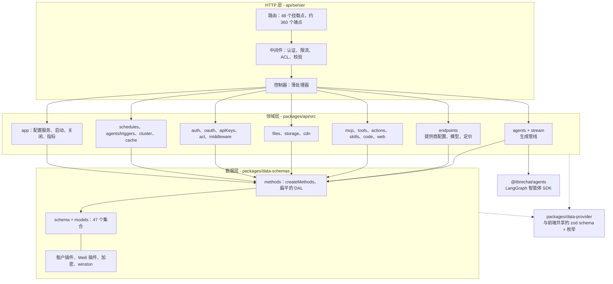

仓库的规则（`CLAUDE.md`）是：`/api` 只放装配代码，新行为放在 `packages/api`，并采用依赖注入构建——模块从调用方接收数据库方法、配置和客户端。这条规则可以直接映射到由 FastAPI 路由器、服务模块和仓储（repository）组成的 Python 布局。

## 4. 启动流程与请求管线

### 4.1 启动顺序（`api/server/index.js`）

1. 加载 `.env` 并引导密钥（`CREDS_KEY`、`CREDS_IV`、`JWT_SECRET`、`JWT_REFRESH_SECRET`）。缺失的会自动生成，旧版默认值会被拒绝。OpenTelemetry 在加载 Express、HTTP 和 Mongoose 之前启动。
2. 注册 47 个 Mongoose 模型（`createModels`），并构建数据访问函数集合（`createMethods`）。构建命名缓存（Keyv 命名空间）。
3. `startServer()`：
   - 等待 Redis。构建 Prometheus 指标。连接 Mongo。
   - 启动受领导者控制的代码环境协调器（reconciler）。启动 Meilisearch 同步（发出后不等待）。
   - 以系统身份初始化数据库：默认角色、访问角色、智能体分类、系统授权。
   - 将 `librechat.yaml` 加载为基础 `AppConfig`。初始化文件存储、部署插件和技能、GitHub 技能同步以及过期文件清理。
   - 执行启动检查，将 `interface.*` 标志同步到角色权限，并准备 `index.html`（CSP nonce）。
   - 挂载 `/health`、`/livez`、`/readyz`、全局中间件和所有路由器。
   - 配置 `GenerationJobManager`（Redis 或内存中的任务存储与事件传输）。
4. `app.listen()`。监听之后的步骤会初始化 MCP 服务器、OAuth 重连管理器和迁移检查，然后启动**智能体触发器引擎**和**定时任务引擎**。直到这时才设置 `serverReady = true`。在此之前，聊天 POST 请求和定时任务写入会收到 `503` 以及 `Retry-After: 1`。
5. 优雅关闭：一个关闭任务注册表，每个任务都有 `phase`（排空前或排空后）和 `priority`，并有 60 秒的硬性截止时间。生成任务在 HTTP 排空之前停止；缓存和导出器最后关闭。

### 4.2 全局中间件（按顺序）

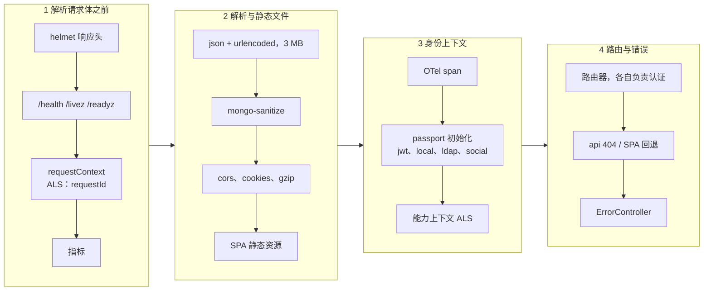

认证**不是**全局的。每个路由器自己应用 `requireJwtAuth`、`optionalJwtAuth` 或某个机器认证中间件。这些中间件同时也会设置租户 ALS 上下文。

### 4.3 聊天请求的中间件链

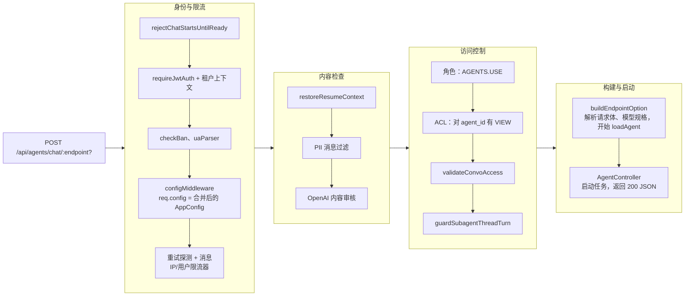

限流器（登录、注册、消息、上传、TTS/STT、工具调用等）使用带 Redis 存储的 `express-rate-limit`。超出限制会调用 `logViolation`，累加违规分数。当分数超过 `BAN_INTERVAL` 时，用户和 IP 会被封禁，其会话会被删除。完整列表：[参考章节 01 §3](reference/01-bootstrap-config-infra.md)。

## 5. 配置系统

配置有三个来源：环境变量（密钥和基础设施）、`librechat.yaml`（产品配置，由 `packages/data-provider/src/config.ts` 中的 zod `configSchema` 校验），以及按主体存储在 Mongo 中的**管理员覆盖**。

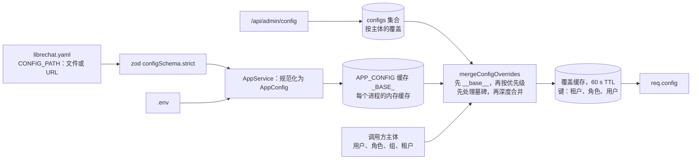

- YAML 顶层段落：`version`、`cache`、`interface`（UI 功能开关，同时驱动角色权限）、`registration`、`endpoints`（openAI、azureOpenAI、anthropic、google、bedrock、assistants、agents、custom[]、all）、`mcpServers`、`mcpSettings`、`modelSpecs`、`fileStrategy` 和 `fileStrategies`、`fileConfig`、`actions`、`balance`、`transactions`、`rateLimits`、`speech`、`ocr`、`webSearch`、`memory`、`summarization`、`skillSync`、`langfuse`、`filters` 和 `messageFilter`（PII）、`turnstile`、`openapi`。
- 覆盖以 `(principalType, principalId, tenantId)` 为键，携带 `priority`、`overrides`、`tombstones` 和 `isActive`。`filters` 只能出现在基础配置中，`langfuse` 只能在 `__base__` 上设置。
- 面向运维人员的新设置要加到 `configSchema` 中，并提供保持当前行为的默认值。在 Python 移植中，让 pydantic 配置模型作为唯一定义来保持这条规则。

详见：[参考章节 01 §4](reference/01-bootstrap-config-infra.md)。

## 6. 认证与会话

### 6.1 凭据模型

| 凭据 | 格式 | 有效期 | 存放位置 |
|---|---|---|---|
| 访问令牌 | 用 `JWT_SECRET` 签名的 HS256 JWT `{id, username, provider, email}` | `SESSION_EXPIRY`，默认 15 分钟 | 客户端内存，以 `Authorization: Bearer` 发送 |
| 刷新令牌 | 用 `JWT_REFRESH_SECRET` 签名的 HS256 JWT `{id, sessionId}` | `REFRESH_TOKEN_EXPIRY`，默认 7 天 | `refreshToken` Cookie（httpOnly，SameSite=strict）。`sessions` 存储 `sha256(token)`。 |
| `token_provider` Cookie | `librechat` 或 `openid` | 同上 | 选择刷新策略 |
| OpenID 令牌复用 | IdP 的 id/access/refresh 令牌 | 由 IdP 决定 | express-session（Redis）加上 `openid_user_id` 标记 Cookie |
| 2FA 临时令牌 | JWT `{userId, twoFAPending}` | 5 分钟 | 在密码步骤之后返回 |
| 智能体触发器令牌 | JWT `{id, scope:'agent_trigger'}` | 60 s | 触发器引擎发起的内部回环调用 |
| 智能体 API 密钥 | `sk-<64 hex>`，存储 `sha256` | 可选 TTL | 远程智能体 API（`/api/agents/v1/*`） |

### 6.2 登录与刷新

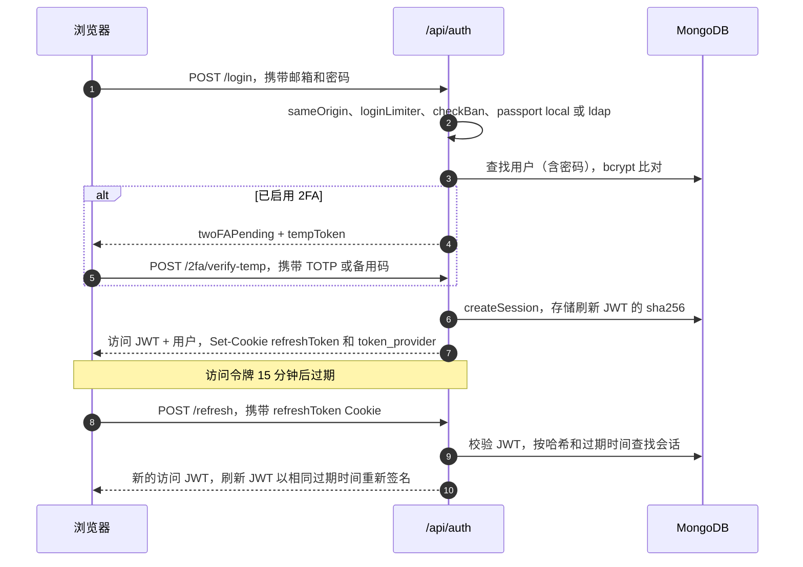

- **登录方式：** 本地（bcrypt）、LDAP（`ldapauth`）、社交 OAuth2（Google、GitHub、Discord、Facebook、Apple）、通用 OpenID Connect（PKCE、nonce、角色映射、角色同步、令牌复用、Entra 组同步、Microsoft OBO）以及 SAML。社交登录和 SAML 回调在设置 Cookie 后重定向到 SPA。管理面板使用一次性的**交换码 + PKCE** 流程。
- **注册：** 可选的邀请、域名白名单和邮箱验证（bcrypt 哈希的令牌，15 分钟）。未验证用户带有 7 天 TTL，到期自动删除。第一个用户成为 `ADMIN`。
- **2FA：** TOTP（RFC 6238，SHA-1，30 s，±1 步），另有 10 个 SHA-256 哈希的备用码。密钥以 `v3:` AES-256-CTR 加密存储。

所有流程、环境变量和边界情况：[参考章节 02](reference/02-auth-authorization.md)。

## 7. 授权与多租户

共有三种相互独立的授权机制，它们底下都还有一层租户作用域。

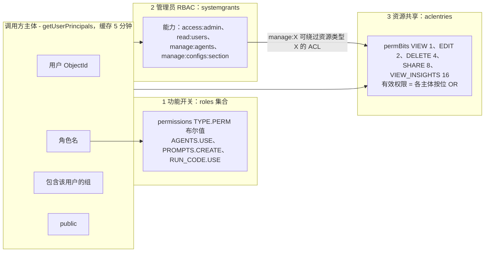

1. **角色权限**（`generateCheckAccess`）：`role.permissions[PermissionType][Permission]`。默认角色是 `ADMIN` 和 `USER`；允许自定义角色。17 种权限类型包括 PROMPTS、AGENTS、MEMORIES、BOOKMARKS、MULTI_CONVO、TEMPORARY_CHAT、RUN_CODE、WEB_SEARCH、FILE_SEARCH、FILE_CITATIONS、PEOPLE_PICKER、MARKETPLACE、MCP_SERVERS、REMOTE_AGENTS、SKILLS、SHARED_LINKS 和 SCHEDULES。
2. **系统能力**（`requireCapability`）：`systemgrants` 行，以（主体、能力、租户）为键。没有 `tenantId` 的授权适用于所有租户。`manage:X` 隐含 `read:X`。
3. **资源 ACL**（`canAccessResource`）：`aclentries` 行，以（主体、resourceType、resourceId）为键，带有 `permBits`。资源类型有 agent、remoteAgent、promptGroup、mcpServer、skill、codeEnvironment 和 sharedLink。创建者获得 `*_owner` 访问角色（15）。共享通过 `/api/permissions/:type/:id` 进行，需要 SHARE 权限位、角色的 `SHARE` 权限；要将资源设为公开，还需要 `SHARE_PUBLIC`。

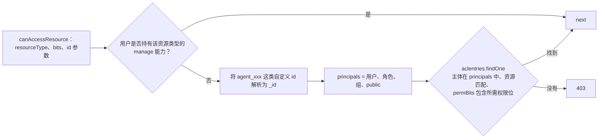

**多租户。** `tenantStorage`（AsyncLocalStorage）保存 `{tenantId, userId, requestId}`。`applyTenantIsolation` Mongoose 插件会：
- 把 `tenantId` 注入每个 find、update、delete 和 aggregate 过滤条件；
- 在插入时写入它；
- 拒绝任何修改它的尝试；
- 在严格模式（`TENANT_ISOLATION_STRICT`）下，拒绝没有租户上下文的查询。

`runAsSystem()` 为平台级任务绕过作用域限制。该策略在 `packages/data-schemas/src/tenant/policy.ts` 中以与存储引擎无关的方式编写，可以一对一地移植到 Python 的 `contextvars`。

## 8. 聊天生成管线

这是系统的核心，也是最难复刻的部分。详细讲解见[参考章节 03](reference/03-chat-agent-pipeline.md)。

### 8.1 端到端时序

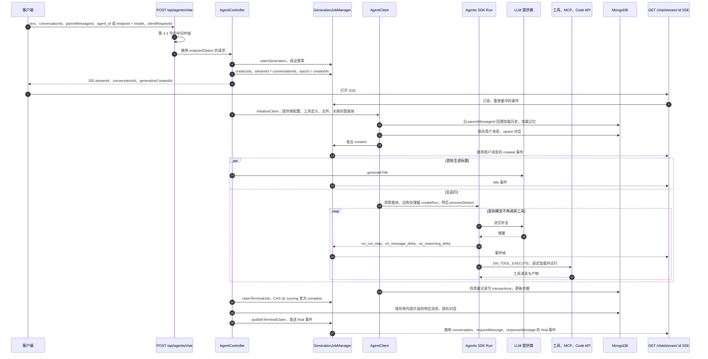

### 8.2 SSE 契约

每一帧都是 `event: message` + `data: <json>`，只有错误使用 `event: error`。负载如下：

| 帧 | 含义 |
|---|---|
| `{created:true, message}` | 用户消息已被接受。客户端渲染它。 |
| `{sync:true, resumeState}` | 重连（`?resume=true`）时的快照：运行步骤、聚合后的内容、待处理的动作 |
| `{event:'on_run_step', data: RunStep}` | 新的步骤。`message_creation` 或 `tool_calls`，带有 `index`、`stepId` 和 `agentId` |
| `on_run_step_delta` | 工具参数分块，以及 MCP 或 Action 的 OAuth 提示（`auth`、`expires_at`） |
| `on_run_step_completed` | 工具结果 `{tool_call:{id, name, args, output}}` |
| `on_message_delta` / `on_reasoning_delta` | 以步骤 id 为键的文本增量和思考增量 |
| `on_pending_action` | HITL：工具审批或 `ask_user_question` 负载 |
| `on_steer_applied`、`on_subagent_update`、`on_summarize_*`、`on_token_usage`、`on_context_usage`、活动与推理标签 | 高级功能 |
| `attachment` | 工具产生的文件、网页搜索结果、记忆更新和引用 |
| `title` | 生成的对话标题 |
| `{final:true, conversation, requestMessage, responseMessage}` | 终止帧。中止变体带有 `aborted:true`；协调（reconcile）变体告诉客户端重新获取数据。 |

SDK 的内容聚合器把这些事件折叠成 `contentParts[]`，存为 `message.content`。片段类型有 text、think、tool_call、image_file、summary、steer 和 agent_update。**前端严格依赖这套事件和内容片段契约。** 如果 Python 移植要为现有 SPA 提供服务，就必须产生完全相同的帧。

### 8.3 生成任务的生命周期

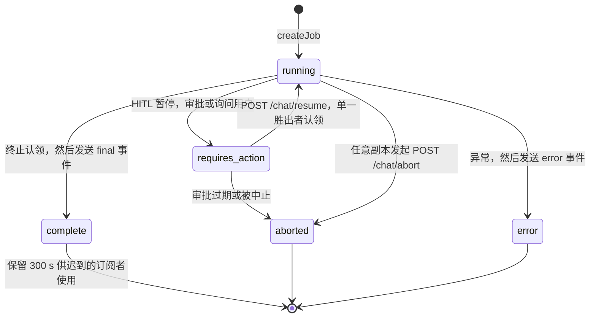

- **任务存储。** 在 Redis 模式下，一个任务是一个哈希 `stream:{id}:job` 加上一个 Redis Stream `stream:{id}:chunks`，后者是记录所有已发出事件的只追加日志。实时帧通过 pub/sub `stream:{id}:events` 传递，按序列号排序。状态变更由 Lua CAS 脚本完成。在内存模式下，一个早期事件缓冲区会暂存帧，直到第一个订阅者接入。
- **恢复。** 客户端调用 `GET /chat/status/:conversationId`，然后以 `resume=true` 重新接入。服务器通过重放分块日志重建聚合内容，在转为实时之前先发送一个 `sync` 帧。
- **中止。** `POST /chat/abort` 通过 CAS 将任务状态设为 aborted，并发布 `abort`。拥有该运行的副本调用 `AbortController.abort()`，从而取消 LangGraph 运行。请求方保存部分响应（`unfinished:true`），并发布中止版的 final 帧。
- **栅栏（fence）。** 任务的 `createdAt` 就是生成纪元（epoch）。每次发出事件、中止和持久化都携带它，因此被替换的生成无法覆盖其后继者的数据。只有一方（complete、abort、error 或 pause）能赢得终止 CAS，也只有这一方会发布终止帧。

### 8.4 持久化时机

1. 用户消息和对话 upsert 与生成并行进行。
2. 标题先被缓存（`GEN_TITLE`，2 分钟）并发出，然后通过只更新元数据的操作保存。
3. 响应消息（`content[]`、`tokenCount`、`attachments`、`contextMeta`、`unfinished`、`error`、`finish_reason`）在终止认领之后写入。
4. 用量变成 `transactions` 行，并更新余额。
5. 记忆更新来自单独的记忆智能体运行。
6. 只有在 HITL、询问用户或事件执行者（event actor）需要时，才会写入 LangGraph 检查点。
7. 断开连接、中止或暂停时，会以 `unfinished:true` 保存部分响应。

### 8.5 其他接入协议

- `POST /api/agents/v1/chat/completions` **兼容 OpenAI**：`model` 是智能体 id，流使用 `data: {chat.completion.chunk}` + `[DONE]`。`POST /api/agents/v1/responses` 是 **Open Responses API**，支持 `store` 和 `previous_response_id`。
- 两者都通过智能体 API 密钥或 OIDC bearer 认证，把请求包装为 `AgentRunEnvelope`，并直接调用 `createRun`。它们跳过可恢复的任务管理器和 HITL。
- `POST /api/agents/v1/events` 是事件驱动智能体的 **webhook 入口**（见[第 15 节](#15-后台处理)）。

## 9. 智能体运行时

`createRun`（`packages/api/src/agents/run.ts`）通过 `@librechat/agents` 构建 LangGraph 图。SDK 本身在单独的文档 [@librechat/agents SDK 架构](agents-sdk/README.md) 中讲解。本节介绍 LibreChat 如何使用它。

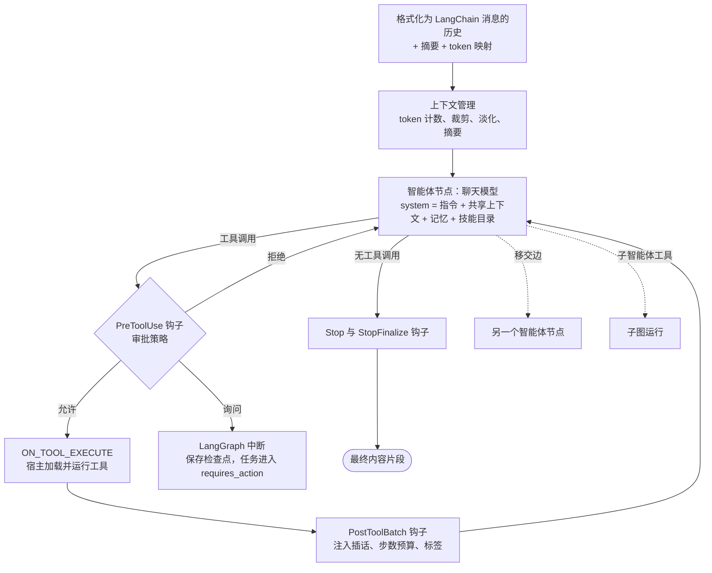

| 功能 | 作用 | 位置 |
|---|---|---|
| 临时智能体 | 把普通的“端点 + 模型”聊天变成一个合成的智能体，工具来自 UI 开关和模型规格 | `agents/load.ts` |
| 多智能体图 | `edges[]`，类型为 `handoff`（转移工具）或 `direct`（静态或并行扇出）。旧版 `agent_ids` 变成一条顺序链。“附加对话”（added convo）会并行运行第二个智能体。 | `agents/edges.ts`、`discovery.ts`、`added.ts` |
| 事件驱动的工具 | 图中只保存只有 schema 的工具定义。SDK 发出 `ON_TOOL_EXECUTE`，由宿主实例化并运行工具。推测式（“急切”）执行会在参数流式传输期间就开始运行。 | `agents/handlers.ts` |
| 上下文管理 | 带校准比例的 token 计数、裁剪到 `maxContextTokens`、旧工具结果的“淡化”（锁定的层级让提示缓存保持稳定），以及摘要/压缩（compaction）为 `summary` 片段 | `agents/compaction.ts`、`fading.ts` |
| HITL | 工具审批策略（allow、ask 或 deny 通配模式）和 `ask_user_question` 会触发 LangGraph `interrupt()`。检查点写入 Mongo（`agent_checkpoints`），运行通过 `Command(resume)` 恢复。 | `agents/hitl/*`、`checkpointer.ts` |
| 插话引导 | 运行中途的用户消息进入每个流各自的 FIFO，并在工具批次边界处注入。`preempt` 会封存（seal）模型流。 | `agents/steering/*`、`stream/SteeringLifecycle.ts` |
| 排队轮次 | 运行进行中发送的后续消息会持久存入 Mongo，在当前轮次结束后作为新轮次被接纳 | `agents/queuedTurns.ts` |
| 子智能体 | 一个 spawn 工具运行子图，可选择分离并在后台运行，带有持久的子线程和完成唤醒 | `agents/subagent*.ts` |
| 后台工具 | `run_in_background`：调用返回一个句柄，模型通过 `check_background_task` 轮询 | `agents/background.ts` |
| 记忆 | 已存储的记忆注入系统提示词。一个后台记忆智能体运行负责执行 `set_memory` / `delete_memory`。 | `agents/memory.ts` |

**Python 替代方案**是 LangGraph Python（`StateGraph`、`ToolNode` 或自定义执行器节点、`interrupt` + `Command(resume)`、`MongoDBSaver`）加上 LangChain 聊天模型或 litellm。需要新写代码的部分是一个**事件转换器**：它把 `astream_events(v2)` / `astream(stream_mode=[messages, updates, custom])` 的输出映射为 LibreChat 的 `RunStep` 和增量事件 schema，另外还需要一个内容聚合器。

## 10. LLM 提供商与模型

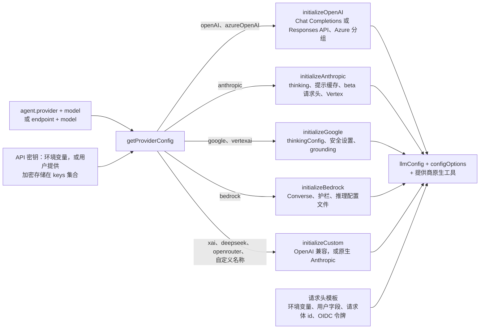

- **端点类型：** openAI、azureOpenAI、anthropic、google、bedrock、custom（YAML 中的一个列表）、agents，以及旧版的 assistants 和 azureAssistants。
- **模型列表：** `GET /api/models` 合并环境变量中的列表、从提供商 `/models` 拉取的结果（缓存 2 分钟）、YAML 默认值，以及在密钥由用户提供时按用户拉取的结果。OpenRouter 和 Helicone 的响应还带有定价和上下文大小。
- **token 与定价：** 静态表格记录上下文窗口（按最长子串匹配模型）和每 1M token 的美元价格，分为提示、补全、缓存读取、缓存写入以及高价长上下文档位。`endpointTokenConfig` 可覆盖这些表格。
- **模型规格：** YAML 中精选的预设（`modelSpecs.list`）。设置了 `enforce` 时，请求体会被规格预设替换。`promptPrefix` 这类私有字段永远不会发送给客户端。
- **标题：** 单独的一次小型补全，在首轮并行运行，超时时间为 45 s。模型可配置（`titleModel`、`titleEndpoint`、`titleMethod`）。
- **语音：** STT 使用 OpenAI 或 Azure Whisper；TTS 使用 OpenAI、Azure、ElevenLabs 或 LocalAI。

各提供商的完整参数映射：[参考章节 04](reference/04-providers-models.md)。

## 11. 工具、MCP、Actions、技能与代码执行

### 11.1 工具解析

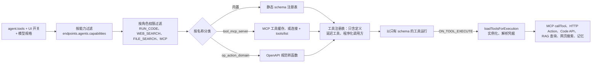

| 类别 | 工具名 | 执行方式 |
|---|---|---|
| 内置插件 | `google`、`dalle`、`flux`、`wolfram`、`tavily_search_results_json`、`image_gen_oai`、`gemini_image_gen`、`calculator` | LangChain 工具类；凭据来自环境变量或按用户加密存储的 `pluginauths` |
| MCP | `<tool>_mcp_<server>` | MCP 客户端会话（按应用、按用户或按请求） |
| Actions | `<operationId>_action_<domain>` | 根据存储的 OpenAPI 规范构建 HTTP 调用（API 密钥或 OAuth2） |
| 代码 | `execute_code`、`bash_tool`、`read_file`、`search_workspace`、`list_workspace_files`、`bash_programmatic_tool_calling` | 外部 Code API（`/exec`、`/upload`、`/download`、`/workspace-tools/execute`） |
| 文件 | `file_search`、`create_file`、`edit_file` | RAG API `/query`；代码工作区 |
| 网页 | `web_search` | 搜索提供商，然后抓取器，然后重排序器 |
| 技能 | `skill` | 返回 SKILL.md 正文，并把附带文件放入沙箱 |
| 记忆 | `set_memory`、`delete_memory` | `memoryentries` |
| 发现 | `tool_search` | 在本地注册表中搜索延迟工具 |
| HITL | `ask_user_question` | LangGraph 中断 |

### 11.2 MCP

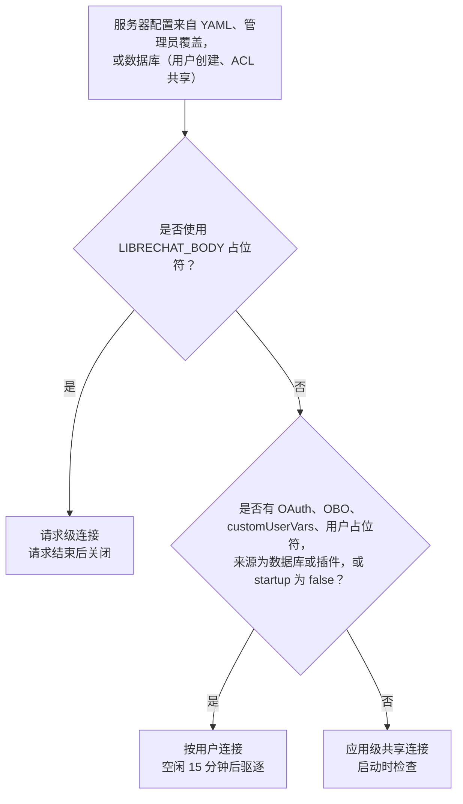

MCP OAuth 是一个阻塞式流程，聊天流会把它呈现给用户：

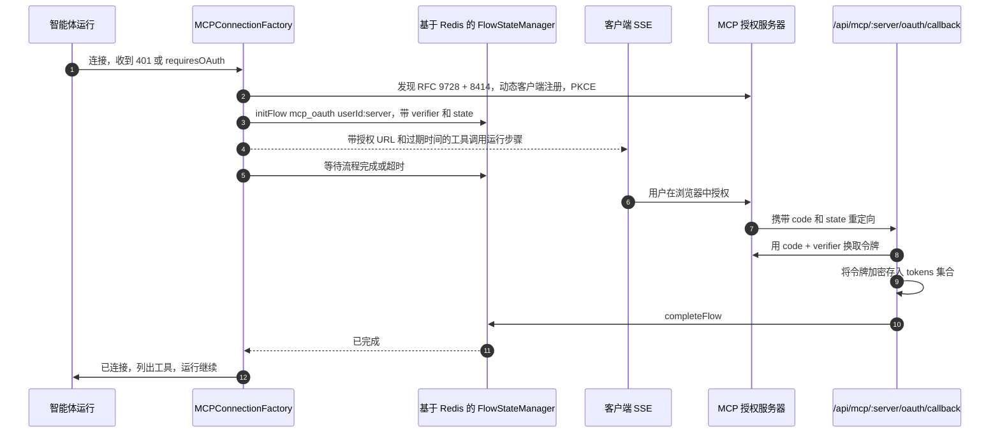

### 11.3 Actions、技能、代码与网页搜索

- **Actions：** OpenAPI 规范存储在 `actions.metadata.raw_spec` 中。客户端域名必须与规范中的服务器 URL 一致，并且必须通过域名和 IP 白名单（SSRF 防护）。每个操作变成一个函数工具。密钥以 AES 加密。OAuth Action 使用同一套流程机制，并使用 state JWT。
- **技能：** SKILL.md 正文 + frontmatter + 附带文件，通过 ACL 共享。来源有内联、`.zip` 导入、部署目录、插件或 GitHub 同步。模型调用 `skill` 工具，文件会被预置到沙箱的 `/mnt/data/skills/<name>/` 下。
- **Code API 契约：** `POST /exec {lang, code, args, session_id, files}` 返回 `{stdout, stderr, session_id, files}`。另外还有 `POST /upload`、`/upload/batch`、`GET /download/:session/:file` 和 `POST /workspace-tools/execute`。有状态会话的作用域可以是按用户、按智能体-用户或按对话。附加环境是用户自己的机器，运行 `librechat-code` 工作进程，位于 Code API 桥接之后。
- **网页搜索：** 每个类别使用第一个已配置的提供商，密钥来自环境变量或用户。使用防 SSRF 的 HTTP agent，结果以 `web_search` 附件的形式流式发送给客户端，并带有引用锚点。

详见：[参考章节 05](reference/05-tools-mcp-actions-skills.md)。

## 12. 文件、存储与 RAG

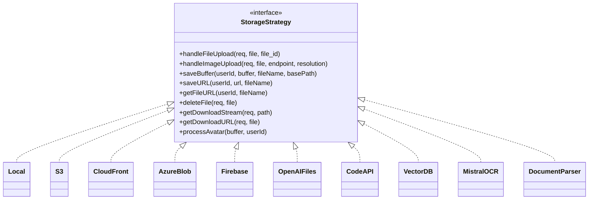

`getStrategyFunctions(source)` 根据 `FileSources` 值返回对应的实现。头像、图片、文档或技能各用哪种存储，由 `fileStrategy` / `fileStrategies` 决定。

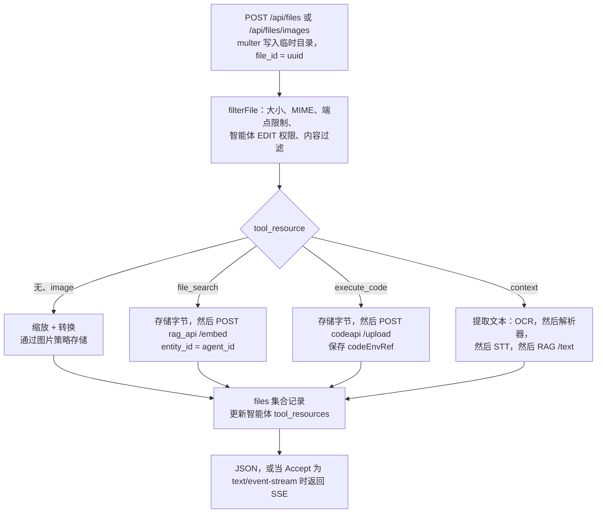

- **RAG API 契约。** 每次调用都携带一个 5 分钟有效、用共享的 `JWT_SECRET` 签名的 HS256 JWT `{id}`。
  - `POST /embed`（multipart：`file_id`、`file`、`entity_id`）返回 `{status, known_type}`。
  - `POST /query {file_id, query, k, entity_id}` 返回 `[[{page_content, metadata}, distance]]`。
  - `POST /text`、`DELETE /documents [ids]`、`GET /health`。
- **生命周期。**
  - `expiresAt` 是针对从未被使用的上传文件的 1 小时 TTL。一旦有消息使用了该文件，它就会被清除。
  - `expiredAt` 是从对话继承而来的保留期截止时间。只在领导者上运行的每小时清理任务会把这些文件从存储、向量数据库和 Code API 中删除，并带有退避。

详见：[参考章节 06 §1-4](reference/06-files-storage-conversations.md)。

## 13. 对话、消息、搜索与分享

- **树模型。** 对话是一条头部记录，预设字段平铺在其中。消息通过 `parentMessageId` 构成一棵树；根的父 id 是 `00000000-0000-0000-0000-000000000000`。兄弟节点是重新生成或编辑的结果，发送给模型的历史是从所选叶子到根的路径。
- **分页。** 键集游标：`base64(JSON{primary, secondary, id})`，每次取 `limit+1` 条，用于对话（按 title、createdAt、updatedAt 或 archivedAt 排序）和消息（按 createdAt）。
- **操作：** 归档、置顶、打标签（带计数的书签）、移动到项目、复制、分叉（直接路径、包含分支或目标层级，并重新映射 id）、导入（ChatGPT、Claude、ChatbotUI 和 LibreChat JSON）、反馈（同时作为评分发送到 Langfuse）以及删除。删除会级联：先排空生成、取消子智能体，然后删除消息、工具调用、分享和检查点。
- **搜索。** Conversation 和 Message 模型上的 Meilisearch 插件在保存后写入 Meili，并使用版本 CAS。启动时的 `syncWithMeili` 负责回填。每个查询都按 `user` 过滤。
- **分享链接。** `sharedlinks` 保存消息 id 和文件快照组成的快照，带有 nanoid 生成的 `shareId`。访问通过 ACL 控制（PUBLIC 主体表示允许匿名访问）。分享输出会把 id 替换为匿名 id。
- **同样在这里：** 提示词（带生产版本和斜杠命令的分组，通过 ACL 共享）、预设、项目（带反范式化统计的文件夹）、收藏、横幅和洞察（实时 Mongo 聚合）。

详见：[参考章节 06 §5-6](reference/06-files-storage-conversations.md)。

## 14. 余额与 token 计费

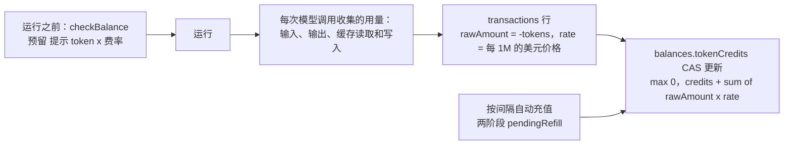

- 1 credit 等于 $0.000001，因此以“美元每 1M token”表示的费率恰好等于“credit 每 token”。费率按以下顺序查找：`endpointTokenConfig`，然后是高价长上下文档位，然后是 `tokenValues` 表，最后是默认值 6。
- 被中止的补全按 1.15× 计费。提示缓存把提示费用拆分为输入、缓存写入和缓存读取。
- 余额默认关闭（`balance.enabled`）。只要余额开启，就会记录交易。

详见：[参考章节 02 §7](reference/02-auth-authorization.md)。

## 15. 后台处理

每个副本都运行所有循环。重复执行通过 **Mongo CAS 租约**（定时任务、触发器投递、排队轮次）或 **Redis 领导者锁**（文件清理、代码环境协调器、MCP 注册表写入）来避免。

| 循环 | 周期 | 防护 | 任务 |
|---|---|---|---|
| 定时任务引擎 | 30 s + 抖动，每 4 次 tick 协调一次 | `schedules` 上的 Mongo 租约 | 认领到期的定时任务，并通过触发器队列触发 |
| 智能体触发器引擎 | 1 s，空闲时退避到 15 s；入队时唤醒 | `agenttriggerdeliveries` 上的 Mongo CAS 租约 | 以回环 `POST /api/agents/chat/agents` 或 `/steer/deliver` 分发投递 |
| 触发器维护 | 30 s | 幂等 | 恢复通道发布、用户清除、批次 |
| 排队轮次恢复 | 30 s | Mongo 租约 | 重新发布唤醒，协调接纳状态 |
| 生成任务清理 | 60 s | 按存储 | 回收陈旧任务和过期审批 |
| 文件保留期清理 | 1 h | 领导者 | 在所有位置删除过期文件 |
| 代码环境协调器 | 60 s | 领导者 | 工作进程撤销租约 |
| GitHub 技能同步 | 60 min | Mongo 锁 | 从 GitHub 镜像技能 |
| 领导者选举 | 每 10 s 续约，租约 25 s | Redis `SET NX EX` | 单一领导者 |
| Meilisearch 同步 | 启动时 | 流程锁 | 回填搜索索引 |

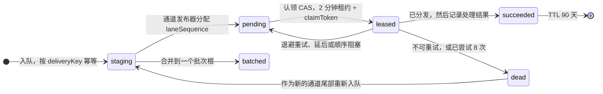

- **触发器投递**（见上图）是一个持久的、与来源无关的智能体轮次发件箱（outbox）。它承载定时任务、webhook、子智能体完成、后台工具完成和排队轮次。每个顺序通道（lane）都是严格的 FIFO：后来的事件不能越过尚未结束的先前事件。
- **ScheduleRun** 状态：`started`，然后是 `requires_action`、`success`、`error` 或 `interrupted`，或者跳过（`skipped_overlap`、`skipped_balance`）。`{scheduleId}` 上带 `status: started` 条件的唯一部分索引保证每个定时任务只有一个活动运行。唯一的部分索引 `capacitySlot` 在数据库内部实施全局并发限制。
- **账户删除**受栅栏保护：设置 `agentTriggerDeletionStartedAt`，排空投递、子智能体、定时任务和生成，按顺序删除约 25 个集合，然后清除触发器数据。

详见：[参考章节 08](reference/08-background-observability-deployment.md)。

## 16. 缓存、Redis 与集群

| 关注点 | 使用 Redis | 不使用 Redis |
|---|---|---|
| 命名缓存（`CacheKeys`：ROLES、APP_CONFIG、TOOL_CACHE、MODEL_QUERIES、TOKEN_CONFIG、GEN_TITLE、FLOWS、ABORT_KEYS、USER_PRINCIPALS……） | 基于 Redis 的 Keyv，命名空间为 `PREFIX::NS:key`。`APP_CONFIG` 和 `CONFIG_STORE` 默认保留在内存中。 | 内存中的 Keyv，带 30 s 清理器 |
| 违规与封禁 | 基于 Redis 的违规分数；封禁存放在基于 Mongo 的 Keyv 中 | JSON 文件 + Mongo |
| 限流 | `rate-limit-redis` | 进程内 |
| 会话（OIDC、SAML） | `connect-redis` | `memorystore` |
| 生成流 | `RedisJobStore` + pub/sub 传输 | 内存中 |
| 领导者 | `SET LeadingServerUUID NX EX 25` + Lua 续约 | 始终是领导者 |
| OAuth 与流程等待 | 基于 Redis Keyv 的 FlowStateManager | 内存中 |

其余内容（TLS、集群模式、心跳、READONLY 恢复）：[参考章节 01 §5-6](reference/01-bootstrap-config-infra.md)。

## 17. 可观测性

- **日志：** Winston，错误和调试日志文件按天轮转，控制台输出 JSON，支持脱敏，并从 ALS 获取请求上下文（请求 id、租户、用户）。
- **指标：** Prometheus，位于 `/metrics`，使用 bearer `METRICS_SECRET`。覆盖 HTTP、SSE 流、生成任务、Mongo 和 Redis 操作、上传以及智能体启动延迟。
- **链路追踪：** OpenTelemetry NodeSDK（HTTP、Express、Mongo、Undici、IORedis），以 OTLP 导出。浏览器 RUM 通过 `/api/rum` 代理。
- **LLM 链路追踪：** Langfuse，按租户配置，使用确定性的 trace id `sha256(runId)`。用户反馈会成为 Langfuse 评分。`/api/traces/:conversationId` 向对话所有者展示链路追踪。

## 18. 数据模型

共 47 个 Mongoose 模型。几乎所有模型都带有 `tenantId`，它们的唯一索引也都与之组合。`user` 外键在 Conversation、Message、ConversationTag、SharedLink、Preset、ChatProject 和 PluginAuth 中是**字符串**，在其他大多数集合中是 **ObjectId**。如果 Python 移植需要读取现有数据，就要保留这个差异。

### 18.1 身份与访问

```mermaid
erDiagram
  User ||--o{ Session : "user"
  User ||--o{ Token : "userId"
  User ||--o| Balance : "user"
  User ||--o{ Transaction : "user"
  User ||--o{ Key : "userId"
  User ||--o{ PluginAuth : "userId"
  User ||--o{ AgentApiKey : "userId"
  Role ||--o{ User : "User.role = Role.name"
  Group }o--o{ User : "memberIds"
  AccessRole ||--o{ AclEntry : "roleId"
  User ||--o{ AclEntry : "主体为 user"
  Group ||--o{ AclEntry : "主体为 group"
  Role ||--o{ AclEntry : "主体为 role"
  User ||--o{ SystemGrant : "主体"
  Role ||--o{ SystemGrant : "主体"
  Role ||--o{ Config : "主体，含 __base__"
  User ||--o{ RefreshTokenBridge : "userId"
  User {
    ObjectId _id
    string email
    string role
    string provider
    boolean twoFactorEnabled
    date expiresAt
    string tenantId
  }
  Session {
    ObjectId user
    string refreshTokenHash
    date expiration
  }
  AclEntry {
    string principalType
    mixed principalId
    string resourceType
    ObjectId resourceId
    int permBits
  }
  SystemGrant {
    string principalType
    mixed principalId
    string capability
    string tenantId
  }
  Balance {
    ObjectId user
    number tokenCredits
    array reservations
  }
  Transaction {
    ObjectId user
    string conversationId
    string tokenType
    number rawAmount
    number rate
    number tokenValue
  }
```

### 18.2 聊天

```mermaid
erDiagram
  User ||--o{ Conversation : "user，字符串类型"
  Conversation ||--o{ Message : "conversationId"
  Message ||--o{ Message : "parentMessageId"
  Conversation ||--o{ Conversation : "subagentThread 父对话"
  ChatProject ||--o{ Conversation : "chatProjectId"
  ConversationTag }o--o{ Conversation : "tags"
  Conversation ||--o{ SharedLink : "conversationId"
  SharedLink }o--o{ Message : "消息快照"
  Message ||--o{ ToolCall : "messageId"
  Conversation ||--o{ File : "conversationId"
  Conversation ||--o{ AgentQueuedTurn : "conversationId"
  User ||--o{ Preset : "user"
  Conversation {
    string conversationId
    string user
    string title
    string endpoint
    string model
    string agent_id
    array messages
    array tags
    boolean isArchived
    date expiredAt
  }
  Message {
    string messageId
    string conversationId
    string parentMessageId
    string sender
    boolean isCreatedByUser
    string text
    array content
    int tokenCount
    boolean unfinished
    boolean error
  }
  SharedLink {
    string shareId
    string conversationId
    string targetMessageId
    array fileSnapshots
  }
```

### 18.3 智能体、工具与内容

```mermaid
erDiagram
  User ||--o{ Agent : "author"
  Agent ||--o{ Agent : "edges.to"
  AgentCategory ||--o{ Agent : "category"
  Agent }o--o{ Action : "actions"
  Agent }o--o{ MCPServer : "mcpServerNames"
  Agent }o--o{ Skill : "skills"
  Agent }o--o| CodeEnvironment : "code_environment_id"
  Agent }o--o{ File : "tool_resources file_ids"
  Skill ||--o{ SkillFile : "skillId"
  User ||--o{ MemoryEntry : "userId"
  Agent ||--o{ MemoryEntry : "按 agentId 分区"
  PromptGroup ||--o{ Prompt : "groupId"
  PromptGroup ||--|| Prompt : "productionId"
  User ||--o{ File : "user"
  User ||--o{ Assistant : "user"
  Agent {
    string id
    string provider
    string model
    string instructions
    array tools
    mixed tool_resources
    array edges
    array versions
    ObjectId author
  }
  File {
    string file_id
    ObjectId user
    string source
    string context
    string filepath
    boolean embedded
    date expiresAt
    date expiredAt
  }
  MCPServer {
    string serverName
    mixed config
    ObjectId author
  }
```

### 18.4 定时任务与触发器

```mermaid
erDiagram
  User ||--o{ Schedule : "user"
  Agent ||--o{ Schedule : "agent_id"
  Schedule ||--o{ ScheduleRun : "scheduleId"
  ScheduleRun }o--o| AgentTriggerDelivery : "deliveryKey"
  ScheduleRun }o--o| Conversation : "conversationId"
  AgentTriggerLaneSequence ||--o{ AgentTriggerDelivery : "orderingKey"
  AgentTriggerDelivery ||--o{ AgentTriggerDelivery : "批次成员"
  AgentQueuedTurnSequence ||--o{ AgentQueuedTurn : "通道"
  AgentQueuedTurn }o--|| AgentTriggerDelivery : "deliveryKey 唤醒"
  User ||--o| AgentTriggerUserPurge : "_id"
  Schedule {
    string id
    object cadence
    string timezone
    date nextRunAt
    date leaseUntil
    string claimToken
    boolean enabled
  }
  ScheduleRun {
    string scheduleId
    date scheduledFor
    string status
    int capacitySlot
    date settledAt
  }
  AgentTriggerDelivery {
    string deliveryKey
    string orderingKey
    int laneSequence
    string status
    mixed envelope
    int attempts
    date leaseUntil
  }
```

### 18.5 集合清单

| 领域 | 集合 |
|---|---|
| 身份与访问 | users、sessions、tokens、roles、groups、accessroles、aclentries、systemgrants、auditlogs（哈希链、只追加）、keys、pluginauths、agentapikeys、balances、transactions、refreshtokenbridges、openidrefreshflights |
| 聊天 | conversations、messages、conversationtags、sharedlinks、presets、toolcalls、chatprojects、agentqueuedturns、agentqueuedturnsequences |
| 智能体与工具 | agents、agentcategories、actions、assistants、mcpservers、memoryentries、toolfavorites、skills、skillfiles、skillsynccredentials、skillsyncstatuses、codeenvironments |
| 文件与提示词 | files、promptgroups、prompts |
| 定时任务与触发器 | schedules、scheduleruns、agenttriggerdeliveries、agenttriggerlanesequences、agenttriggeruserpurges |
| 配置与 UI | configs、banners |
| 不在模型注册表中 | `agent_checkpoints` 和 `agent_checkpoint_writes`（LangGraph）、`keyv`（基于 Mongo 的缓存）、`librechatCredentialMetadata`、`mcp_authorization_fence_retries`、`code_environment_tombstones` |

所有字段、索引、TTL、方法和迁移：[参考章节 07](reference/07-data-model.md)。

## 19. HTTP API 面

48 个挂载点上共约 360 个端点。最大的几组：

| 前缀 | 认证 | 用途 |
|---|---|---|
| `/api/auth`、`/oauth` | 公开或 JWT | 登录、注册、刷新、登出、2FA、密码重置、社交/OIDC/SAML 回调 |
| `/api/agents` | JWT | 智能体 CRUD 与版本、工具、Actions、聊天（启动、流、状态、中止、恢复、插话、排队轮次） |
| `/api/agents/v1/*` | API 密钥、OIDC、M2M OIDC | OpenAI 兼容的聊天补全与模型、Responses API、事件入口、智能体与技能管理 |
| `/api/convos`、`/api/messages` | JWT | 对话与消息 CRUD、分叉、导入、归档、反馈、子智能体线程 |
| `/api/files` | JWT | 上传、图片、头像、下载、语音（STT/TTS）、代码下载 |
| `/api/mcp` | JWT | MCP 服务器 CRUD、连接状态、重新初始化、OAuth 发起与回调 |
| `/api/prompts`、`/api/skills`、`/api/memories`、`/api/tags`、`/api/presets`、`/api/projects`、`/api/share`、`/api/schedules` | JWT | 各功能的 CRUD |
| `/api/permissions`、`/api/roles` | JWT | 共享 ACL、角色权限 |
| `/api/admin/*` | JWT + `access:admin` | 管理员登录交换、配置覆盖、用户、角色、组、授权、审计日志、技能同步、Langfuse、代码环境 |
| `/api/config`、`/api/endpoints`、`/api/models`、`/api/banner`、`/api/balance`、`/api/user`、`/api/keys`、`/api/api-keys` | JWT 或可选 | 启动配置、端点与模型目录、用户设置、用户提供的密钥 |
| `/health`、`/livez`、`/readyz`、`/metrics`、`/api/openapi.json` | 公开或 bearer | 运维 |

每个路由及其中间件链和处理器：[参考章节 09](reference/09-http-routes.md)。

---

## 20. Python 复刻蓝图

### 20.1 技术映射

| Node / LibreChat 组件 | Python 选择 |
|---|---|
| Express 路由器 + 中间件链 | 每个前缀一个 **FastAPI** `APIRouter`。中间件链变成 `Depends(...)` 链；全局关注点变成 Starlette 中间件。 |
| `librechat.yaml` zod schema | **pydantic v2** 模型（`extra='forbid'`）+ 用于环境变量的 **pydantic-settings**。YAML 使用 `ruamel.yaml` 或 PyYAML。 |
| Mongoose + data-schemas 方法 | **PyMongo async / Motor**，配合 **Beanie** 或放在仓储类后面的普通 pydantic 文档。每个 CAS 或租约都用原生的 `find_one_and_update`。 |
| 租户插件 + AsyncLocalStorage | `contextvars.ContextVar` + 一个 `TenantScopedCollection` 包装器（过滤条件、写入租户、`$set` 防护、`aggregate` `$match`），再加上 `run_as_system()` |
| passport 策略 | **PyJWT**、**authlib**（OAuth2/OIDC、PKCE）、**ldap3**、**python3-saml**、**passlib/bcrypt**（cost 10）、**pyotp** |
| `@librechat/agents`（LangGraph JS） | **langgraph** + **langchain-core** + 各提供商包（`langchain-openai`、`-anthropic`、`-google-genai`/`-vertexai`、`-aws`），或 **litellm**。事件转换器和内容聚合器需要自己编写。移植计划见 [SDK 文档第 12 节](agents-sdk/README.md#12-python-移植计划)。 |
| LangGraph Mongo 检查点存储（checkpointer） | `langgraph-checkpoint-mongodb`（`MongoDBSaver`），每次生成一个命名空间 + TTL |
| GenerationJobManager + SSE | **sse-starlette** `EventSourceResponse`。任务存储使用 `redis.asyncio`（哈希 + Redis Streams `XADD`/`XRANGE` + Lua CAS）或内存中的 dict。Pub/sub 传递带序列号的帧。 |
| MCP SDK | 官方 **`mcp`** Python SDK（stdio、SSE、streamable-http、websocket 客户端；`OAuthClientProvider`）+ 可选的 `langchain-mcp-adapters` |
| OpenAPI Actions | `openapi-core` 或 `prance` + `jsonref`，每个操作用 pydantic `create_model` 生成模型，`httpx` 配合带 SSRF 检查的 transport |
| Keyv 缓存、限流 | 放在 `Cache` 协议后面的 `redis.asyncio` / `cachetools.TTLCache`；**limits** 库（或 slowapi）配合 Redis 存储 |
| 文件存储 | `aiofiles`、`aioboto3`（+ `botocore` `CloudFrontSigner`）、`azure-storage-blob`、`firebase-admin`、**Pillow**/pyvips |
| 文档解析 / OCR | `pypdf`/`pdfplumber`、`python-docx`、`openpyxl`、通过 `httpx` 调用 Mistral OCR |
| Meilisearch | `meilisearch-python-sdk`（异步），由发件箱任务而非 ORM 钩子驱动 |
| 后台循环 | 从 FastAPI `lifespan` 启动的 asyncio 任务，使用相同的 Mongo 租约。**不要**把触发器队列迁移到 Celery 或 arq：按通道的 FIFO + 死信重新入队需要 Mongo 模型。 |
| 领导者选举 | `redis.asyncio` `SET NX EX` + Lua 续约，或 `redis.lock.Lock` |
| 加密（`encrypt`、`encryptV2`、`encryptV3`） | `cryptography` AES-CBC（静态 IV）、AES-CBC `iv:ct`、AES-256-CTR `v3:iv:ct`，字节级兼容 |
| Winston、prom-client、OTel、Langfuse | `structlog`/`logging`、`prometheus-client`、`opentelemetry-instrumentation-{fastapi,httpx,pymongo,redis}`、`langfuse` v3 |
| Node 集群 / 副本 | `uvicorn --workers N` 或 `gunicorn -k uvicorn.workers.UvicornWorker`；进程多于一个时 Redis 成为必需 |

### 20.2 建议的包结构

```text
librechat_py/
  app/
    main.py            # 应用工厂，lifespan：启动顺序、就绪门控、关闭注册表
    settings.py        # pydantic-settings，环境变量按关注点分组
    config/            # librechat.yaml 模型、AppConfig 服务、按主体的覆盖合并
    api/
      deps/            # 认证、租户、封禁、限流、角色/能力/ACL 检查、req.config
      routes/          # 每个挂载前缀一个模块（auth、agents、convos、messages、files、mcp……）
    auth/              # jwt、会话、本地、oauth/oidc（authlib）、saml、ldap、2fa、智能体 API 密钥
    authz/             # 角色权限、系统授权、ACL 服务、主体缓存
    agents/            # 控制器、客户端（历史、build_messages、finalize）、初始化、加载，
                       # 边/发现、hitl、插话引导、排队轮次、子智能体、记忆、标题、用量
    runtime/           # 替代 @librechat/agents：图构建器、事件 schema + 转换器，
                       # 内容聚合器、消息格式化、token 计数、裁剪、摘要、钩子
    providers/         # 各提供商的 llm 配置构建器（或 litellm）、模型列表、token + 价格表
    stream/            # 任务管理器、任务存储（内存 / redis）、事件总线、恢复快照、SSE 写入器
    tools/             # 注册表、内置工具、网页搜索、文件搜索、代码执行、Actions、技能
    mcp/               # 服务器注册表、连接管理器（应用/用户/请求作用域）、oauth、工具适配器
    files/             # 上传管线、存储策略、图片、rag 客户端、ocr、保留期清理
    conversations/     # 对话/消息服务、游标、分叉/导入、分享链接、标签、项目、提示词、预设
    billing/           # 余额预留、交易、费率表
    background/        # 循环运行器、领导者选举、定时任务引擎、触发器引擎、清理任务
    db/                # 客户端、租户作用域集合、文档、索引、迁移 CLI
    cache/             # 缓存协议、后端、命名缓存、违规与封禁
    search/            # meilisearch 同步 + 发件箱
    observability/     # 日志、指标、otel、langfuse
  tests/               # pytest + mongodb（testcontainers）+ 基于 Python SDK 的真实 MCP 服务器
```

### 20.3 需要保持字节级兼容的契约

如果 Python 后端要为现有前端提供服务或读取现有数据库，下面这些必须保持一致。如果是全新设计的产品，就把它们当作推荐的默认做法。

1. **SSE 帧与内容片段**（[第 8.2 节](#82-sse-契约)）：事件名、`RunStep` 结构、增量结构、`created`、`sync` 和 `final` 帧、中止与协调变体，以及 `attachment` 负载。
2. **聊天启动协议：** POST 返回 `{streamId, conversationId, generationCreatedAt}`；`streamId == conversationId`；GET 流支持 `resume=true`；状态与中止端点。
3. 参考章节 09 中所有路由的 **REST 请求与响应结构**。`packages/data-provider/src` 中有对应的 TypeScript 类型（`types/queries.ts`、`api-endpoints.ts`、`data-service.ts`）。
4. **认证：** 访问 JWT 的声明、`refreshToken` / `token_provider` Cookie，以及 `sha256` 会话哈希，这样现有会话可以继续使用。
5. **存储数据格式：** 集合名、`user` 是字符串还是 ObjectId、消息树的根 id、游标编码、`encrypt`、`encryptV2` 和 `encryptV3` 格式、bcrypt 哈希、审计日志哈希的规范化（`stableStringify`），以及工具命名（`_mcp_`、`_action_`、`sys__all__sys`）。
6. **RAG API 与 Code API 的 HTTP 契约**（第 12 节和第 11.3 节）。这两个服务都可以原样复用；RAG API 本来就是 Python 写的。

### 20.4 分阶段路线图

| 阶段 | 范围 | 完成标准 |
|---|---|---|
| 0. 基础 | 设置、YAML 配置模型、Mongo 仓储 + 租户包装器、缓存、日志、`/health`、关闭注册表、加密 | 配置能通过真实 `librechat.yaml` 的校验；租户一致性测试通过 |
| 1. 身份 | 本地认证、刷新会话、2FA、角色 + 权限门控、封禁 + 限流、`/api/user`、`/api/config`、`/api/endpoints`、`/api/models` | 现有 SPA 能登录并加载启动配置 |
| 2. 核心聊天 | 支持 2 到 3 个提供商的临时智能体、历史加载、SSE 契约、任务管理器（先内存，后 Redis）、中止、恢复、标题、对话/消息 CRUD、游标 | 在 SPA 中流式聊天、重新生成、编辑、中止和重新加载后恢复都能正常工作 |
| 3. 智能体与工具 | 智能体 CRUD 与版本、ACL 共享、工具注册表、内置工具、MCP（应用与用户作用域、OAuth 流程）、Actions、网页搜索、记忆、移交边 | 带 MCP 和 Actions 的智能体能运行；OAuth 提示会出现在流中 |
| 4. 文件 | 存储策略、上传、图片、RAG embed/query + `file_search`、文本提取、Code API 上传与预置、保留期清理 | 附件、带引用的文件搜索和代码执行文件都能工作 |
| 5. 产品功能面 | 预设、提示词、标签、项目、分享链接、搜索（Meili）、导入与分叉、余额 + 交易、模型规格、语音 | 与上游 LibreChat 功能对齐 |
| 6. 高级智能体运行时 | HITL 审批 + 检查点、插话引导、排队轮次、子智能体、后台工具、摘要/压缩、技能、有状态代码环境 | 本分支特有的智能体功能 |
| 7. 异步与企业级 | 触发器引擎、定时任务、事件入口与绑定、系统授权 + 管理 API + 审计日志、配置覆盖、OIDC/SAML/LDAP、多租户严格模式、远程智能体 API、Langfuse/OTel/指标 | 基于 Redis 的多副本部署，兼容管理面板 |

### 20.5 可以简化的部分

Node 代码中有很大一部分在处理**混合版本的滚动部署**和 **DocumentDB/Cosmos 的特殊行为**。全新的 Python 实现可以省去这些：

- 触发器投递的**能力屏障**（capability shield，为旧工作进程保留的双重 `capability_*` 生命周期）；
- 生成**协议 v1** 的兼容逻辑，以及为事件执行者保留的旧版轮次适配器；
- `permissionBitSupersets`（在真正的 MongoDB 上使用 `$bitsAllSet`）；
- DocumentDB 事务探测以及对 `$$NOW` 的规避；
- `experimental.js`（Node 集群测试框架）；
- 旧版 **Assistants API** 端点，OpenAI 正在弃用它们；
- 基于文件的违规存储（`./data/*.json`）。

保留那些保证正确性的机制：生成纪元、单一胜出者的终止 CAS、带认领令牌的 Mongo 租约、用作并发防护的唯一部分索引，以及所有者删除栅栏。

### 20.6 主要风险

1. **重建 `@librechat/agents`。** 事件规范化、内容聚合、提供商的特殊行为（Anthropic 的 thinking 和缓存控制、Google 的 thought signature、OpenAI Responses API）、裁剪和摘要，使它成为工作量最大的部分：约 12.3 万行 TypeScript。从 LangGraph Python 起步，并针对从 Node 服务器录制的 SSE 流编写黄金测试。在 Python 移植就绪之前，可以用一个运行 TypeScript SDK 的 Node sidecar（边车进程）过渡（[SDK 文档第 12.4 节](agents-sdk/README.md#124-降低风险的做法)）。
2. **前端耦合。** 如果 Python 后端要为现有 SPA 提供服务，每个响应结构和 SSE 帧都是契约。从 Node 后端录制真实流量，作为测试夹具回放。
3. **并发语义。** 租约、栅栏和 CAS 规则分散在定时任务、触发器、排队轮次和任务存储的代码中。移植时要连同它们的唯一索引一起移植，并添加故障注入测试。
4. **范围。** 这个分支比上游 LibreChat 大好几倍。在进入第 6 阶段之前，先确定哪些分支特有的功能（定时任务、事件执行者、子智能体线程、附加代码环境、Langfuse 扇出）是真正需要的。
