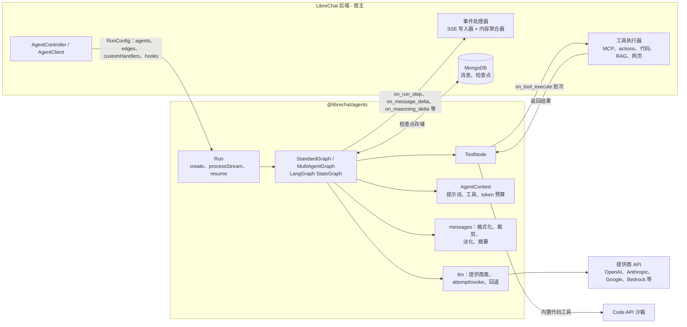
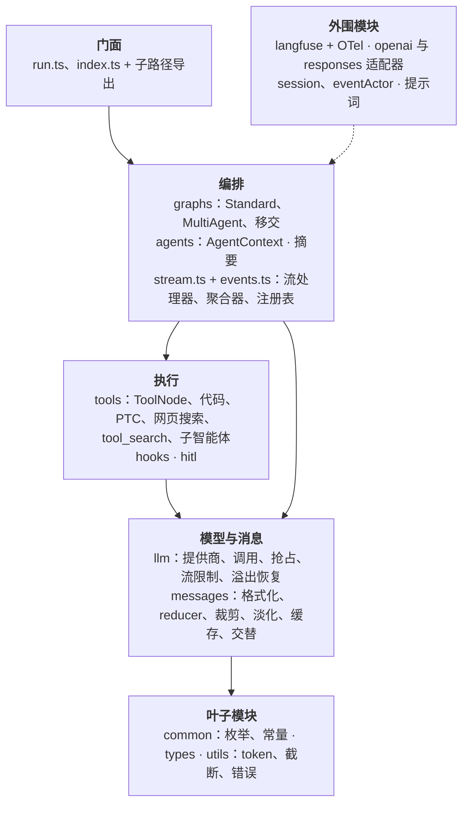
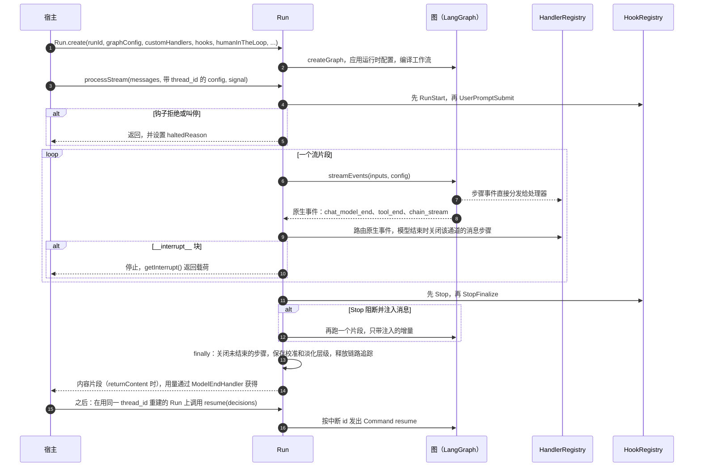
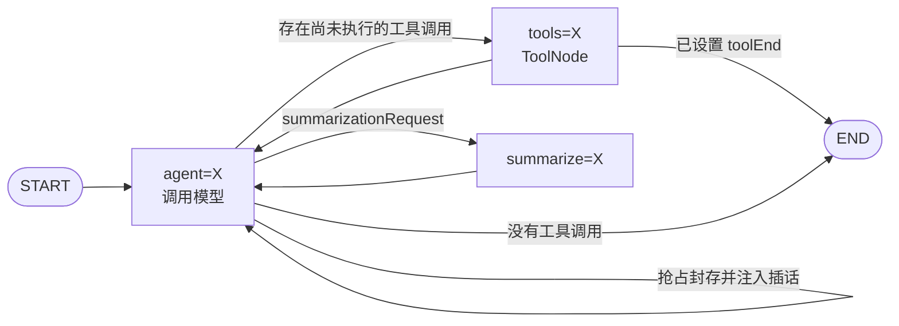
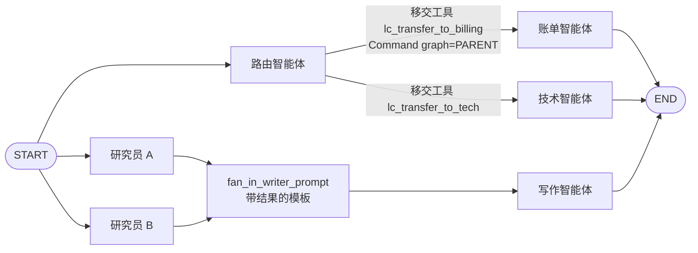
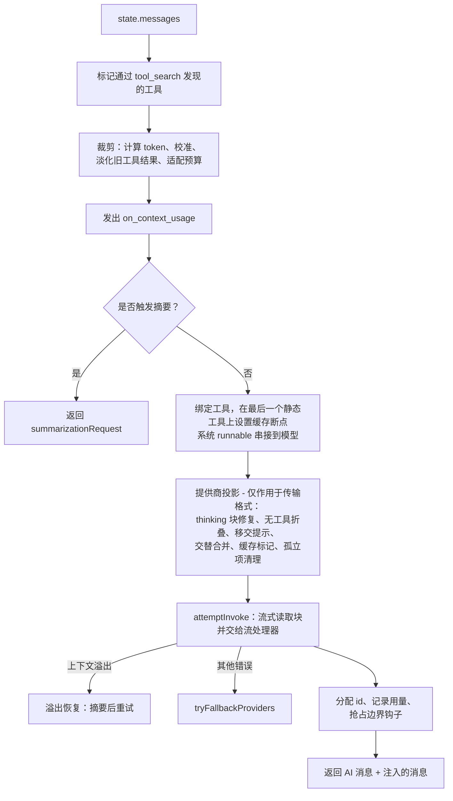
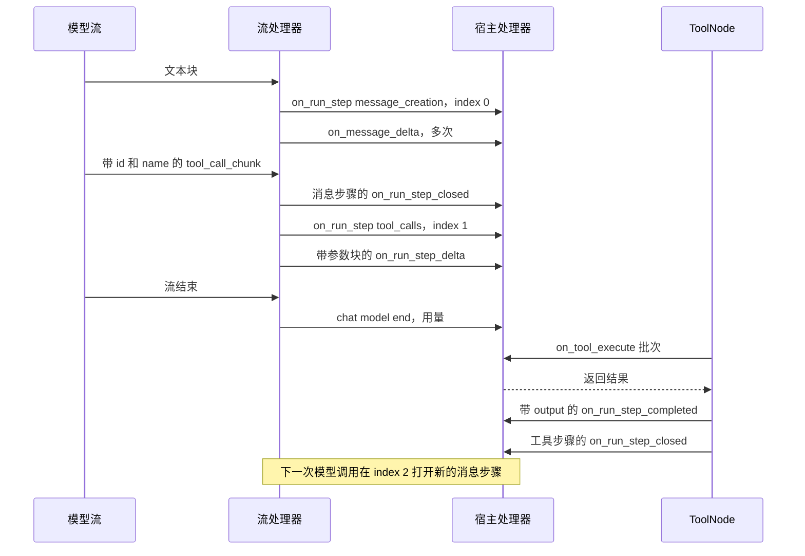
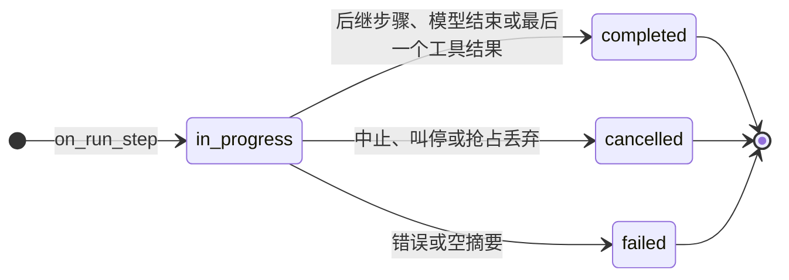
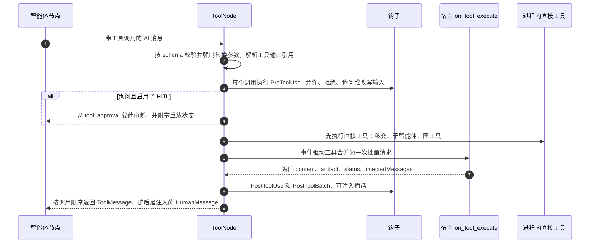
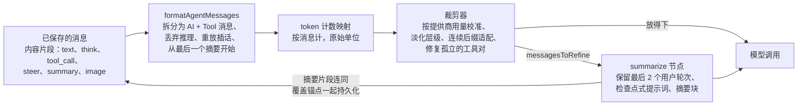

# @librechat/agents SDK 架构

`@librechat/agents`（[LibreChat-AI/agents](https://github.com/LibreChat-AI/agents)）是每一次 LibreChat 聊天背后的
智能体运行时。LibreChat 后端
（[后端架构](../README.md) 第 9 节）负责认证请求、构建智能体配置并持久化结果。之后的工作由 SDK 接手：
它运行 LangGraph 循环，把模型输出以规范化事件的形式流式输出，执行工具，管理上下文窗口，并在需要人工审批时暂停。

本文为使用 Python 重建该 SDK 的团队梳理 SDK 的整体结构。

- **快照：** `v3.9.3`（`2d5653d`）。LibreChat `v0.8.8-rc4` 锁定的是 `3.9.1`；两者足够接近，
  不影响本文描述的架构。
- **规模：** 346 个文件中约 12.3 万行非测试 TypeScript 代码。此外还有约 6.2 万行
  spec 和脚本。它构建在 `@langchain/core 1.2`、`@langchain/langgraph 1.4` 以及 LangChain
  各提供商包之上。
- **产出方式：** 静态阅读源码、文档、ADR 和 spec。没有运行任何代码。
- **阅读方式：** 本页包含各类图示和 Python 移植计划。六个参考章节给出字段级细节，
  并附有文件路径。

| 参考章节 | 内容 |
|---|---|
| [01 运行 API 与事件契约](reference/01-run-api-events.md) | 导出项、`RunConfig`、`processStream`/`resume`、每个 `GraphEvents` 载荷、顺序规则、内容聚合、OpenAI/Responses 适配器、`AgentSession` |
| [02 图、人机协同、钩子](reference/02-graphs-hitl-hooks.md) | 状态通道、节点拓扑、路由、多智能体移交与扇出、`AgentContext`、系统提示组装、审批与重放、钩子目录、抢占、事件 actor |
| [03 工具](reference/03-tools.md) | `ToolNode`、`on_tool_execute` 宿主契约、校验、截断、提前执行、内置工具、Code API、工具搜索、程序化工具调用、网页搜索、子智能体 |
| [04 LLM 提供商](reference/04-llm-providers.md) | 提供商类及其特殊行为、调用路径、重试与回退、各提供商的提示缓存、流限制、上下文溢出恢复 |
| [05 消息与上下文](reference/05-messages-context.md) | `formatAgentMessages`、状态 reducer、token 计数、裁剪、淡化（fading）层级、摘要与压缩（compaction） |
| [06 可观测性与布局](reference/06-observability-layout.md) | Langfuse 与 OTel 链路追踪、内置提示词、标题、ADR、仓库布局、模块依赖图、移植顺序 |

---

## 目录

1. [SDK 所处的位置](#1-sdk-所处的位置)
2. [模块结构](#2-模块结构)
3. [运行生命周期](#3-运行生命周期)
4. [图拓扑](#4-图拓扑)
5. [智能体节点](#5-智能体节点)
6. [流式事件契约](#6-流式事件契约)
7. [工具执行](#7-工具执行)
8. [人机协同、钩子与插话](#8-人机协同钩子与插话)
9. [LLM 提供商层](#9-llm-提供商层)
10. [消息与上下文管理](#10-消息与上下文管理)
11. [可观测性](#11-可观测性)
12. [Python 移植计划](#12-python-移植计划)

---

## 1. SDK 所处的位置



SDK 不持久化消息，不认证用户，也不感知 HTTP。它在四个方面依赖宿主：

1. **配置：** 每个智能体的 `AgentInputs`（提供商、客户端选项、指令、工具定义、
   token 限制），以及图的边。
2. **事件处理器：** 一个接收规范化流事件的 `HandlerRegistry`。LibreChat 把这些事件
   转发到 SSE，并把它们折叠进 `message.content`。
3. **工具执行：** 在事件驱动模式下，模型绑定的是只有 schema 的工具。SDK 把每个工具
   批次作为一次 `on_tool_execute` 请求发给宿主，并等待结果。
4. **检查点存储：** 只有人机协同暂停、事件 actor 和持久化子智能体才需要。

## 2. 模块结构



| 目录 | 非测试代码行数 | 职责 |
|---|---|---|
| `src/tools` | 38.2k | ToolNode（6.3k）、子智能体（7.5k）、网页搜索（7.0k）、本地引擎（5.7k）、Cloudflare（2.9k）、代码、PTC、工具搜索 |
| `src/llm` | 20.4k | 打过补丁的提供商类（OpenAI 4.9k、Anthropic 3.4k、Bedrock 2.6k、Google 1.8k）、调用、回退、抢占、限制 |
| `src/messages` | 17.6k | `formatAgentMessages`、裁剪、淡化、缓存标记、reducer、来源追踪（provenance）、交替 |
| `src/graphs` | 8.4k | `Graph.ts`（6.2k）、`MultiAgentGraph.ts`、移交路由 |
| `src/utils` | 6.3k | token 计数、工具内容压缩、截断、溢出检测、标题链 |
| `run.ts`、`stream.ts`、`events.ts` | 6.6k | 公共门面、流处理器、内容聚合器、处理器注册表 |
| `src/types` | 5.0k | 共享类型；也是 Python 移植的 schema |
| `src/langfuse*`、`instrumentation.ts` | 3.9k | 链路追踪 |
| `src/session`、`src/eventActor` | 6.2k | 程序化会话、持久化事件 actor |
| `src/summarization`、`src/hooks`、`src/agents`、`src/hitl` | 8.5k | 压缩、生命周期钩子、每个智能体的上下文、审批辅助函数 |

TypeScript 容忍目录级的循环依赖（llm ↔ messages、graphs ↔ tools、agents ↔ summarization）；Python
不行。移植时需要严格的依赖顺序：
common → types → utils → messages → llm → tools → agents → graphs → stream/summarization → run。
参见 [第 06 章 §2](reference/06-observability-layout.md)。

## 3. 运行生命周期



- `processStream` 支持调用方传入的 `AbortSignal`、协作式**抢占**（封存部分轮次后
  继续）、**Stop 续跑**（Stop 钩子注入后续消息）以及递归上限（默认 50，
  另为抢占封存预留余量）。
- 标题和标签生成（`generateTitle`、`generateActivityLabel`、`generateReasoningLabel`）是 `Run` 上
  独立的小型模型调用，不发出任何图事件。
- token 用量不在 `Run` 上累计。宿主的 `ModelEndHandler` 从每个 `on_chat_model_end` 收集
  `usage_metadata`；子智能体的用量通过 `subagentUsageSink` 送达。

## 4. 图拓扑

### 4.1 单智能体



状态通道有：
- `messages`：按 id 做 upsert 的 reducer，带一个供压缩使用的 `__remove_all__` 哨兵值；
- `summarizationRequest`；
- `runStepState`：一个随检查点保存的 sidecar（边车），记录运行步骤 id 和内容索引，使恢复后的运行保持原有步骤 id；
- `handoffState`（仅多智能体）。

外层工作流把每个智能体的子图包装成一个节点。

### 4.2 多智能体



- **移交边**为源智能体提供 `lc_transfer_to_<dest>` 工具。工具调用返回
  `Command(goto=dest, graph=PARENT)`。同一批次中的多个移交会变成一次并行的 `Send` 扇出，共享同一个
  组 id。接收方看到的是去掉转移调用后的消息，外加一条可选的路由指令。移交次数
  受 `maxHandoffs` 限制。
- **直接边**是静态的。支持单源边、全部汇合（`[A, B] → C`），以及提示节点：
  提示节点用本次运行的消息渲染 `{results}`，并可以对目标智能体隐藏这些结果
  （`excludeResults`）。
- **智能体身份**记录在 `RunStep.agentId` 上，并行通道还带有 `groupId`。LibreChat 用它们
  来渲染分栏并隐藏顺序输出；SDK 本身没有 `hide_sequential_outputs`。

## 5. 智能体节点



`AgentContext` 分两部分构建系统提示：
- **稳定**部分：多智能体身份前言、指令，以及程序化工具调用指南；
- **动态**部分：附加指令和跨运行的对话摘要。

当提供商支持提示缓存时，稳定部分带一个缓存断点，动态部分则移到
紧挨最后一条用户消息之前的“动态尾部”。加上工具、稳定前缀和
对话尾部的断点，最多保持四个缓存断点，使缓存命中率在对话变长时
依然保持在较高水平。

## 6. 流式事件契约

LibreChat 前端就建立在这份契约之上，必须原样复现。
[第 01 章 §3](reference/01-run-api-events.md) 列出了每个载荷字段。

| 事件 | 触发时机 | 载荷核心 |
|---|---|---|
| `on_run_step` | 新的消息步骤开始（某个步骤键的首个内容、阶段拆分，或从推理切换到正文），或新的工具调用步骤开始 | `RunStep {id, type: message_creation or tool_calls, index, stepIndex, stepDetails, runId, agentId?, groupId?, status, created_at}` |
| `on_message_delta` | 收到一个文本块 | `{id: stepId, delta: {content: [{type: text, text}]}}` |
| `on_reasoning_delta` | 收到一个推理块。所有提供商的格式都规范化为 `think`。 | `{id, delta: {content: [{type: think, think}]}}` |
| `on_run_step_delta` | 收到一个工具参数块。宿主也通过这个事件发送 MCP OAuth 提示。 | `{id, delta: {type: tool_calls, tool_calls: [{id, name, args, index}], auth?, expires_at?}}` |
| `on_run_step_completed` | 工具结果就绪，或摘要已提交 | `{result: {id, index, type: tool_call, tool_call: {id, name, args, output, progress: 1}}}` |
| `on_run_step_closed` | 每个步骤恰好一次：完成、取消或失败 | `{id, index, type, status, closed_at}` |
| `on_tool_execute` | 事件驱动的工具批次。这是一次对宿主的 RPC。 | `{toolCalls, agentId, userId, configurable, resolve, reject, onResult?}` |
| `on_context_usage` | 每次模型调用之前 | token 预算明细 |
| `on_summarize_start` / `_delta` / `_complete` | 压缩 | 摘要进度和最终的 `summary` 块 |
| `on_subagent_update` | 子智能体活动，外层包装谱系信息 | `{subagentRunId, subagentType, phase, data, ...}` |
| `on_agent_log` | 调试与诊断日志 | `{level, scope, message}` |





- **顺序规则。**
  - 步骤的增量总是在它的 `on_run_step` 之后。
  - 在同一个智能体通道内，上一个消息步骤先关闭，下一个才打开。
  - 内容索引同步预留，所以并行通道永远不会冲突。
  - 运行结束时，所有仍在进行中的步骤都会被关闭，除非运行因等待审批而暂停。
- **内容聚合。** `createContentAggregator` 把这些事件折叠成 `contentParts[]`，这正是
  LibreChat 存为 `message.content` 的内容：
  - text 和 think 片段直接拼接；
  - 工具调用参数持续拼接，直到最终更新设置 `output` 和 `progress: 1`；
  - 摘要替换其所在槽位。

  这个函数要逐行移植。

## 7. 工具执行



- **两种执行模式。** 在*直接*模式下，LangChain 工具实例在进程内运行。在*事件驱动*
  模式（LibreChat 的默认模式）下，模型只看到 schema 定义，每个批次由宿主执行。
  移交、子智能体和由图管理的工具始终直接运行。
- **结果。**
  - 输出截断到 `maxToolResultChars`，预算的 70% 留给开头，30% 留给结尾。
  - 错误变成内容为 `Error: ... Please fix your mistakes.` 的 ToolMessage。
  - artifact 原样透传（`content_and_artifact`）。
  - 代码会话的文件合并进一个共享的会话映射。
- **提前执行。** 模型仍在流式输出时，一旦某个调用的参数已经封闭，SDK 就可以开始执行
  这个宿主工具调用。如果最终参数与已启动时的参数不同，SDK 会拒绝把该工具
  执行第二次。
- **内置工具：**
  - `execute_code`、`bash_tool` 以及程序化工具调用（`run_tools_with_code` /
    `run_tools_with_bash`）：沙箱中的代码通过 Code API 上的续跑循环调用其他工具；
  - `tool_search`：用 BM25 发现延迟加载的工具；
  - `web_search`：搜索、抓取和重排序，带引用锚点；
  - `subagent`：派生一个子图，可以在前台运行，也可以分离运行；
  - `calculator`；
  - `skill` 和 `read_file` 的定义，由宿主执行；
  - 一套本地编码工具和一套 Cloudflare 沙箱工具。
- **Code API 契约**（[第 03 章 §4](reference/03-tools.md)）：
  - `POST {base}/exec` 接收 `{lang, code, args, files, session_id}`，返回
    `{session_id, stdout, stderr, files, deleted_files}`。
  - `POST {base}/exec/programmatic` 使用续跑令牌。
  - 基础 URL 来自 `LIBRECHAT_CODE_BASEURL`，默认为 `https://api.librechat.ai/v1`。
  - 认证头由宿主提供。

## 8. 人机协同、钩子与插话

- **审批。**
  - `PreToolUse` 钩子给出 `ask` 决策时，每个工具批次触发一次 LangGraph `interrupt()`。载荷为
    `{type: tool_approval, action_requests, review_configs}`。
  - 恢复值是针对每个调用的决策：`approve`、`reject`、`edit`（新的输入）或 `respond`（一个
    合成的结果）。缺失或无效的决策按拒绝处理（fail closed）。
  - 恢复时 LangGraph 会从头重新运行 ToolNode。SDK 把重放记录附在
    中断值上，因此已经完成的同批工具不会再次执行。
- **询问用户。** `ask_user_question` / `ask_user_questions` 以最多 4 个问题发起中断，并以
  `{answer}` 或 `{answers}` 恢复。
- **钩子。** 一个按事件分键的注册表，用 glob 或正则匹配，支持超时和一次性匹配器。
  结果按如下规则合并：`deny` 优先于 `ask`，`ask` 优先于 `allow`；最后一个 `updatedInput` 生效；注入的
  消息会累积。事件包括：
  - `RunStart`、`UserPromptSubmit`；
  - `PreToolUse`、`PostToolUse`、`PostToolUseFailure`、`PostToolBatch`、`PermissionDenied`；
  - `PreemptBoundary`；
  - `SubagentStart`、`SubagentStop`；
  - `Stop`、`StopFinalize`、`StopFailure`；
  - `PreCompact`、`PostCompact`。
- **插话通道。** 运行中途发送的用户消息可以在三个位置到达模型：
  1. 在工具边界，通过 `PostToolBatch` 注入的消息；
  2. 在生成中途，当 `preemption.shouldPreempt()` 封存部分轮次并由 `PreemptBoundary` 注入时；
  3. 在结尾，当 `Stop` 钩子阻断并注入时。

  已保存的插话是 `steer` 内容片段，`formatAgentMessages` 会把它们重放为用户轮次。

## 9. LLM 提供商层

| 提供商 | SDK 类 | SDK 处理的特殊行为 |
|---|---|---|
| OpenAI、Azure | 打过补丁的 `ChatOpenAI` / `AzureChatOpenAI`，带 Completions 和 Responses 委托 | Responses API 路由、推理内容透传、显式缓存断点、关闭 SDK 重试的可中止 fetch、流平滑 |
| Anthropic | `CustomAnthropic` | 内置（vendored）的消息转换、thinking 块与签名、beta 请求头、去除 assistant 预填充、增量用量、手动工具流 |
| Bedrock | `CustomChatBedrockConverse` | 自行处理 `ConverseStream`、缓存点、推理配置文件（inference profile）、护栏（guardrails）、严格的 user/assistant 交替 |
| Google、Vertex | 打过补丁的 `ChatGoogleGenerativeAI` / `ChatVertexAI` | 思维签名（thought signature）、`thinkingConfig`、服务端工具片段、schema 清理 |
| DeepSeek、xAI、Moonshot、OpenRouter、Mistral | 子类 | `reasoning_content` 重放、`<think>` 解析、OpenRouter `reasoning_details`、严格交替 |

- `attemptInvoke` 流式调用模型，把每个块交给流处理器，并执行流限制
  （默认工具调用参数上限为 64 KiB）。
  - 遇到上下文长度错误时，它执行**溢出恢复**：先摘要，再按修正后的
    预算重试。
  - 遇到其他错误时，它按顺序尝试已配置的**回退提供商**。
- 可以在运行时用 `registerProvider({provider, model, family})` 添加自定义提供商。

细节以及移植时会遇到的每一个转换特殊行为：[第 04 章](reference/04-llm-providers.md)。

## 10. 消息与上下文管理



- **格式化。** 一条已保存的助手消息，如果片段为 `[think, text + tool_call_ids, tool_call, steer, text]`，
  会变成：
  - `AI(text, tool_calls)`
  - `Tool(output)`
  - `Human(steer)`
  - `AI(text)`

  除非设置了 `preserveReasoningContent`（DeepSeek 会设置），否则推理内容被丢弃。token 映射按
  字符长度分摊到派生出的各条消息上。
- **token 计数。** 大多数模型使用 `o200k_base`，Claude 使用 Claude 词表 × 1.1，每条
  消息加 3 个 token，另有图片、PDF 和音频的估算器。
- **校准。** 提供商报告的用量与本地计数之间的比值，限制在 [0.5, 5] 区间内，并在
  运行之间延续。
- **裁剪**在 `maxContextTokens × 0.95` 减去指令后的范围内保留一段连续后缀。它从不以
  工具消息开头，会重新挂接 Anthropic 的 thinking 块，并把被丢弃的消息作为 `messagesToRefine` 返回。
- **淡化**按一个“锁存”（latched）层级截断旧的工具结果，该层级只会越来越严格，因此每次调用之间
  字节保持一致，提供商的提示缓存可以持续命中。
- **摘要**可由可配置的 token 比例、剩余 token 数或消息数触发。它用检查点式提示词
  （Goal、Constraints、Progress、Decisions、Next Steps）对除最近尾部之外的全部内容做摘要。
  它写入一个带 `coverage.retainedFromMessageId` 锚点的 `summary` 内容片段，
  连续失败 3 次后放弃。

默认的检查点提示词文本、承载格式和 16 条需要测试的不变量见
[第 05 章](reference/05-messages-context.md)。

## 11. 可观测性

链路追踪是可选的。Langfuse 叠加在 OpenTelemetry 之上：
- 专用的 tracer provider；
- 确定性的 trace id（`sha256(runId)[:32]`），因此无需查找即可为反馈打分；
- 在导出时进行 span 整形和脱敏；
- 按租户路由到不同的 Langfuse 目标。

LangGraph 的控制流（中断、父图命令）记录为成功，而不是错误。运行名称
（`AgentGraph`、`AgentModelCall` 等）属于契约的一部分，因为 LibreChat 会导入它们。
[第 06 章](reference/06-observability-layout.md) 涵盖这部分内容，以及内置的标签和标题提示词。

## 12. Python 移植计划

### 12.1 LangGraph Python 已提供的与需要自行实现的

| 领域 | Python 中已有 | 必须自行实现 |
|---|---|---|
| 图运行时 | `StateGraph`、`add_messages` + `RemoveMessage(REMOVE_ALL_MESSAGES)`、`Command(goto, graph=PARENT)`、`Send`、`interrupt`、`Command(resume=...)`、检查点存储、`durability="exit"` | `agent=`、`tools=`、`summarize=` 的节点装配；路由；`runStepState` 和 `handoffState` 通道 |
| 流式 | `astream_events(v2)`、`get_stream_writer`、`adispatch_custom_event` | 从块到 `RunStep` 的状态机（步骤键、推理切换、通道关闭）、内容聚合器以及顺序保证 |
| 工具 | `ToolNode`、`StructuredTool`、`langchain-mcp-adapters` | 自定义 ToolNode：基于 future 的事件驱动宿主 RPC、钩子、HITL 重放记录、移交的 Send 扇出、截断、提前执行 |
| 提供商 | `langchain-openai`、`-anthropic`、`-google-genai`、`-google-vertexai`、`-aws`、`-mistralai`、`-deepseek`、`-xai`，或 litellm | thinking 与签名处理、缓存标记、交替合并、Responses API 重放、用量规范化、回退链、溢出检测 |
| 上下文 | `trim_messages`（不够用） | `formatAgentMessages`、带校准的裁剪器、淡化层级、孤立项修复、summarize 节点及其提示词 |
| 人机协同与钩子 | `interrupt` | 钩子注册表及合并规则、审批载荷与决策校验、已完成同批工具的重放 |
| 链路追踪 | `langfuse` v3（原生 OTel）、`opentelemetry-sdk` | span 整形与脱敏导出器、确定性 id、租户路由 |

### 12.2 包结构（无循环依赖）

```text
librechat_agents/
  common/         enums.py (GraphEvents, Providers, ContentTypes, StepTypes, Constants), constants.py
  types/          pydantic 模型: RunStep, deltas, content parts, ToolExecuteRequest/Result, hitl, RunConfig  (叶子)
  utils/          tokens.py, truncation.py, tool_content.py, errors.py (上下文溢出), misc.py
  messages/       format.py, reducer.py, prune.py, fading.py, cache.py, alternation.py, provenance.py, injected.py
  llm/            registry.py, init.py, invoke.py (attempt_invoke, fallbacks), preempt.py, stream_limits.py,
                  overflow.py, providers/{openai,anthropic,bedrock,google,vertexai,mistral,openrouter,deepseek,xai}.py
  tools/          tool_node.py, handlers.py, code_executor.py, bash.py, ptc.py, tool_search.py, calculator.py,
                  subagent/, search/, local/
  hooks/          registry.py, execute.py, matchers.py, policies.py
  hitl/           payloads.py, approval.py, ask_user.py
  agents/         context.py (AgentContext, 系统提示, 预算), projection.py
  graphs/         base.py (步骤簿记), standard.py, multi_agent.py, handoff.py, factory.py
  summarization/  trigger.py, node.py, prompts.py, semantic_index.py
  stream/         stream_handler.py, aggregator.py, registry.py (HandlerRegistry, ModelEndHandler, ToolEndHandler)
  run.py          Run: create, process_stream, resume, get_interrupt, generate_title
  observability/  langfuse/, otel.py (未配置时为空操作)
  adapters/       openai_chat.py, responses.py
  session/, event_actor/   (后期阶段)
```

### 12.3 移植顺序

| 阶段 | 范围 | 完成标准 |
|---|---|---|
| 0. 叶子模块 | 枚举、pydantic 事件与内容模型、token 计数器、截断、溢出检测 | 模型能把录制的 TypeScript 事件 JSON 原样往返 |
| 1. 最小循环 | OpenAI + Anthropic 提供商、`formatAgentMessages`、AgentContext（指令 + 工具绑定）、标准图、事件驱动 ToolNode、流处理器、聚合器、支持中止的 `Run.process_stream` | 一次 LibreChat 形态的带工具调用的聊天，在录制的测试夹具上产出与 TypeScript SDK 字节级一致的 `contentParts` |
| 2. 生产级聊天 | 标题、裁剪器 + 校准 + 淡化、溢出恢复、摘要、回退、其余提供商、提示缓存、基础 Langfuse | 长对话保持在预算之内，缓存命中率一致 |
| 3. 智能体功能 | 多智能体移交与扇出、钩子、HITL 审批 + 带重放的恢复、子智能体、工具搜索、PTC、代码与网页搜索工具、流限制、抢占与插话 | TypeScript spec 中的审批、插话和移交场景全部通过 |
| 4. 保真度 | 完整的 trace 整形与租户路由、活动与推理标签、语义索引、来源追踪（provenance）不变量 | trace 整形黄金测试通过 |
| 5. 高级功能 | 事件 actor、会话、本地与 Cloudflare 执行引擎、OpenAI 与 Responses 适配器 | 按需 |

### 12.4 降低风险的做法

- **先做黄金测试夹具。** 用 `FakeChatModel` 和录制的提供商流，在一组固定对话上运行 TypeScript SDK。
  记录每一个处理器事件和最终的 `contentParts`，然后让 Python 移植版
  完全复现它们。`src/specs`（68 个行为 spec 文件）就是现成的场景清单。
- **可选的 sidecar 桥接。** 在 Python 后端建设期间，它可以通过一个小型 Node sidecar（边车进程）
  继续使用 TypeScript SDK。sidecar 通过 socket 暴露 `process_stream` 和 `resume`，并把
  `on_tool_execute` 批次转发回 Python。这样后端移植和 SDK 移植可以各自独立发布。
  事件和 `on_tool_execute` 的载荷就是协议本身。
- **可以舍弃的部分。** 混合版本兼容代码、`lazyRequire` 源码模式机制、旧版
  supervisor 和 task-manager 提示词，以及 Cloudflare 和本地引擎（除非你需要它们）。
- **陷阱**（汇总自各章）：
  - LangGraph Python 同样会从头重新运行被中断的节点，所以要移植重放记录。
  - 每条消息在离开节点之前都必须有 id，否则按 id 做 upsert 的 reducer 会产生重复。
  - 在 reducer 之外捕获 `start_index`。
  - 不要在抢占认领或一次性匹配器的临界区内 await。
  - 严格保持 camelCase 和 snake_case 字段名（`stepDetails`、`runId`，但 `created_at`、
    `tool_call_ids`）。
  - 用 Protocol 打破目录间的循环依赖。
